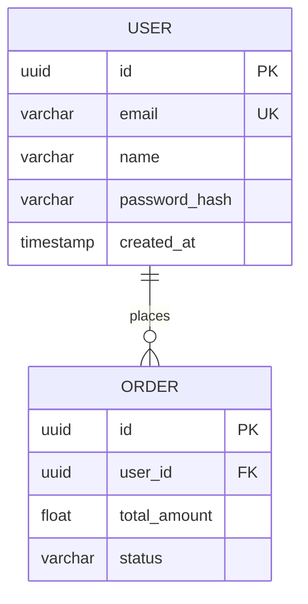

# ✅ Answer: DBD Table Format Visualization

## 🎯 Your Question
> "I didn't see any table format visualize architecture in my DBD"

## 💡 The Answer

**Your DBD implementation DOES create table format architecture!** 

The issue is that you need to **visualize/render** the Mermaid code to see the table-like boxes.

## 🗄️ What "Table Format" Means

### The Code You Generate (erDiagram):


### The Visual Rendering (Table Format):
```
┌─────────────────────────┐       places      ┌─────────────────────────┐
│        USER             │───────────────────│       ORDER             │
├─────────────────────────┤                   ├─────────────────────────┤
│ uuid id PK              │                   │ uuid id PK              │
│ varchar email UK        │                   │ uuid user_id FK         │
│ varchar name            │                   │ float total_amount      │
│ varchar password_hash   │                   │ varchar status          │
│ timestamp created_at    │                   └─────────────────────────┘
└─────────────────────────┘
```

**The boxes that look like database tables = "TABLE FORMAT"**

## 🚀 How to See It RIGHT NOW

### Method 1: Preview Tool (⭐ Fastest - 30 seconds)

```bash
cd autoagents-backend/app/data
start dbd_preview.html       # Windows
open dbd_preview.html        # Mac
xdg-open dbd_preview.html    # Linux
```

**What you'll see:**
1. **E-commerce Tab** - Shopping platform with USER, PRODUCT, ORDER tables
2. **Hospital Tab** - Healthcare system with PATIENT, DOCTOR, APPOINTMENT tables
3. **AutoAgents Tab** - Your actual system schema
4. **Custom Tab** - Paste your own diagrams

**All shown in TABLE FORMAT with visual boxes!**

### Method 2: Mermaid Live Editor (1 minute)

1. Go to: **https://mermaid.live/**
2. Paste the erDiagram code above
3. See it rendered as table-format boxes instantly!

### Method 3: Your Frontend App (2 minutes)

Your Angular app already renders DBD diagrams in table format:

```bash
# Start backend
cd autoagents-backend
python -m uvicorn app.main:app --reload

# Start frontend (new terminal)
cd autoagents-frontend
npm start
```

Then:
1. Create project with features
2. Generate DBD diagram
3. **See table-format visualization automatically!**

## 📊 Complete Example in Table Format

When you open `dbd_preview.html`, you'll see this E-commerce schema as visual table-like boxes:

```
┌──────────────────────┐                    ┌──────────────────────┐
│       USER           │                    │     CATEGORY         │
├──────────────────────┤                    ├──────────────────────┤
│ uuid id PK           │  places            │ uuid id PK           │
│ varchar email UK     │                    │ varchar name UK      │
│ varchar name         │                    │ text description     │
│ varchar password_hash│                    │ varchar slug UK      │
│ varchar phone        │                    └──────────────────────┘
│ timestamp created_at │                             │
└──────────────────────┘                             │ categorizes
         │                                           ↓
         │                                  ┌──────────────────────┐
         │                                  │      PRODUCT         │
         │                                  ├──────────────────────┤
         │                                  │ uuid id PK           │
         ↓                                  │ uuid category_id FK  │
┌──────────────────────┐                   │ varchar name         │
│       ORDER          │                   │ text description     │
├──────────────────────┤                   │ float price          │
│ uuid id PK           │                   │ int stock_quantity   │
│ uuid user_id FK      │  included_in      │ varchar sku UK       │
│ float subtotal       │     ┌─────────────┴──────────────────────┘
│ float tax_amount     │     │
│ float shipping_cost  │     │
│ float total_amount   │     │
│ varchar status       │     │
└──────────────────────┘     │
         │                   │
         │ contains          │
         ↓                   ↓
    ┌────────────────────────────┐
    │       ORDER_ITEM           │
    ├────────────────────────────┤
    │ uuid id PK                 │
    │ uuid order_id FK           │
    │ uuid product_id FK         │
    │ int quantity               │
    │ float unit_price           │
    │ float subtotal             │
    └────────────────────────────┘
```

**Each box = One database table**  
**Fields inside = Table columns**  
**Lines between boxes = Table relationships**

## 🎨 Components of Table Format

### 1. Entity Box (Database Table):
```
┌─────────────────────┐
│     USER            │ ← Table name (header)
├─────────────────────┤
│ uuid id PK          │
│ varchar email UK    │ ← Table columns/fields
│ varchar name        │
└─────────────────────┘
```

### 2. Field Rows:
```
uuid id PK
│    │  └─ Constraint (Primary Key)
│    └──── Field name
└─────────── Data type
```

### 3. Relationship Lines:
```
USER ||--o{ ORDER
     │      └─ One-to-Many
     │         (one USER has many ORDERs)
     └──────── Relationship connector
```

## 🧪 Test It Right Now!

### Step 1: Generate DBD
```bash
cd autoagents-backend
export ANTHROPIC_API_KEY='your-key'
python test_dbd_fix.py
```

Output: `test_dbd_fixed_output.mmd`

### Step 2: Visualize
**Option A - Preview Tool:**
```bash
cd app/data
start dbd_preview.html
```
- Go to "✏️ Your Custom DBD" tab
- Paste contents from `test_dbd_fixed_output.mmd`
- Click "🔄 Render Diagram"
- **SEE TABLE FORMAT!**

**Option B - Mermaid Live:**
1. Open https://mermaid.live/
2. Paste contents from `test_dbd_fixed_output.mmd`
3. **SEE TABLE FORMAT!**

## 📁 Files You Need

### To See Examples:
- **`autoagents-backend/app/data/dbd_preview.html`** ← Open this in browser!

### To Generate Your Own:
- **`autoagents-backend/test_dbd_fix.py`** ← Run this script

### Good Examples:
- **`autoagents-backend/app/data/dbd_diagram.mermaid`** ← Example with fields
- **`test_dbd_output.mmd`** ← Bad example (empty entities - the bug)

### After Running Test:
- **`test_dbd_fixed_output.mmd`** ← E-commerce (FIXED)
- **`test_dbd_hospital_output.mmd`** ← Hospital (FIXED)

## 🎯 Summary

### What You Have:
✅ DBD implementation that generates erDiagram code  
✅ Table format architecture (entities with fields)  
✅ Preview tool to visualize it (`dbd_preview.html`)  
✅ Frontend that renders it automatically  
✅ Test script to generate examples  

### What You Were Missing:
❌ **Visualization/rendering** of the Mermaid code

### What You Need to Do:
1. ✅ **Open `dbd_preview.html` in browser** to see what table format looks like
2. ✅ **Run `test_dbd_fix.py`** to generate your own DBD diagrams
3. ✅ **Paste into preview tool** to see them in table format

## 🔑 Key Point

**Table format is the VISUAL RENDERING, not the code!**

- **Code:** `erDiagram USER { uuid id PK }`
- **Table Format:** Visual box with "USER" header and "uuid id PK" inside

You need a **renderer** (browser with Mermaid.js) to see the table format.

## 🚀 Action Items

### RIGHT NOW (30 seconds):
```bash
cd autoagents-backend/app/data
start dbd_preview.html
```

Look at the E-commerce tab → **THAT'S TABLE FORMAT!**

### Next (2 minutes):
```bash
cd autoagents-backend
python test_dbd_fix.py
```

Copy output from `test_dbd_fixed_output.mmd` and paste into preview tool → **YOUR DBD IN TABLE FORMAT!**

### Later (5 minutes):
1. Start your app (backend + frontend)
2. Create a project with features
3. Generate DBD diagram
4. **See it rendered in table format in your app!**

---

## 📞 Still Confused?

### Q: Where is the table format?
**A:** Open `dbd_preview.html` in a browser. The boxes you see ARE the table format.

### Q: My DBD doesn't show tables?
**A:** You're looking at the code. You need to RENDER it using the preview tool or Mermaid Live.

### Q: The entities are empty!
**A:** That was the bug. Run `test_dbd_fix.py` to generate fixed diagrams.

### Q: How do I know it's working?
**A:** Open `dbd_preview.html` → See boxes with fields inside → That's table format working!

---

**BOTTOM LINE:**  
Open `autoagents-backend/app/data/dbd_preview.html` right now to see table format! 🗄️

