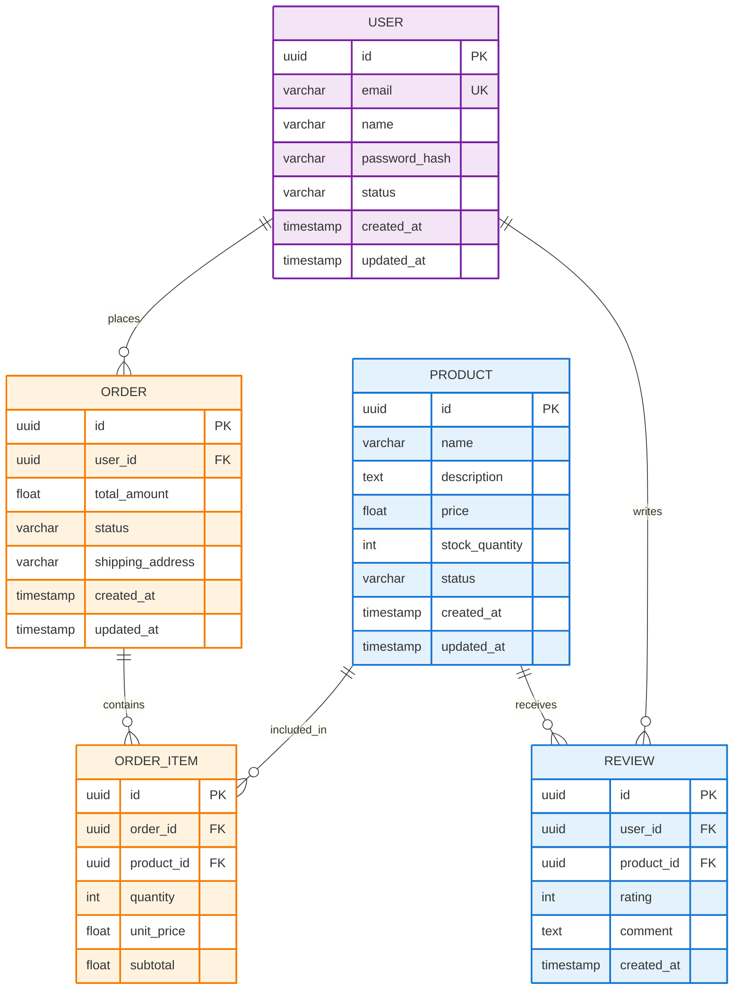

# API-Based Diagram Generation - Complete Implementation

## ✅ What Was Changed

### Frontend Changes (`autoagents-frontend/`)

#### 1. **Removed Hardcoded Diagram Generation**
**File:** `src/app/workspace/workspace-view.component.ts`

**Before:** Frontend had local builders/emitters that generated diagrams without calling the API
**After:** All diagram generation now goes through the backend API (Agent3 service)

**Changes:**
- ✅ Removed imports for `buildHLD`, `buildLLD`, `buildDBD`, `emitHLD`, `emitLLD`, `emitDBD`
- ✅ Changed `loadPredefinedDiagram()` to trigger API regeneration instead
- ✅ Removed all local diagram generation logic
- ✅ Added helpful placeholder messages when no diagram exists
- ✅ Updated error handling to guide users to regenerate via API

**Key Code:**
```typescript
protected loadPredefinedDiagram(type: 'hld' | 'lld' | 'database'): void {
  // This function is now deprecated - all diagrams should be generated via API
  // Trigger API-based diagram regeneration instead
  console.debug(`[workspace] loadPredefinedDiagram called for ${type} - triggering API generation instead`);
  this.onRegenerateDiagram();
}
```

#### 2. **Fixed Light Theme Brightness**
**File:** `src/app/workspace/workspace-view.component.scss`

**Before:** Light theme had very bright blue/white background
**After:** Subdued gray/dark blue gradient for better readability

```scss
.studio-panel__preview.light {
  border-color: rgba(148, 163, 184, 0.3);
  background: radial-gradient(circle at top, rgba(71, 85, 105, 0.15), rgba(30, 41, 59, 0.6));
}
```

### Backend Changes (`autoagents-backend/`)

#### 3. **Enhanced LLD Prompt for Detailed Architecture**
**File:** `app/services/agent3.py`

**Improvements:**
- 📋 Clear instructions to map features to specific classes
- 🏗️ Defines 5 architectural layers (Controllers, Services, Repositories, Models, Relationships)
- 🎯 Emphasizes LLD must be MORE DETAILED than HLD
- 💡 Provides specific examples for each layer
- 🎨 Uses subtle professional colors (pastel fills with darker strokes)

**Example Output:**
```mermaid
classDiagram
  class UserController {
    +createUser() User
    +getUser(id) User
    +updateUser(id) User
    +deleteUser(id) void
  }
  
  class UserService {
    -repository: UserRepository
    -validator: Validator
    +processUserCreation() User
    +validateUserData() boolean
  }
  
  class UserRepository {
    +findById(id) User
    +save(user) User
    +update(user) User
    +delete(id) void
  }
  
  class User {
    -id: UUID
    -email: String
    -name: String
    -createdAt: DateTime
  }
  
  UserController --> UserService
  UserService --> UserRepository
  UserRepository --> User
  
  classDef controllerClass fill:#E3F2FD,stroke:#1976D2,stroke-width:2px,color:#000000
  classDef serviceClass fill:#FFF3E0,stroke:#F57C00,stroke-width:2px,color:#000000
  UserController:::controllerClass
  UserService:::serviceClass
```

#### 4. **Enhanced DBD Prompt for Detailed Database Schema**
**File:** `app/services/agent3.py`

**Improvements:**
- 📋 Clear instructions to extract entities from features
- 🗄️ Defines comprehensive field mapping with data types
- 🔗 Explains all relationship types with examples
- 📊 Includes common patterns (USER table, audit fields, status tracking)
- 🎨 Uses subtle professional colors matching UI theme

**Example Output:**


## 🎯 How It Works Now

### Complete Flow

1. **User Selects Diagram Type** (HLD, LLD, or DBD)
   - Clicks diagram type dropdown in workspace
   - Selects desired diagram type

2. **Frontend Triggers API Call**
   - `onDiagramTypeChange()` event fires
   - Parent component calls `invokeAgent3(features, stories, diagramType)`
   - HTTP POST to `/diagrams/generate` endpoint

3. **Backend Generates Diagram**
   - Agent3Service receives request with:
     - Project title
     - Features array (from Agent1)
     - Stories array (from Agent2)
     - Diagram type (hld/lld/database)
     - Original prompt
   
4. **AI Creates Diagram**
   - Claude AI API called with enhanced prompts
   - Generates Mermaid code based on:
     - Specific features provided
     - User stories context
     - Diagram type requirements
   
5. **Backend Post-Processing**
   - Removes markdown fences
   - Cleans emojis and special characters
   - Validates syntax (braces, colors, etc.)
   - Fixes common errors
   - Returns clean Mermaid code

6. **Frontend Renders Diagram**
   - Receives Mermaid code from API
   - Validates syntax
   - Renders using Mermaid.js
   - Applies theme (dark/light)
   - Shows in workspace with zoom/pan controls

## 🚀 Key Benefits

### 1. **100% Dynamic and API-Generated**
- ✅ No hardcoded diagrams
- ✅ Every diagram based on actual features and stories
- ✅ Uses Claude AI API for intelligent generation
- ✅ Adapts to any project type

### 2. **Truly Detailed LLD**
- ✅ Shows specific classes for each feature
- ✅ Includes methods with parameters and return types
- ✅ Shows properties with data types
- ✅ Maps features → Controllers → Services → Repositories → Models
- ✅ MORE detailed than HLD (implements the high-level design)

### 3. **Comprehensive DBD**
- ✅ Creates tables based on feature nouns
- ✅ Defines fields with appropriate data types
- ✅ Shows all relationships (1:1, 1:N, N:M)
- ✅ Includes constraints (PK, FK, UK)
- ✅ Adds audit fields (created_at, updated_at)
- ✅ Covers entire data model needed for features

### 4. **Professional UI**
- ✅ Subtle colors (not too bright)
- ✅ Pastel fills with darker stroke colors
- ✅ Good contrast in both themes
- ✅ Matches existing dark theme design
- ✅ Readable light theme alternative

## 📊 Testing the Changes

### Step 1: Start Backend
```powershell
cd autoagents-backend
.\start_backend.ps1
```

Wait for: `Uvicorn running on http://0.0.0.0:8000`

### Step 2: Start Frontend
```powershell
cd autoagents-frontend
npm start
```

Wait for: `Angular Live Development Server is listening on localhost:4200`

### Step 3: Create a Project
1. Open http://localhost:4200
2. Enter a project idea (e.g., "E-commerce platform for selling electronics")
3. Let Agent1 generate features
4. Approve features
5. Let Agent2 generate stories
6. Approve stories
7. Workspace opens automatically

### Step 4: Test LLD
1. In workspace, click **diagram type dropdown**
2. Select **"LLD - Low Level Design"**
3. Wait for API generation (5-10 seconds)
4. **Expected Result:**
   - Shows detailed class diagram
   - Multiple classes (Controllers, Services, Repositories, Models)
   - Methods with parameters: `+createUser(data) User`
   - Properties with types: `-email: String`
   - Relationships between classes
   - Subtle professional colors
   - Based on YOUR features (not generic)

### Step 5: Test DBD
1. Click **diagram type dropdown**
2. Select **"DBD - Database Design"**
3. Wait for API generation (5-10 seconds)
4. **Expected Result:**
   - Shows detailed ER diagram
   - Multiple tables extracted from features
   - Fields with data types: `uuid id PK`, `varchar name`
   - Relationships: `USER ||--o{ ORDER : places`
   - Constraints shown: PK, FK, UK
   - Audit fields: created_at, updated_at
   - Subtle professional colors
   - Based on YOUR features (not generic)

### Step 6: Test Theme Toggle
1. View any diagram (HLD, LLD, or DBD)
2. Click **"Switch to light mode"** button
3. **Expected Result:**
   - Background changes to subdued gray/dark tones
   - NOT bright blue/white
   - Diagram remains clearly readable
   - Good contrast maintained

### Step 7: Test Regeneration
1. Click **"Regenerate Diagram"** button
2. **Expected Result:**
   - Loading message appears
   - New diagram generated via API
   - Diagram updates in ~5-10 seconds
   - Can be different from previous (AI-generated)

## 🔍 Verification Checklist

- [ ] LLD shows specific classes mapped to features
- [ ] LLD includes methods with parameters and return types
- [ ] LLD shows service layer, repository layer, models
- [ ] LLD is MORE detailed than HLD
- [ ] DBD shows tables extracted from features
- [ ] DBD includes all necessary fields with data types
- [ ] DBD shows relationships between entities
- [ ] DBD includes PK, FK, UK constraints
- [ ] Both diagrams use subtle colors (not too bright)
- [ ] Light theme has good contrast (not blinding)
- [ ] Diagrams are different for different projects
- [ ] NO hardcoded/generic content
- [ ] All generation goes through API
- [ ] Backend logs show Claude API calls
- [ ] Regeneration button triggers new API call

## 📝 Implementation Summary

### What Makes This Pro-Level

1. **Intelligent Entity Extraction**
   - AI analyzes feature descriptions
   - Identifies core business entities
   - Creates appropriate classes/tables
   - Maps relationships automatically

2. **Feature-Driven Design**
   - Every class/table derived from features
   - Methods match feature requirements
   - Database schema supports feature data
   - No generic placeholders

3. **Layered Architecture**
   - LLD shows proper separation of concerns
   - Controller → Service → Repository → Model
   - Each layer has specific responsibilities
   - Professional software architecture

4. **Comprehensive Data Model**
   - DBD includes all necessary tables
   - Proper normalization
   - Audit fields for tracking
   - Foreign keys for referential integrity

5. **Production-Ready Output**
   - Valid Mermaid syntax (extensively validated)
   - Professional color schemes
   - Readable in both themes
   - Export/save capabilities

## 🎉 Result

You now have a **fully API-driven diagram generation system** that:
- ✅ Creates **detailed LLD** showing complete class architecture
- ✅ Creates **comprehensive DBD** showing entire database schema
- ✅ Generates diagrams **dynamically** based on actual project features
- ✅ Uses **Claude AI API** for intelligent diagram creation
- ✅ Has **subtle professional colors** matching your UI theme
- ✅ Works for **any project type** with any features
- ✅ Provides **true technical detail** beyond high-level design

No more hardcoded diagrams - everything is generated intelligently by AI based on your specific project! 🚀

