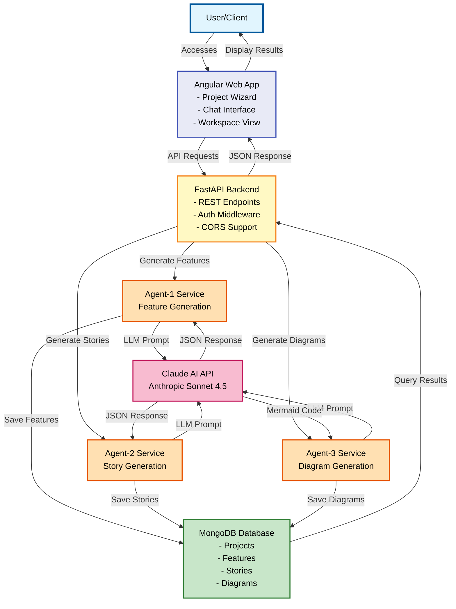
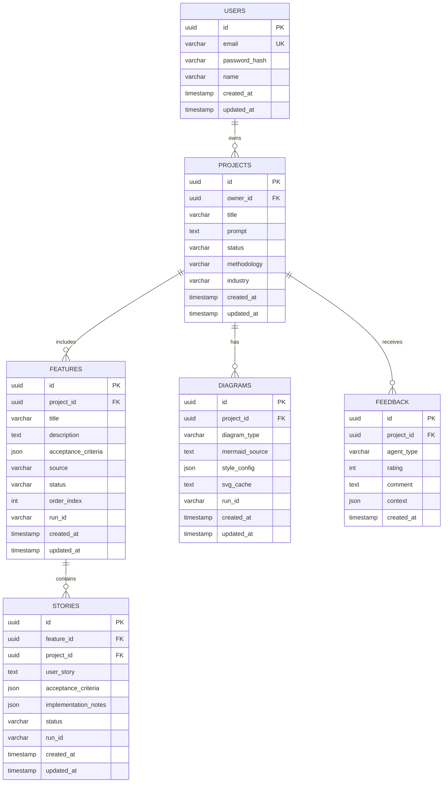

# AutoAgents Complete Architecture Documentation

This document provides a complete visualization of the AutoAgents system architecture using High-Level Design (HLD), Low-Level Design (LLD), and Database Design (DBD) diagrams.

---

## 📊 High-Level Design (HLD)

The HLD shows the overall system architecture and data flow between major components.

### System Overview
- **User Layer**: End users and clients
- **Frontend**: Angular web application
- **Backend**: FastAPI REST API
- **AI Agents**: Three specialized agents for feature generation, story generation, and diagram visualization
- **AI Provider**: Claude API (Anthropic Sonnet 4.5)
- **Database**: MongoDB for persistent storage

### HLD Diagram

### Data Flow
1. **User Input**: User accesses Angular app and inputs project requirements
2. **API Communication**: Frontend sends HTTP requests to FastAPI backend
3. **Agent Processing**: 
   - Agent-1 generates features from requirements
   - Agent-2 creates user stories from approved features
   - Agent-3 builds visual diagrams from features and stories
4. **AI Integration**: Each agent communicates with Claude API for intelligent content generation
5. **Data Persistence**: Generated artifacts are saved to MongoDB
6. **Response Delivery**: Results are returned to frontend for user review and editing

---

## ⚙️ Low-Level Design (LLD)

The LLD provides detailed component interactions, class structures, and implementation details.

### Component Architecture
- **Frontend Components**: Angular components with signals for state management
- **Backend Routers**: FastAPI routers organized by domain
- **Agent Services**: Specialized services for each AI agent
- **Database Layer**: MongoDB collections and access patterns

### LLD Diagram

```mermaid
classDiagram
    %% Frontend Components
    class AppComponent {
        +chatMessages: Signal
        +workspaceItems: Signal
        +currentAgent: Signal
        +handleUserInput()
        +updateWorkspace()
    }
    
    class ProjectWizard {
        +currentStep: number
        +projectData: ProjectCreate
        +nextStep()
        +submitProject()
    }
    
    class WorkspaceView {
        +features: Feature[]
        +stories: Story[]
        +diagrams: Diagram[]
        +editItem()
        +removeItem()
    }
    
    %% Backend Routers
    class AuthRouter {
        +POST /auth/login
        +POST /auth/register
        -verifyPassword()
        -generateJWT()
    }
    
    class ProjectsRouter {
        +POST /projects
        +GET /projects/user/userId
        +GET /projects/projectId
        -validateOwnership()
    }
    
    class FeaturesRouter {
        +POST /projects/projectId/features/generate
        +GET /projects/projectId/features
        -callAgent1()
    }
    
    class StoriesRouter {
        +POST /projects/projectId/stories/generate
        +GET /projects/projectId/stories
        -callAgent2()
    }
    
    class DiagramsRouter {
        +POST /projects/projectId/diagram/generate
        +GET /projects/projectId/diagram
        -callAgent3()
    }
    
    %% Agent Services
    class Agent1Service {
        -model: string
        +generateFeatures()
        -buildPrompt()
        -parseResponse()
    }
    
    class Agent2Service {
        -model: string
        +generateStories()
        -buildPrompt()
        -parseResponse()
    }
    
    class Agent3Service {
        -model: string
        +generateMermaid()
        -buildPrompt()
        -cleanMermaidCode()
        -removeTruncatedStyles()
    }
    
    class ClaudeClient {
        +getClient()
        +extractText()
        -handleAPIError()
    }
    
    %% Database Layer
    class Database {
        +users: Collection
        +projects: Collection
        +features: Collection
        +stories: Collection
        +diagrams: Collection
        +connectToMongo()
        +closeConnection()
    }
    
    %% Relationships - Frontend
    AppComponent --> ProjectWizard
    AppComponent --> WorkspaceView
    
    %% Relationships - Backend Routers
    ProjectsRouter --> Database
    FeaturesRouter --> Agent1Service
    FeaturesRouter --> Database
    StoriesRouter --> Agent2Service
    StoriesRouter --> Database
    DiagramsRouter --> Agent3Service
    DiagramsRouter --> Database
    
    %% Relationships - Services
    Agent1Service --> ClaudeClient
    Agent2Service --> ClaudeClient
    Agent3Service --> ClaudeClient
    
    Agent1Service --> Database
    Agent2Service --> Database
    Agent3Service --> Database
    
    %% Style Definitions
    class AppComponent:::frontendClass
    class ProjectWizard:::frontendClass
    class WorkspaceView:::frontendClass
    class AuthRouter:::backendClass
    class ProjectsRouter:::backendClass
    class FeaturesRouter:::backendClass
    class StoriesRouter:::backendClass
    class DiagramsRouter:::backendClass
    class Agent1Service:::serviceClass
    class Agent2Service:::serviceClass
    class Agent3Service:::serviceClass
    class ClaudeClient:::externalClass
    class Database:::dbClass
    
    classDef frontendClass fill:#E8EAF6,stroke:#3F51B5,color:#000
    classDef backendClass fill:#FFF9C4,stroke:#F57F17,color:#000
    classDef serviceClass fill:#FFE0B2,stroke:#E65100,color:#000
    classDef externalClass fill:#F8BBD0,stroke:#C2185B,color:#000
    classDef dbClass fill:#C8E6C9,stroke:#2E7D32,color:#000
```

### Key Components

#### Frontend (Angular)
- **AppComponent**: Root component managing global state with Angular signals
- **ProjectWizard**: Multi-step wizard for project creation
- **WorkspaceView**: Display and management of approved features, stories, and diagrams

#### Backend (FastAPI)
- **AuthRouter**: User authentication and JWT token management
- **ProjectsRouter**: Project CRUD operations
- **FeaturesRouter**: Feature generation and retrieval via Agent-1
- **StoriesRouter**: Story generation and retrieval via Agent-2
- **DiagramsRouter**: Diagram generation and retrieval via Agent-3

#### Services
- **Agent Services**: Specialized services for each AI agent with prompt building and response parsing
- **ClaudeClient**: Centralized client for Claude API communication with error handling

---

## 🗄️ Database Design (DBD)

The DBD shows the data model with all entities, relationships, and attributes.

### Collections
1. **USERS**: User accounts and authentication
2. **PROJECTS**: Project containers with metadata
3. **FEATURES**: Feature specifications from Agent-1
4. **STORIES**: User stories from Agent-2
5. **DIAGRAMS**: Visual diagrams from Agent-3
6. **FEEDBACK**: User feedback on agent outputs

### DBD Diagram

### Entity Descriptions

#### USERS
- **Purpose**: Store user account information
- **Key Fields**: 
  - `email`: Unique identifier for login (UK)
  - `password_hash`: Securely hashed password
- **Relationships**: One user owns many projects

#### PROJECTS
- **Purpose**: Top-level container for project work
- **Key Fields**:
  - `owner_id`: Reference to user who created the project (FK)
  - `prompt`: Original user requirements/description
  - `status`: Current project state (draft, active, archived)
- **Relationships**: Has many features, stories, diagrams, and feedback

#### FEATURES
- **Purpose**: AI-generated or user-created feature specifications
- **Key Fields**:
  - `acceptance_criteria`: JSON array of criteria
  - `source`: Origin (agent or manual)
  - `run_id`: Links features from same generation run
- **Relationships**: Belongs to project, has many stories

#### STORIES
- **Purpose**: User stories generated by Agent-2
- **Key Fields**:
  - `feature_id`: Parent feature reference (FK)
  - `user_story`: Story text in standard format
  - `implementation_notes`: Technical guidance for developers
- **Relationships**: Belongs to feature and project

#### DIAGRAMS
- **Purpose**: Mermaid visualizations from Agent-3
- **Key Fields**:
  - `diagram_type`: Type of diagram (hld, lld, database)
  - `mermaid_source`: Raw Mermaid code
  - `style_config`: JSON configuration for styling
  - `svg_cache`: Pre-rendered SVG for performance
- **Relationships**: Belongs to project

#### FEEDBACK
- **Purpose**: User ratings and comments on agent outputs
- **Key Fields**:
  - `agent_type`: Which agent (agent1, agent2, agent3)
  - `rating`: Numeric score
  - `context`: JSON metadata about what was rated
- **Relationships**: Belongs to project

---

## 🎨 Color Legend

All diagrams use consistent color coding:

| Component Type | Color | Usage |
|---------------|-------|-------|
| 🔵 Light Blue | `#E1F5FE` | User/Client layer |
| 🟣 Indigo | `#E8EAF6` | Frontend (Angular) |
| 🟡 Yellow | `#FFF9C4` | Backend (FastAPI) |
| 🟠 Orange | `#FFE0B2` | Agent Services |
| 🔴 Pink | `#F8BBD0` | External APIs |
| 🟢 Green | `#C8E6C9` | Database layer |

---

## 📚 Additional Resources

- **HLD Document**: See `docs/HLD.md` for detailed high-level design
- **LLD Backend**: See `docs/LLD_Backend.md` for backend implementation details
- **LLD Frontend**: See `docs/LLD_Frontend.md` for frontend architecture
- **DB Design**: See `docs/DB_DESIGN.md` for database schema details
- **Diagram Files**: See `autoagents-backend/app/data/` for standalone Mermaid files
- **Preview**: Open `autoagents-backend/app/data/mermaid_preview.html` for interactive view

---

**Last Updated**: 2025-11-22  
**Version**: 1.0  
**Status**: Production Ready ✅

