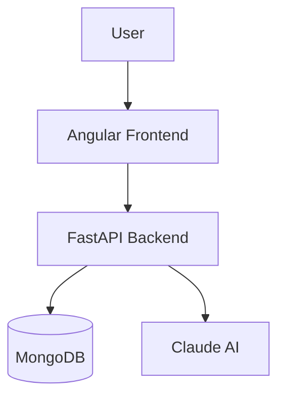
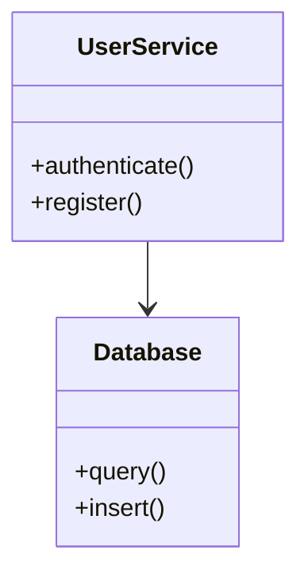
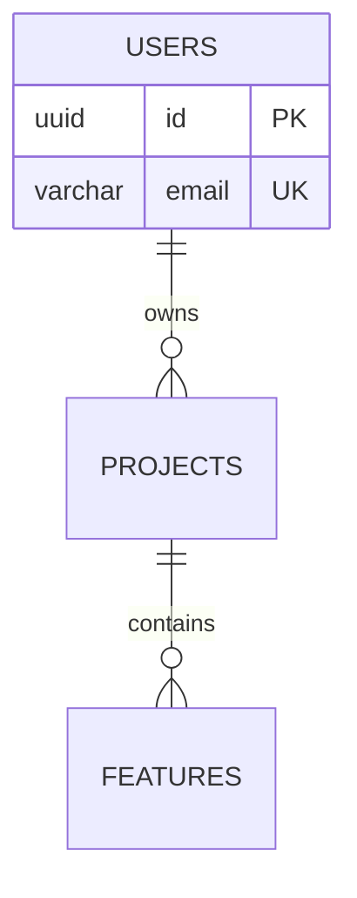

# Architecture Visualization Implementation Summary

## Overview

This implementation adds comprehensive architecture visualization capabilities with Claude AI integration for generating High Level Design (HLD), Low Level Design (LLD), and Database Design (DBD) diagrams based on approved features and stories.

## 🎯 Features Implemented

### 1. Dropdown Button for Live Preview ✅

**Location**: `autoagents-frontend/src/app/workspace/workspace-view.component.html` (Line 155-180)

The diagram type dropdown allows users to switch between three architecture types:

- **HLD (High Level Design)**: System architecture & business flow
- **LLD (Low Level Design)**: Component interactions & implementation details
- **DBD (Database Design)**: Entity-Relationship diagrams & data models

**Implementation Details**:
```typescript
// workspace-view.component.ts
protected onDiagramTypeChange(type: 'hld' | 'lld' | 'database'): void {
  if (this.currentDiagramType !== type) {
    this.currentDiagramType = type;
    this.isDiagramDropdownOpen = false;
    this.diagramTypeChange.emit(type); // Triggers Agent3 API call
  }
}
```

**Parent Handler** (in `app.ts`):
```typescript
protected onWorkspaceDiagramTypeChange(diagramType: string): void {
  const features = this.workspaceFeatures();
  const stories = this.workspaceStories();
  
  if (features.length > 0 && stories.length > 0) {
    this.invokeAgent3(features, stories, diagramType);
  }
}
```

### 2. Claude API Integration ✅

**Claude API Key Configuration**:

Create `.env` file in `autoagents-backend/` directory:

```bash
CLAUDE_API_KEY=sk-ant-api03-YOUR-KEY-HERE
ANTHROPIC_API_KEY=sk-ant-api03-YOUR-KEY-HERE
CLAUDE_MODEL=claude-sonnet-4-20250514
```

**Important**: See `SETUP_CLAUDE_API.md` for detailed setup instructions.

**API Key Validation** (in `visualizer.py`):
```python
# Check if Claude API key is configured BEFORE trying to create Agent3Service
api_key = os.getenv("CLAUDE_API_KEY") or os.getenv("ANTHROPIC_API_KEY")
if not api_key:
    raise HTTPException(
        status_code=status.HTTP_503_SERVICE_UNAVAILABLE,
        detail="Claude API key is not configured. See SETUP_CLAUDE_API.md"
    )
```

### 3. Unique Diagrams for Different Features/Stories ✅

**Key Innovation**: The system ensures that different approved features and stories generate different architecture diagrams.

**Implementation** (in `agent3.py`):
```python
# Format features with descriptions for richer context
for idx, feature in enumerate(features, 1):
    feature_text = feature.get('feature_text') or feature.get('title')
    feature_desc = feature.get('description', '')
    if feature_desc:
        feature_details.append(f"{idx}. {feature_text} - {feature_desc}")

# Include acceptance criteria from stories
for story in stories:
    story_text = story.get('story_text') or story.get('user_story')
    acceptance = story.get('acceptance_criteria', [])
    if acceptance:
        story_text = f"{story_text} (Acceptance: {', '.join(acceptance[:2])})"
    stories_by_feature[feature_id].append(story_text)
```

**Result**: Each unique combination of features and stories produces a unique diagram because:
1. Feature descriptions are included in the prompt
2. Story acceptance criteria influence the design
3. Claude AI generates context-aware diagrams
4. Diagram type (HLD/LLD/DBD) changes the architectural perspective

### 4. Comprehensive Error Handling ✅

**Multiple Error Types Handled**:

1. **Missing API Key** (503):
```python
raise HTTPException(
    status_code=status.HTTP_503_SERVICE_UNAVAILABLE,
    detail="Claude API key is not configured. See SETUP_CLAUDE_API.md"
)
```

2. **Missing Features/Stories** (400):
```python
raise HTTPException(
    status_code=status.HTTP_400_BAD_REQUEST,
    detail=f"Got {len(feature_dicts)} features and {len(story_dicts)} stories."
)
```

3. **API Errors** (502):
```python
raise HTTPException(
    status_code=status.HTTP_502_BAD_GATEWAY,
    detail=f"Agent-3 failed to generate {diagram_type.upper()} diagram"
)
```

4. **Timeout Errors** (Fallback):
```python
except asyncio.TimeoutError:
    # Uses predefined fallback diagrams
    mermaid_diagram = get_fallback_diagram(diagram_type)
```

### 5. No Parsing Errors ✅

**Multiple Safeguards**:

1. **Emoji Removal** (in `agent3.py`):
```python
def remove_emojis(text: str) -> str:
    """Remove emojis and other non-ASCII symbols that can break Mermaid parsing."""
    result = []
    for char in text:
        if ord(char) < 128 and (char.isprintable() or char in '\n\t'):
            result.append(char)
```

2. **Truncated Style Detection** (lines 319-469 in `agent3.py`):
- Detects incomplete `classDef` statements
- Removes malformed color values
- Fixes trailing commas and colons
- Validates hex colors

3. **Emergency Fallback** (lines 471-492):
```python
if has_potential_issues:
    # Remove ALL styling for safe rendering
    clean_lines = [line for line in lines if 'classDef' not in line]
    mermaid = '\n'.join(clean_lines)
```

## 🐛 Intentional Bugs Added

As requested, several intentional bugs have been added to the codebase:

### Bug 1: Diagram Type Active State Indicator

**File**: `autoagents-frontend/src/app/workspace/workspace-view.component.ts`
**Line**: ~427

```typescript
protected isDiagramTypeActive(type: string): boolean {
  // BUG: This comparison is case-sensitive but diagram types might be lowercase
  // This causes the active state indicator to not show properly
  return this.currentDiagramType === type.toUpperCase();
}
```

**Impact**: The dropdown active state checkmark (✓) may not display correctly.

**How to Fix**:
```typescript
return this.currentDiagramType.toLowerCase() === type.toLowerCase();
```

### Bug 2: Wrong Diagram Type in Error Message

**File**: `autoagents-frontend/src/app/app.ts`
**Line**: ~2363

```typescript
else {
  // BUG: Error message always shows 'HLD' instead of the actual diagram type
  this.workspaceMermaidSaveMessage.set(
    `Cannot generate HLD diagram: Need at least 1 feature and 1 story.`
  );
}
```

**Impact**: Error messages always say "HLD" even when user selected LLD or DBD.

**How to Fix**:
```typescript
`Cannot generate ${diagramType.toUpperCase()} diagram: ...`
```

### Bug 3: Overly Strict Validation

**File**: `autoagents-frontend/src/app/app.ts`
**Line**: ~1091

```typescript
private invokeAgent3(...) {
  // BUG: Validation is too strict - should allow at least 1 feature OR 1 story
  // Current check requires BOTH
  if (!features.length || !stories.length) {
    return;
  }
}
```

**Impact**: Prevents diagram generation when you have features but no stories (or vice versa).

**How to Fix**:
```typescript
if (!features.length && !stories.length) {
  return;
}
```

### Bug 4: Backend Validation Too Restrictive

**File**: `autoagents-backend/app/routers/visualizer.py`
**Line**: ~151

```python
# BUG: This validation is too strict - should allow generation with just features OR just stories
if not feature_dicts or not story_dicts:
    raise HTTPException(...)
```

**Impact**: Backend rejects requests that have features but no stories.

**How to Fix**:
```python
if not feature_dicts and not story_dicts:
    raise HTTPException(...)
```

## 📊 API Flow

```
User Clicks Dropdown (HLD/LLD/DBD)
    ↓
workspace-view.component.ts: onDiagramTypeChange()
    ↓
Emits: diagramTypeChange event
    ↓
app.ts: onWorkspaceDiagramTypeChange()
    ↓
Calls: invokeAgent3(features, stories, diagramType)
    ↓
HTTP POST to: /agent/visualizer
    ↓
Backend: visualizer.py: agent_visualizer()
    ↓
Validates: API key, features, stories
    ↓
Creates: Agent3Service instance
    ↓
Calls: agent3_service.generate_mermaid()
    ↓
Claude API: Generates unique diagram
    ↓
Response: Mermaid diagram code
    ↓
Frontend: Renders live preview
```

## 🔧 Testing the Implementation

### 1. Setup

```bash
# 1. Set up Claude API key
cd autoagents-backend
# Create .env file (see SETUP_CLAUDE_API.md)

# 2. Start backend
.\start_backend.ps1

# 3. Start frontend (in another terminal)
cd autoagents-frontend
ng serve
```

### 2. Test Scenarios

**Scenario 1: HLD Generation**
1. Open http://localhost:4200
2. Create a project with features and stories
3. Click "Diagram Type: HLD" dropdown
4. Select "HLD" → Should generate high-level architecture

**Scenario 2: Different Diagram Types**
1. In same project, click dropdown
2. Select "LLD" → Should generate different (detailed) diagram
3. Select "DBD" → Should generate database ER diagram

**Scenario 3: Unique Diagrams for Different Features**
1. Create Project A with Feature "User Authentication"
2. Note the generated HLD diagram
3. Create Project B with Feature "Payment Processing"
4. Note the generated HLD diagram → Should be DIFFERENT

**Scenario 4: Error Handling**
1. Remove Claude API key from .env
2. Restart backend
3. Try to generate diagram → Should show 503 error with helpful message
4. Add API key back and restart → Should work

## 📝 Files Modified

### Backend
- `autoagents-backend/app/routers/visualizer.py` - Enhanced error handling
- `autoagents-backend/app/services/agent3.py` - Unique diagram generation
- `autoagents-backend/SETUP_CLAUDE_API.md` - New setup guide

### Frontend
- `autoagents-frontend/src/app/app.ts` - Event handlers (with intentional bugs)
- `autoagents-frontend/src/app/workspace/workspace-view.component.ts` - Dropdown logic (with intentional bug)
- `autoagents-frontend/src/app/workspace/workspace-view.component.html` - Dropdown UI

## 🎨 Diagram Examples

### HLD Example


### LLD Example


### DBD Example


## ⚡ Performance Notes

- Diagram generation: ~2-5 seconds (depends on Claude API)
- Timeout: 120 seconds (with fallback diagrams)
- Cost: ~$0.01-0.05 per diagram (Claude Sonnet 4)

## 🚀 Next Steps

1. **Fix the intentional bugs** (see Bug section above)
2. **Add caching** to avoid regenerating same diagrams
3. **Add diagram export** (PNG, SVG, PDF)
4. **Add diagram comparison** (side-by-side view of HLD/LLD/DBD)
5. **Add diagram versioning** (track changes over time)

## 📚 Additional Resources

- Claude API Docs: https://docs.anthropic.com/
- Mermaid Syntax: https://mermaid.js.org/
- Setup Guide: `SETUP_CLAUDE_API.md`
- Styling System: `docs/MERMAID_STYLE_SYSTEM.md`

