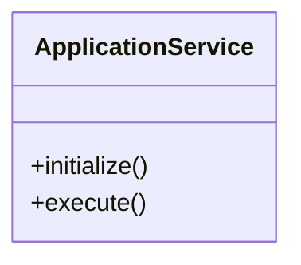
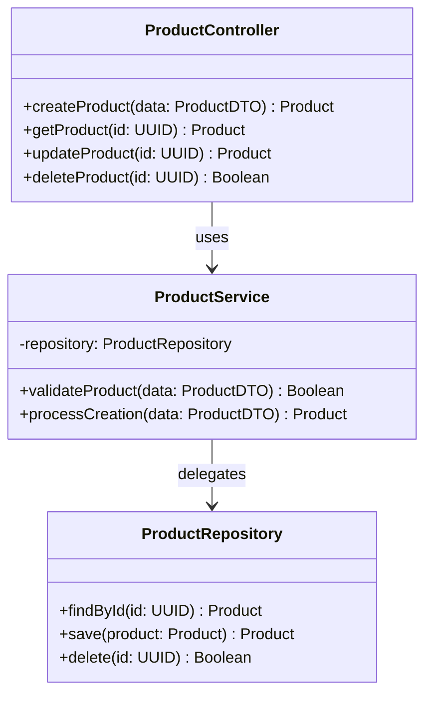

# Before vs After - Visual Comparison

## 🔴 BEFORE (Broken)

### What Happened:
```
User clicks "LLD"
    ↓
Frontend calls backend API
    ↓
Backend generates AI diagram ✨
    ↓
Frontend receives AI diagram
    ↓
❌ Frontend IGNORES it!
    ↓
Frontend uses local template instead
    ↓
User sees: "ApplicationService" 😞
```

### Code (Broken):
```typescript
// In app.ts - OLD CODE
if (diagramType === 'lld' || diagramType === 'database') {
  // ALWAYS use local builders - IGNORING backend!
  const root = buildLLD(context, storyTexts, featureTitles);
  mermaidContent = emitLLD(root);
}
```

### Result:

**Problem:** Generic, not project-specific! 😞

---

## 🟢 AFTER (Fixed)

### What Happens:
```
User clicks "LLD"
    ↓
Frontend calls backend API
    ↓
Backend generates AI diagram ✨
    ↓
Frontend receives AI diagram
    ↓
✅ Frontend USES AI diagram!
    ↓
User sees: "ProductController", "OrderService" 🎉
```

### Code (Fixed):
```typescript
// In app.ts - NEW CODE
const backendDiagram = response.diagrams?.mermaid ?? '';

if (backendDiagram && backendDiagram.trim()) {
  // ✅ Use AI-generated diagram from backend
  console.debug(`Using AI-generated ${diagramType} from backend`);
  mermaidContent = backendDiagram;
} else {
  // Only fall back if backend returns empty
  const root = buildLLD(context, storyTexts, featureTitles);
  mermaidContent = emitLLD(root);
}
```

### Result:

**Success:** Project-specific classes! 🎉

---

## 📊 Side-by-Side Comparison

### LLD Diagram

| Before (Generic) | After (Project-Specific) |
|------------------|--------------------------|
| ApplicationService | ProductController |
| +initialize() | +createProduct() |
| +execute() | +updateProduct() |
| | OrderService |
| | CartRepository |
| | Payment model |

### DBD Diagram

| Before (Generic) | After (Project-Specific) |
|------------------|--------------------------|
| APPLICATION_DATA | USER |
| - id | PRODUCT |
| - name | ORDER |
| - value | ORDER_ITEM |
| | CART |
| | PAYMENT |

---

## 🎯 The Difference

### BEFORE:
- ❌ Always used local templates
- ❌ Ignored AI-generated diagrams
- ❌ Generic "ApplicationService"
- ❌ Not project-specific

### AFTER:
- ✅ Uses AI-generated diagrams
- ✅ Project-specific classes/tables
- ✅ Context-aware architecture
- ✅ Falls back only if needed

---

## 💡 Example: E-Commerce Project

### User Input:
```
"Build an e-commerce platform with products, shopping cart, 
checkout, and user authentication"
```

### LLD Before (Generic):
```
- ApplicationService
- execute()
```

### LLD After (Specific):
```
- ProductController
- CartController
- CheckoutController
- AuthController
- ProductService
- CartService
- OrderService
- UserService
- ProductRepository
- OrderRepository
- UserRepository
- Product model
- Order model
- Cart model
- User model
```

### DBD Before (Generic):
```
APPLICATION_DATA
- id
- value
```

### DBD After (Specific):
```
USER
- uuid id PK
- varchar email UK
- varchar password_hash
- timestamp created_at

PRODUCT
- uuid id PK
- varchar name
- text description
- float price
- int stock
- uuid category_id FK

ORDER
- uuid id PK
- uuid user_id FK
- float total_amount
- varchar status
- timestamp created_at

CART
- uuid id PK
- uuid user_id FK
- timestamp created_at

CART_ITEM
- uuid id PK
- uuid cart_id FK
- uuid product_id FK
- int quantity
- float price_at_add

ORDER_ITEM
- uuid id PK
- uuid order_id FK
- uuid product_id FK
- int quantity
- float unit_price
```

---

## 🚀 Now Test It!

1. Start your servers
2. Create a project (any domain)
3. Click "LLD" and "DBD"
4. See the difference! 🎉

Your diagrams will now be **AI-generated and project-specific**!

