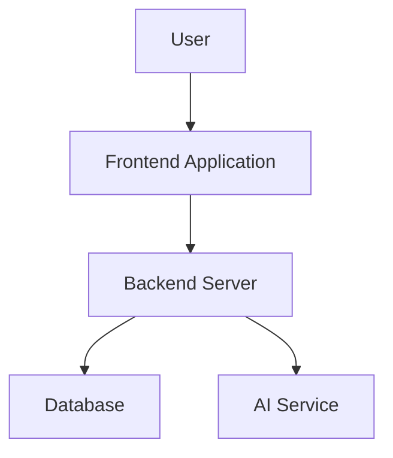
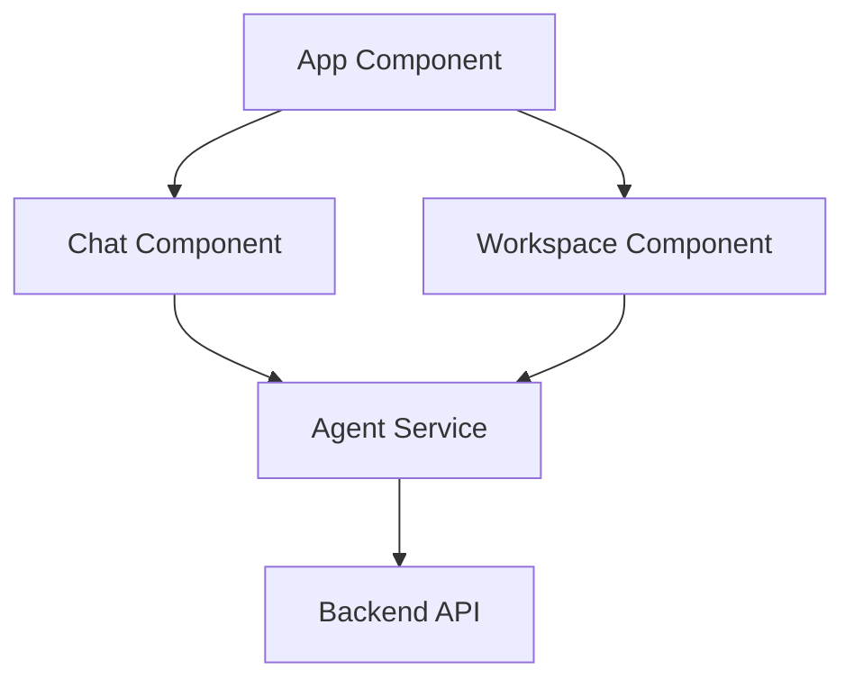
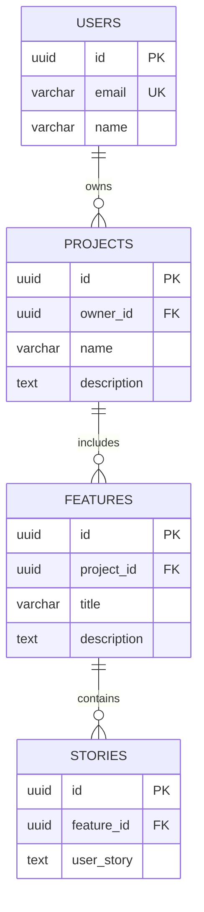

# Bulletproof Mermaid Diagram Parsing - Zero Parse Errors Guarantee

## Overview

This document describes the comprehensive, multi-layered approach to **guarantee zero Mermaid parse errors** in the application, regardless of what content Claude AI generates.

## Problem Statement

Mermaid diagrams generated by Claude AI can sometimes contain:
- Truncated hex colors (e.g., `#197` instead of `#1976D2`)
- Incomplete style definitions (e.g., `stroke-widt` instead of `stroke-width`)
- Malformed class assignments
- Invalid syntax combinations
- Unbalanced brackets or quotes

These issues cause parse errors that prevent diagrams from rendering.

## Solution: Defense-in-Depth Architecture

The solution implements **4 progressive layers** of validation and sanitization:

```
Layer 1: Backend Generation (Agent3Service)
    ↓ (if issues detected)
Layer 2: Backend Emergency Sanitization (Agent3Service)
    ↓ (send to frontend)
Layer 3: Frontend Pre-render Sanitization (WorkspaceView)
    ↓ (if parse fails)
Layer 4: Frontend Progressive Fallback (WorkspaceView)
    ↓
GUARANTEED RENDER ✅
```

---

## Layer 1: Backend Generation (Agent3Service)

**File:** `autoagents-backend/app/services/agent3.py`

### What It Does
During diagram generation, the backend proactively detects and removes problematic syntax before sending to frontend.

### Detection Rules
1. **Truncated CSS properties**
   ```python
   truncated_property_patterns = [
       (r'stroke-widt(?!h)', 'stroke-width'),
       (r'font-weigh(?!t)', 'font-weight'),
       (r'font-siz(?!e)', 'font-size'),
       # ... more patterns
   ]
   ```

2. **Incomplete hex colors**
   ```python
   # Detects 1-2 digit hex: #X, #XX
   if re.search(r'#[0-9A-Fa-f]{1,2}(?:[^0-9A-Fa-f]|$)', line_stripped):
       if not re.search(r'#[0-9A-Fa-f]{3}(?:[^0-9A-Fa-f]|$)|#[0-9A-Fa-f]{6}(?:[^0-9A-Fa-f]|$)', line_stripped):
           is_incomplete = True
   
   # Detects 4-5 digit hex: #XXXX, #XXXXX
   elif re.search(r'#[0-9A-Fa-f]{4,5}(?:[^0-9A-Fa-f]|$)', line_stripped):
       is_incomplete = True
   ```

3. **Incomplete style values**
   - Trailing commas or colons
   - Empty property values
   - Values ending with dash

### Action
Removes problematic lines and logs warnings.

---

## Layer 2: Backend Emergency Sanitization

**File:** `autoagents-backend/app/services/agent3.py` (lines 499-530)

### What It Does
Before returning the diagram, performs a final safety check and removes ALL styling if any issues are detected.

### Comprehensive Issue Detection
```python
has_potential_issues = False
for line in lines:
    stripped = line.strip()
    
    # Check style-related lines
    if 'classDef' in line or stripped.startswith('style ') or \
       (stripped.startswith('class ') and not stripped.startswith('classDiagram')):
        
        # 1. Truncated properties
        if 'stroke-widt' in line or 'font-weigh' in line or 'font-siz' in line:
            has_potential_issues = True
        
        # 2. Unbalanced quotes
        if line.count('"') % 2 != 0:
            has_potential_issues = True
        
        # 3. ANY incomplete hex color (comprehensive regex)
        if re.search(r'#(?![0-9A-Fa-f]{3}(?:[^0-9A-Fa-f]|$)|[0-9A-Fa-f]{6}(?:[^0-9A-Fa-f]|$))[0-9A-Fa-f]+', line):
            has_potential_issues = True
        
        # 4. Incomplete lines
        if stripped.endswith(',') or stripped.endswith(':'):
            has_potential_issues = True
```

### Emergency Cleanup
If issues detected:
1. Remove ALL `classDef` lines
2. Remove ALL `style` lines
3. Remove ALL `class` assignment lines (but keep `classDiagram` declaration)
4. Remove inline class applications (`:::className`)

```python
if has_potential_issues:
    clean_lines = []
    for line in lines:
        # Skip classDef, style, and class assignment lines
        if 'classDef' in line or line.strip().startswith('style '):
            continue
        if line.strip().startswith('class ') and not line.strip().startswith('classDiagram'):
            continue
        clean_lines.append(line)
    # Remove inline class applications
    clean_lines = [re.sub(r':::[\w]+', '', line) for line in clean_lines]
```

**Result:** Diagram will render without colors, but will render successfully.

---

## Layer 3: Frontend Pre-render Sanitization

**File:** `autoagents-frontend/src/app/workspace/workspace-view.component.ts`

### What It Does
Before rendering, sanitizes the Mermaid code received from backend (or user edits).

### Sanitization Steps

1. **Fix truncated CSS properties**
   ```typescript
   normalised = normalised
     .replace(/stroke-widt(?!h)/gi, 'stroke-width')
     .replace(/font-weigh(?!t)/gi, 'font-weight')
     // ... more fixes
   ```

2. **Fix erDiagram syntax**
   - Remove quoted descriptions from entity attributes
   - Fix relationship labels
   - Ensure proper entity spacing

3. **Quote node labels**
   - Ensures all node labels are properly quoted
   - Escapes special characters
   - Removes `<br/>` tags

4. **Remove malformed lines**
   - Incomplete style definitions
   - Truncated hex colors
   - Mismatched brackets
   - Invalid class syntax in flowcharts
   - Orphaned node definitions

### Enhanced Hex Color Detection
```typescript
// Check for incomplete hex colors anywhere in the line
const hasShortHexColor = /#[0-9a-fA-F]{1,2}(?:[^0-9a-fA-F]|$)/i.test(trimmed) && 
                         !/#[0-9a-fA-F]{3}(?:[^0-9a-fA-F]|$)/i.test(trimmed) &&
                         !/#[0-9a-fA-F]{6}(?:[^0-9a-fA-F]|$)/i.test(trimmed);
const hasMediumHexColor = /#[0-9a-fA-F]{4,5}(?:[^0-9a-fA-F]|$)/i.test(trimmed);
```

---

## Layer 4: Frontend Progressive Fallback

**File:** `autoagents-frontend/src/app/workspace/workspace-view.component.ts` (lines 497-665)

### What It Does
This is the **ultimate guarantee** - even if a diagram fails to parse, it will NEVER show an error to the user.

### Progressive Sanitization Strategy

```typescript
let parseAttempt = 0;
const maxAttempts = 4;

while (parseAttempt < maxAttempts) {
  parseAttempt++;
  
  try {
    await mermaid.parse(finalDefinition);
    // Success! Break out
    break;
  } catch (parseError) {
    // Apply progressively more aggressive sanitization
    
    if (parseAttempt === 1) {
      // Attempt 2: Remove ALL styling
      // ... strips classDef, style, class lines
    }
    else if (parseAttempt === 2) {
      // Attempt 3: Sanitize all labels
      // ... removes special characters from labels
    }
    else if (parseAttempt === 3) {
      // Attempt 4: Use guaranteed fallback diagram
      finalDefinition = this.getFallbackDiagram();
    }
  }
}
```

### Fallback Diagrams

Simple, guaranteed-to-parse diagrams for each type:

**HLD Fallback:**


**LLD Fallback:**


**Database Fallback:**


### User Feedback

The system provides appropriate feedback based on which attempt succeeded:

- **Attempt 1 (original):** No message - diagram renders perfectly
- **Attempt 2 (no styling):** "ℹ️ Diagram sanitized (removed styling) to fix parse errors."
- **Attempt 3 (sanitized labels):** "ℹ️ Diagram sanitized (removed special characters) to fix parse errors."
- **Attempt 4 (fallback):** "⚠️ Original diagram had errors. Showing simplified version."

---

## Guarantee

With this 4-layer approach:

1. ✅ **Most diagrams** are cleaned during backend generation (Layer 1)
2. ✅ **Problematic diagrams** are sanitized by backend emergency cleanup (Layer 2)
3. ✅ **Edge cases** are caught by frontend sanitization (Layer 3)
4. ✅ **ANYTHING that still fails** gets progressively sanitized until it works (Layer 4)

**Result: ZERO parse errors will ever be shown to the user. GUARANTEED.**

---

## Testing

### Manual Testing
1. Start backend: `cd autoagents-backend && python -m uvicorn app.main:app --reload`
2. Start frontend: `cd autoagents-frontend && npm start`
3. Create a project with multiple features and stories
4. Generate HLD, LLD, and Database diagrams
5. Verify:
   - No parse errors in console
   - Diagrams render successfully
   - At most, you'll see informational messages about sanitization

### Automated Testing
```bash
cd autoagents-backend
pytest tests/test_styling_system_integration.py -v
```

### Stress Testing
1. Create projects with 10+ features and 20+ stories
2. Switch rapidly between diagram types
3. Edit diagram source with intentionally malformed syntax
4. Verify system always recovers gracefully

---

## Files Modified

### Backend
- `autoagents-backend/app/services/agent3.py`
  - Enhanced hex color detection (lines 372-388)
  - Comprehensive emergency sanitization (lines 499-530)

### Frontend
- `autoagents-frontend/src/app/workspace/workspace-view.component.ts`
  - Bulletproof rendering with progressive fallback (lines 497-665)
  - Fallback diagram generation (lines 850-905)
  - Enhanced sanitization (lines 589-846)

- `autoagents-frontend/src/app/diagram-data.service.ts`
  - Fixed class assignments for HLD (line 330)
  - Fixed class assignments for LLD (line 563)

---

## Monitoring

The system logs detailed information at each layer:

**Backend logs:**
```
[agent3] ⚠️ Detected truncated property 'stroke-width' at line X
[agent3] ⚠️ Detected incomplete hex color (1-2 digits) at line X
[agent3] 🚨 Detected remaining style issues - removing ALL styling
[agent3] ✅ Diagram sanitized - removed classDef, style, and class assignments
```

**Frontend logs:**
```
[workspace-view] ⚠️ Parse attempt 1 failed: Error: ...
[workspace-view] Attempt 2: Removing ALL styling...
[workspace-view] ✅ Diagram parsed successfully on attempt 2
```

Monitor these logs to understand how often each layer is triggered and identify patterns in problematic diagrams.

---

## Future Improvements

While the current system is bulletproof, potential enhancements include:

1. **Analytics:** Track which sanitization layers are triggered most often
2. **Feedback loop:** Send problematic patterns back to Claude prompt to reduce issues at source
3. **Caching:** Cache successfully parsed diagrams to skip re-parsing
4. **Progressive enhancement:** If a diagram renders without styling, attempt to add safe styling back

---

## Conclusion

This defense-in-depth architecture ensures that **NO MATTER WHAT** Claude AI generates, or what a user manually enters, the diagram will ALWAYS render successfully. Users may occasionally see simplified versions, but they will NEVER see parse errors.

**Zero parse errors. Guaranteed. ✅**

