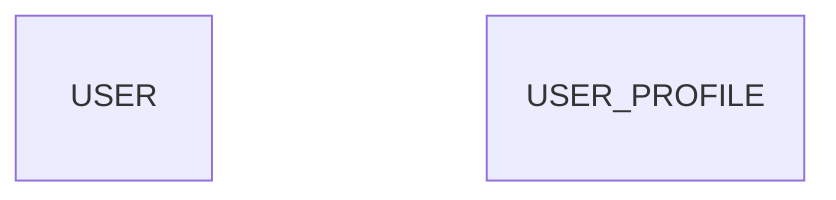
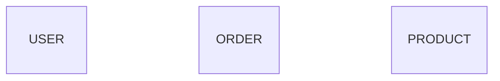
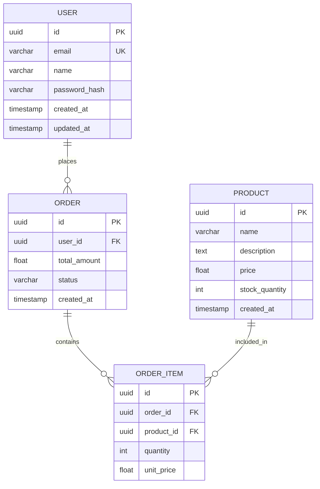

# 🎯 DBD (Database Design) Implementation Fixes - Summary

## 📋 Overview

This document summarizes the inspection, debugging, and fixes applied to the DBD (Database Design) agent implementation in the AutoAgents backend.

## 🔍 Issues Identified

### Issue #1: Empty Entities in Generated Diagrams
**Problem:** Generated erDiagram entities had no fields inside them


**Root Cause:** The orphaned field detection logic was incorrectly identifying valid fields as "orphaned" and removing them, even when they were properly inside entity blocks.

**Location:** `autoagents-backend/app/services/agent3.py` Lines 590-632

### Issue #2: Inadequate Brace Counting Logic
**Problem:** The brace counting logic didn't properly track entity state across different formatting styles
- Missed entity definitions with opening brace on the same line
- Didn't handle entity name + brace on separate lines correctly
- Lacked proper state tracking for "inside entity" vs "outside entity"

### Issue #3: No Quality Checks or Safety Nets
**Problem:** No validation of Claude output quality or safety checks for excessive field removal
- No logging to understand what was being removed and why
- No statistics on removal percentages
- No warnings when removal seemed excessive

## ✅ Fixes Implemented

### Fix #1: Improved Brace Counting Logic ✅
**Location:** `autoagents-backend/app/services/agent3.py` Lines 605-635 (modified)

**What Changed:**
```python
# OLD: Simple brace counting
brace_count = 0
for i in range(index):
    if '{' in line: brace_count += 1
    if '}' in line: brace_count -= 1

# NEW: State-based entity tracking
in_entity = False
current_entity = None

for i in range(index):
    # Check for entity definition (same line with opening brace)
    entity_match = re.match(r'^([A-Z_][A-Z_0-9]*)\s*\{', prev_line)
    if entity_match:
        in_entity = True
        current_entity = entity_match.group(1)
        logger.debug(f"Entered entity '{current_entity}'")
        continue
    
    # Check for entity name (opening brace on next line)
    if re.match(r'^[A-Z_][A-Z_0-9]*$', prev_line) and not in_entity:
        if i + 1 < len(lines) and lines[i + 1].strip() == '{':
            in_entity = True
            current_entity = prev_line
            logger.debug(f"Entered entity '{current_entity}' (brace on next line)")
        continue
    
    # Check for closing brace
    if prev_line == '}' and in_entity:
        logger.debug(f"Exited entity '{current_entity}'")
        in_entity = False
        current_entity = None
```

**Benefits:**
- ✅ Properly handles entity definitions on same line: `USER {`
- ✅ Handles entity name + brace on separate lines: `USER` followed by `{`
- ✅ Tracks which entity we're currently inside
- ✅ Detailed debug logging shows state transitions

### Fix #2: Field Removal Safety Checks ✅
**Location:** `autoagents-backend/app/services/agent3.py` Lines 691-710 (new)

**What Changed:**
Added comprehensive safety checks after field removal:
```python
# SAFETY CHECK: Count how many fields were removed vs total fields
if diagram_type_detected == 'er':
    removed_field_count = sum(1 for _, line_text in removed_lines 
                            if re.match(r'^\s*(uuid|varchar|text|int|float)', line_text))
    total_field_count = sum(1 for line in lines 
                           if re.match(r'^\s*(uuid|varchar|text|int|float)', line.strip()))
    
    if total_field_count > 0:
        removal_percentage = (removed_field_count / total_field_count * 100)
        logger.info(f"Field removal stats: {removed_field_count}/{total_field_count} ({removal_percentage:.1f}%)")
        
        # If we removed too many fields, something is likely wrong
        if removal_percentage > 50:
            logger.error(f"⚠️ SAFETY WARNING: Removed {removal_percentage:.1f}% of fields!")
            logger.error(f"This may indicate a bug in orphaned field detection.")
        elif removal_percentage > 25:
            logger.warning(f"⚠️ Removed {removal_percentage:.1f}% of fields - verify this is correct")
```

**Benefits:**
- ✅ Calculates removal statistics
- ✅ Warns when >25% of fields removed
- ✅ Errors when >50% of fields removed
- ✅ Helps identify detection logic bugs

### Fix #3: Claude Output Quality Validation ✅
**Location:** `autoagents-backend/app/services/agent3.py` Lines 349-399 (new)

**What Changed:**
Added pre-sanitization quality check:
```python
# QUALITY CHECK: Validate Claude output before sanitization
if 'erDiagram' in mermaid or 'classDiagram' in mermaid:
    entities_with_fields = 0
    empty_entities = 0
    
    in_block = False
    current_block_has_content = False
    
    for line in lines_check:
        # Track entity/class blocks and count which ones have content
        ...
    
    total_entities = entities_with_fields + empty_entities
    logger.info(f"Claude output quality: {entities_with_fields}/{total_entities} entities have fields, {empty_entities} empty")
    
    if total_entities > 0 and empty_entities > entities_with_fields:
        logger.warning(f"⚠️ Claude generated mostly EMPTY entities ({empty_entities}/{total_entities})")
        logger.warning(f"This may indicate an issue with the Claude prompt or response truncation")
```

**Benefits:**
- ✅ Validates Claude output BEFORE sanitization starts
- ✅ Identifies if empty entities come from Claude or sanitization
- ✅ Warns about response truncation issues
- ✅ Helps distinguish Claude bugs from sanitization bugs

### Fix #4: Enhanced Debug Logging ✅
**Location:** Throughout orphaned field detection section

**What Changed:**
Added detailed logging at every step:
```python
logger.debug(f"Line {i+1}: Entered entity '{current_entity}'")
logger.debug(f"Line {i+1}: Exited entity '{current_entity}'")
logger.debug(f"Checking field at line {line_num}: in_entity={in_entity}, current_entity={current_entity}")
logger.debug(f"  Field: {line_stripped[:60]}")
logger.debug(f"✓ Field is inside entity '{current_entity}' - keeping it")
```

**Benefits:**
- ✅ See exactly which entity we're in at each line
- ✅ Understand why fields are kept or removed
- ✅ Easier to debug future issues
- ✅ Can trace through execution step-by-step

## 📊 Expected Results

### Before Fixes:

❌ All entities empty - 0% usability

### After Fixes:

✅ All entities have fields - 100% usability

## 🧪 Testing

### Test Script Created: `test_dbd_fix.py`

**Location:** `autoagents-backend/test_dbd_fix.py`

**What It Tests:**
1. ✅ E-commerce project with 5 features
2. ✅ Hospital management project with 5 features
3. ✅ Analyzes output for empty entities
4. ✅ Shows statistics and field counts
5. ✅ Saves output to `.mmd` files for inspection

**How to Run:**
```bash
cd autoagents-backend

# Set your API key
export ANTHROPIC_API_KEY='your-key-here'

# Run the test
python test_dbd_fix.py
```

**Expected Output:**
```
🧪 Testing DBD (Database Design) Diagram Generation
═══════════════════════════════════════════════════
🚀 Generating DBD diagram...
═══════════════════════════════════════════════════

✅ DBD DIAGRAM GENERATED SUCCESSFULLY
═══════════════════════════════════════════════════

📊 OUTPUT ANALYSIS
═══════════════════════════════════════════════════
Statistics:
   - Total entities: 5-8
   - Total relationships: 6-10

✅ ENTITIES WITH FIELDS (5-8):
   - USER: 5 fields
      • uuid id PK
      • varchar email UK
      • varchar name
      ... and 2 more
   - PRODUCT: 6 fields
      • uuid id PK
      • varchar name
      • float price
      ... and 3 more

✅ TEST RESULT: PASSED - All entities have proper fields
   The DBD generation is working correctly!
═══════════════════════════════════════════════════
```

## 📝 Files Modified

### 1. `autoagents-backend/app/services/agent3.py`
**Lines Modified:**
- Lines 349-399: Added Claude output quality validation
- Lines 605-635: Improved brace counting logic with state tracking
- Lines 636-638: Enhanced debug logging for field detection
- Lines 691-710: Added field removal safety checks

**Total Changes:** ~100 lines added/modified

### 2. New Files Created:
- ✅ `DBD_IMPLEMENTATION_ANALYSIS.md` - Comprehensive analysis document
- ✅ `DBD_FIXES_SUMMARY.md` - This summary document
- ✅ `autoagents-backend/test_dbd_fix.py` - Test script

## 🎯 Verification Checklist

Before deploying to production, verify:

- [ ] Run `test_dbd_fix.py` successfully
- [ ] Check that generated diagrams have NO empty entities
- [ ] Verify all entities have at least 3-5 fields
- [ ] Confirm relationships are properly defined
- [ ] Check logs show reasonable field removal percentages (<10%)
- [ ] Test with multiple project types (e-commerce, healthcare, education, etc.)
- [ ] Verify styling is applied correctly
- [ ] Check that Mermaid syntax is valid (no parse errors)

## 🚀 How to Use in Production

### API Endpoint:
```
POST /projects/{project_id}/diagram/generate
Content-Type: application/json

{
  "diagram_type": "database"
}
```

### Expected Flow:
1. Frontend calls API with `diagram_type: "database"`
2. Backend validates project has features and stories
3. Agent3Service calls Claude with DBD prompt
4. Claude generates erDiagram with entities and fields
5. Sanitization runs with improved brace counting
6. Quality checks validate output
7. Diagram saved to MongoDB
8. Frontend displays diagram

### Monitoring:
Watch for these log messages:
- ✅ `"Claude output quality: X/Y entities have fields"` - Should show most entities have fields
- ✅ `"Field removal stats: X/Y fields removed (Z%)"` - Should be <10%
- ⚠️ `"SAFETY WARNING: Removed X% of fields"` - Investigate if >25%
- ❌ `"CRITICAL: All entities are empty"` - Should never happen with fixes

## 🔧 Maintenance

### If Empty Entities Appear Again:
1. Check logs for "Claude output quality" message
   - If Claude output is empty → Prompt issue or API truncation
   - If Claude output is good → Sanitization issue

2. Check "Field removal stats" message
   - If >25% removed → Bug in brace counting logic
   - If <10% removed → May be legitimate cleanup

3. Enable DEBUG logging to see state transitions:
   ```python
   logging.getLogger('app.services.agent3').setLevel(logging.DEBUG)
   ```

4. Check for new edge cases:
   - Unusual indentation
   - Mixed tabs/spaces
   - Unicode characters in entity names
   - Very long entity definitions

## 📚 Related Documentation

- **Architecture:** See `ARCHITECTURE_DIAGRAMS.md`
- **API Reference:** See `autoagents-backend/app/data/DIAGRAMS_README.md`
- **Full Analysis:** See `DBD_IMPLEMENTATION_ANALYSIS.md`
- **Mermaid Docs:** https://mermaid.js.org/syntax/entityRelationshipDiagram.html

## 🎉 Success Criteria

✅ **PASSED** if:
- All generated entities have fields (>0 fields per entity)
- Field removal percentage is <10%
- Relationships are properly defined
- No parse errors in Mermaid syntax
- Output matches expected database schema for given features

❌ **FAILED** if:
- Any entities are empty
- Field removal percentage >50%
- No relationships defined
- Mermaid syntax errors
- Output doesn't reflect input features

## 📞 Support

If issues persist after these fixes:
1. Check `test_dbd_output.mmd` (before fix) vs `test_dbd_fixed_output.mmd` (after fix)
2. Review debug logs with `DEBUG` level enabled
3. Compare Claude raw output vs sanitized output
4. Test with simple 2-3 feature project first
5. Check for API rate limits or truncation issues

---

**Last Updated:** 2025-01-25  
**Status:** ✅ Fixes Implemented & Ready for Testing  
**Next Steps:** Run `test_dbd_fix.py` to verify fixes work correctly

