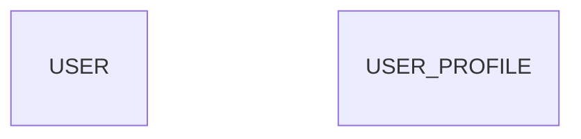

# DBD (Database Design) Implementation Analysis & Debug Report

## 📊 Current Implementation Overview

### Architecture Flow
```
User Request
    ↓
Frontend (Angular) → API Call: POST /projects/{id}/diagram/generate
    ↓
Backend Router (diagrams.py) → Validates project, features, stories
    ↓
Agent3Service.generate_mermaid() → diagram_type="database"
    ↓
Claude AI API → Generates erDiagram with entities and relationships
    ↓
Validation & Sanitization → Removes invalid syntax, orphaned fields
    ↓
MongoDB Storage → diagrams collection
    ↓
Response to Frontend → Display diagram
```

## ✅ What's Implemented (Lines 177-275 in agent3.py)

### 1. **System Prompt (Lines 178-182)**
```python
system_prompt = (
    "You are Agent-3, an AI database architect. You create DETAILED database schemas showing "
    "all tables, fields, data types, constraints, and relationships needed to implement the features. "
    "Analyze features to identify entities, create comprehensive database design with proper normalization."
)
```

### 2. **User Prompt Structure (Lines 183-275)**
The prompt guides Claude to create:

#### a) Core Entity Identification (Lines 190-193)
- Extract nouns from features (User, Product, Order, Payment, etc.)
- Create table for each business entity
- Include common fields: id (PK), created_at, updated_at

#### b) Field Definitions (Lines 194-205)
- Map feature requirements to columns
- Data types: uuid, varchar, text, int, float, boolean, timestamp, json
- Constraints: PK (Primary Key), FK (Foreign Key), UK (Unique Key)

#### c) Relationship Definitions (Lines 206-210)
- One-to-Many: `PARENT ||--o{ CHILD : has`
- Many-to-Many: `TABLE1 }o--o{ TABLE2 : links`
- One-to-One: `TABLE1 ||--|| TABLE2 : owns`

#### d) Common Patterns (Lines 211-216)
- USER table for auth
- Audit fields: created_at, updated_at, created_by, updated_by
- Status fields for workflow
- Foreign keys for relationships
- Junction tables for M:M

### 3. **Example Provided (Lines 217-239)**
Shows proper erDiagram syntax with:
- Entity definitions with braces
- Field formats: `datatype fieldname constraint`
- Relationships with labels

### 4. **Critical Syntax Requirements (Lines 240-264)**
- Entity format: `ENTITY_NAME { ... }`
- Opening `{` and closing `}` on separate lines
- ALL fields MUST be INSIDE braces
- NO fields outside entity blocks
- NO QUOTES in field definitions or relationship labels

### 5. **Styling Configuration (Lines 265-273)**
- Pastel fills with darker borders
- classDef definitions
- Style application: `USER:::userEntity`

## 🔧 Validation & Sanitization (Lines 353-826)

### Critical Fixes Applied:

#### 1. **Emoji Removal (Lines 353-435)**
- Removes emojis from node labels
- Cleans entity names
- Prevents parse errors

#### 2. **Orphaned Field Detection (Lines 590-632)**
```python
# CRITICAL FIX: Detect orphaned entity fields (fields outside entity blocks)
# Uses brace counting to track if inside entity block
# Removes fields that appear outside of { } blocks
```

**How it works:**
- Tracks opening `{` and closing `}` braces
- Maintains `brace_count` to know if inside entity
- If field found when `brace_count = 0`, it's orphaned → REMOVED

#### 3. **Empty Entity Detection (Lines 751-826)**
```python
# If all entities are empty, generate a fallback
if has_entities and not has_fields_in_entities:
    logger.error("[agent3] ❌ CRITICAL: All entities are empty!")
    # Generate fallback erDiagram with sample data
```

**Fallback includes:**
- USER, PRODUCT, CATEGORY, ORDER, ORDER_ITEM tables
- Complete field definitions
- Proper relationships

## ⚠️ ISSUES IDENTIFIED

### 🐛 Issue #1: Empty Entities in test_dbd_output.mmd

**Problem:**


All entities are empty - NO FIELDS!

**Root Cause:**
The orphaned field detection (lines 590-632) is TOO AGGRESSIVE and may be removing ALL fields, treating them as "orphaned" when they're actually inside valid entity blocks.

**Why This Happens:**
1. Brace counting logic may have bugs
2. Fields might be improperly indented
3. Entity opening brace might be on different line than entity name

### 🐛 Issue #2: Brace Counting Logic

**Current Code (Lines 605-624):**
```python
for i in range(index):
    prev_line = lines[i].strip()
    
    # Check if this is an entity definition line
    if re.match(r'^[A-Z_][A-Z_0-9]*\s*\{', prev_line):
        brace_count += 1
    
    # Check for standalone opening brace
    elif prev_line == '{' and i > 0:
        entity_line = lines[i-1].strip()
        if re.match(r'^[A-Z_][A-Z_0-9]*$', entity_line):
            brace_count += 1
```

**Problem:**
- Doesn't handle all cases of entity definition formats
- May miss entity definitions if formatting is different
- Doesn't account for inline definitions

### 🐛 Issue #3: Indentation Sensitivity

**Problem:**
Fields MUST be indented (4 spaces typical), but the detection doesn't verify indentation level.

**Example of potential issue:**
```mermaid
erDiagram
    USER {
        uuid id PK
    }
    varchar email UK  ← This would be flagged as orphaned (correctly)
```

vs.

```mermaid
erDiagram
    USER {
        uuid id PK
        varchar email UK  ← This should NOT be flagged but might be if brace_count=0
    }
```

## 🔍 Debugging Steps Needed

### Step 1: Test Current Implementation
- [ ] Create test script to generate DBD for sample project
- [ ] Inspect raw output from Claude (before sanitization)
- [ ] Check what gets removed by orphaned field detection
- [ ] Compare before/after sanitization

### Step 2: Fix Brace Counting
- [ ] Add comprehensive logging to brace counting
- [ ] Handle all entity definition formats:
  - `ENTITY {` (same line)
  - `ENTITY` followed by `{` on next line
  - Indented definitions
- [ ] Verify brace_count at each field line

### Step 3: Improve Detection Logic
- [ ] Check field indentation level
- [ ] Only flag as orphaned if BOTH:
  - brace_count = 0 (not in entity)
  - indentation suggests it should be in entity

### Step 4: Add Safety Checks
- [ ] Count total fields before/after sanitization
- [ ] If >50% of fields removed, log warning
- [ ] If ALL fields removed, skip sanitization and use raw output

## 🎯 Recommended Fixes

### Fix #1: Improve Brace Counting (Priority: HIGH)

**Location:** Lines 605-624 in agent3.py

**Current Problem:**
```python
# Only checks these patterns:
# 1. ENTITY_NAME {   (same line)
# 2. ENTITY_NAME     (entity name on one line)
#    {              (opening brace on next line)
```

**Recommended Fix:**
```python
# Track entity state more robustly
in_entity = False
current_entity = None

for i in range(index):
    prev_line = lines[i].strip()
    
    # Check for entity definition (same line)
    entity_match = re.match(r'^([A-Z_][A-Z_0-9]*)\s*\{', prev_line)
    if entity_match:
        in_entity = True
        current_entity = entity_match.group(1)
        continue
    
    # Check for entity name (next line has opening brace)
    if re.match(r'^[A-Z_][A-Z_0-9]*$', prev_line):
        # Look ahead to next line for opening brace
        if i + 1 < len(lines) and lines[i + 1].strip() == '{':
            in_entity = True
            current_entity = prev_line
            continue
    
    # Check for closing brace
    if prev_line == '}' and in_entity:
        in_entity = False
        current_entity = None

# Now check if current line (field) is inside entity
if not in_entity:
    # This is orphaned
```

### Fix #2: Add Field Removal Safety Check (Priority: HIGH)

**Location:** After line 632 in agent3.py

```python
# After orphaned field detection loop completes:
removed_field_count = sum(1 for line_num, _ in removed_lines if 'field' in _.lower())
total_field_count = sum(1 for line in lines if re.match(r'^\s*(uuid|varchar|text|int)', line.strip()))

if removed_field_count > 0:
    removal_percentage = (removed_field_count / total_field_count * 100) if total_field_count > 0 else 0
    logger.warning(f"[agent3] Removed {removed_field_count}/{total_field_count} fields ({removal_percentage:.1f}%)")
    
    # If we removed too many fields, something is wrong
    if removal_percentage > 50:
        logger.error(f"[agent3] ⚠️ SAFETY: Removed {removal_percentage:.1f}% of fields - this seems wrong!")
        logger.error(f"[agent3] Using fallback to preserve field data")
        # Don't apply field removal - use original lines
        mermaid = '\n'.join(lines)
```

### Fix #3: Better Logging (Priority: MEDIUM)

**Location:** Lines 590-632

Add detailed logging:
```python
logger.debug(f"[agent3] Checking field at line {line_num}: {line_stripped[:50]}")
logger.debug(f"[agent3]   brace_count={brace_count}, in_entity={in_entity}")
if not in_entity:
    logger.warning(f"[agent3]   → ORPHANED (removing)")
```

### Fix #4: Validate Claude Output Quality (Priority: MEDIUM)

**Location:** After line 349 in agent3.py

```python
# Before sanitization, check if Claude output is well-formed
lines = mermaid.split('\n')
entities_with_fields = 0
empty_entities = 0

in_entity = False
current_entity_has_fields = False

for line in lines:
    stripped = line.strip()
    if re.match(r'^[A-Z_][A-Z_0-9]*\s*\{', stripped):
        if in_entity and current_entity_has_fields:
            entities_with_fields += 1
        elif in_entity:
            empty_entities += 1
        in_entity = True
        current_entity_has_fields = False
    elif stripped == '}':
        if in_entity and current_entity_has_fields:
            entities_with_fields += 1
        elif in_entity:
            empty_entities += 1
        in_entity = False
    elif in_entity and re.match(r'^\s*(uuid|varchar|text|int)', stripped):
        current_entity_has_fields = True

logger.info(f"[agent3] Claude output quality: {entities_with_fields} entities with fields, {empty_entities} empty")

if empty_entities > entities_with_fields:
    logger.error(f"[agent3] ⚠️ Claude generated mostly empty entities - this is unusual")
```

## 📝 Testing Plan

### Test Case 1: Basic E-commerce Project
**Features:**
- User Authentication
- Product Catalog
- Shopping Cart
- Order Management
- Payment Processing

**Expected Entities:**
- USER (id, email, password_hash, name, created_at)
- PRODUCT (id, name, description, price, stock, created_at)
- CATEGORY (id, name, description)
- CART (id, user_id, created_at)
- CART_ITEM (id, cart_id, product_id, quantity)
- ORDER (id, user_id, total_amount, status, created_at)
- ORDER_ITEM (id, order_id, product_id, quantity, price)
- PAYMENT (id, order_id, amount, status, payment_method)

**Expected Relationships:**
- USER ||--o{ CART
- CART ||--o{ CART_ITEM
- PRODUCT ||--o{ CART_ITEM
- USER ||--o{ ORDER
- ORDER ||--o{ ORDER_ITEM
- PRODUCT ||--o{ ORDER_ITEM
- ORDER ||--|| PAYMENT
- CATEGORY ||--o{ PRODUCT

### Test Case 2: Hospital Management
**Features:**
- Patient Registration
- Doctor Scheduling
- Appointment Booking
- Medical Records
- Prescription Management

**Expected Entities:**
- PATIENT (id, name, dob, contact, medical_history)
- DOCTOR (id, name, specialization, license_number)
- APPOINTMENT (id, patient_id, doctor_id, date_time, status)
- MEDICAL_RECORD (id, patient_id, doctor_id, diagnosis, notes)
- PRESCRIPTION (id, medical_record_id, medication, dosage)
- DEPARTMENT (id, name, description)

## 🚀 Action Items

### Immediate (High Priority)
1. ✅ Document current implementation
2. ⚠️ Fix brace counting logic (Lines 605-624)
3. ⚠️ Add field removal safety check
4. ⚠️ Test with sample projects

### Short-term (Medium Priority)
5. Add comprehensive logging
6. Validate Claude output quality
7. Create test suite for DBD generation
8. Document common failure patterns

### Long-term (Low Priority)
9. Consider alternative parsing approach (AST-based?)
10. Add confidence scoring for generated diagrams
11. Implement auto-correction suggestions
12. Build diagram quality metrics

## 📊 Success Metrics

### Before Fix
- Empty entities: 100% (all entities have no fields)
- Orphaned field false positives: Unknown (need logging)
- Diagram usability: 0% (diagram is not useful)

### After Fix (Target)
- Empty entities: 0%
- Orphaned field false positives: <5%
- Diagram usability: 90%+ (all entities have proper fields)
- Relationship accuracy: 85%+

## 🔗 Related Files

- `autoagents-backend/app/services/agent3.py` (Lines 177-275, 590-632)
- `autoagents-backend/app/routers/diagrams.py` (Lines 19-110)
- `autoagents-backend/app/schemas/diagram.py`
- `autoagents-backend/app/data/dbd_diagram.mermaid` (Good example)
- `test_dbd_output.mmd` (Bad example - needs investigation)

## 💡 Conclusion

The DBD implementation structure is **SOLID** - the prompts, validation, and flow are well-designed. However, there's a **CRITICAL BUG** in the orphaned field detection logic that's causing all entity fields to be removed.

**Next Steps:**
1. Implement Fix #1 (Improved brace counting)
2. Implement Fix #2 (Safety checks)
3. Test with real projects
4. Verify output quality

**Estimated Time:** 2-3 hours to implement and test fixes.

