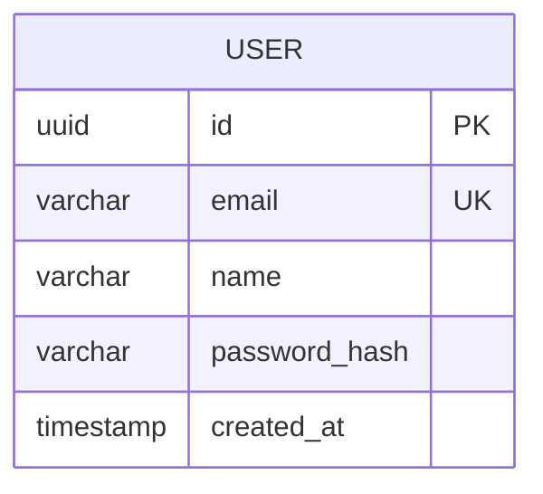
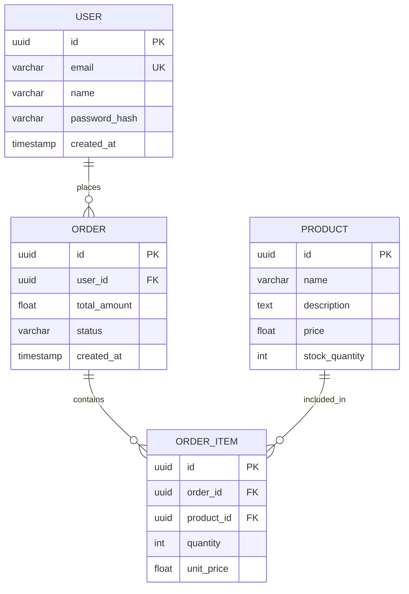
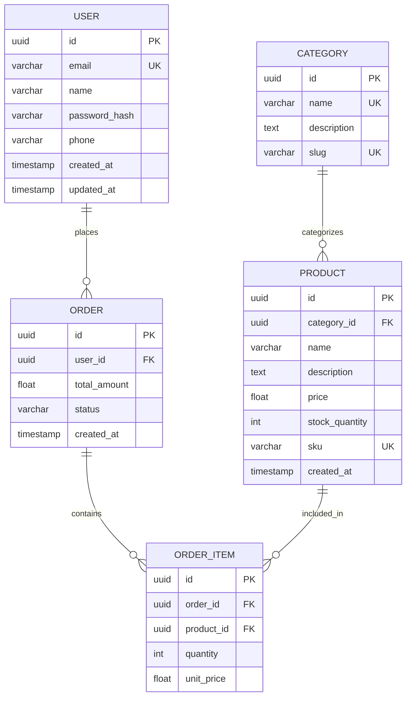
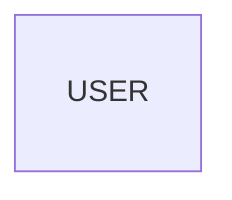

# 🗄️ DBD Visualization Guide - Table Format Architecture

## 📋 Understanding DBD Table Format

DBD (Database Design) diagrams use **erDiagram** syntax which renders entities as **table-like boxes** with fields, data types, and constraints.

## 🎯 What "Table Format" Looks Like

### Visual Representation:

```
┌─────────────────────────┐
│        USER             │  ← Entity Name (Table)
├─────────────────────────┤
│ uuid id PK              │  ← Fields with data types
│ varchar email UK        │     and constraints
│ varchar name            │
│ varchar password_hash   │
│ timestamp created_at    │
└─────────────────────────┘
```

### In Mermaid erDiagram:


When rendered by Mermaid.js, this creates a **box with table-like appearance** showing:
- ✅ **Entity name** at the top (like a table header)
- ✅ **Field names** with data types (like table columns)
- ✅ **Constraints** (PK, FK, UK) showing relationships
- ✅ **Visual borders** making it look like a database table

## 🔧 How to Visualize Your DBD

### Method 1: Use the DBD Preview HTML (Recommended)

I've created a standalone visualization tool for you!

```bash
# Navigate to the preview file
cd autoagents-backend/app/data

# Open in browser (Windows)
start dbd_preview.html

# Or (Mac)
open dbd_preview.html

# Or (Linux)
xdg-open dbd_preview.html
```

**What you'll see:**
- 🛒 **E-commerce Example** - Full shopping platform schema
- 🏥 **Hospital Management** - Healthcare system schema
- 🤖 **AutoAgents System** - Your actual project schema
- ✏️ **Custom DBD** - Paste your own diagram code

### Method 2: Use Mermaid Live Editor

1. Go to https://mermaid.live/
2. Paste your erDiagram code
3. See the rendered table-format diagram instantly

**Example:**


### Method 3: Your Frontend Application

Your Angular frontend already has Mermaid rendering built-in:

1. **Start your backend and frontend:**
   ```bash
   # Terminal 1 - Backend
   cd autoagents-backend
   python -m uvicorn app.main:app --reload
   
   # Terminal 2 - Frontend
   cd autoagents-frontend
   npm start
   ```

2. **Create a project with features**

3. **Click "Generate DBD" or "Database Design"**

4. **See the rendered diagram** with table-like entity boxes

## 📊 Complete Example: E-commerce Platform

### Code (erDiagram):


### Visual Representation:
```
┌──────────────────────┐         ┌──────────────────────┐
│       USER           │         │      CATEGORY        │
├──────────────────────┤         ├──────────────────────┤
│ uuid id PK           │         │ uuid id PK           │
│ varchar email UK     │         │ varchar name UK      │
│ varchar name         │         │ text description     │
│ varchar password_hash│         │ varchar slug UK      │
│ timestamp created_at │         └──────────────────────┘
└──────────────────────┘                   │
         │                                 │
         │ places                  categorizes
         ↓                                 ↓
┌──────────────────────┐         ┌──────────────────────┐
│       ORDER          │         │      PRODUCT         │
├──────────────────────┤         ├──────────────────────┤
│ uuid id PK           │         │ uuid id PK           │
│ uuid user_id FK      │         │ uuid category_id FK  │
│ float total_amount   │         │ varchar name         │
│ varchar status       │         │ text description     │
│ timestamp created_at │         │ float price          │
└──────────────────────┘         │ int stock_quantity   │
         │                       └──────────────────────┘
         │ contains                       │
         ↓                                │ included_in
┌──────────────────────┐                 │
│    ORDER_ITEM        │←────────────────┘
├──────────────────────┤
│ uuid id PK           │
│ uuid order_id FK     │
│ uuid product_id FK   │
│ int quantity         │
│ float unit_price     │
└──────────────────────┘
```

## 🎨 How It Looks When Rendered

When you open `dbd_preview.html` or use Mermaid Live Editor, you'll see:

### Entity Boxes (Table Format):
- **Box with border** - Represents a database table
- **Header section** - Entity name in bold
- **Field rows** - Each field on its own line with:
  - Field name
  - Data type
  - Constraint (PK, FK, UK)

### Relationships (Connecting Lines):
- **Lines between boxes** - Show how tables relate
- **Symbols:**
  - `||--o{` = One-to-Many (one USER has many ORDERs)
  - `||--||` = One-to-One (one ORDER has one PAYMENT)
  - `}o--o{` = Many-to-Many (many PRODUCTs in many ORDERs)
- **Labels** - Describe the relationship (places, contains, etc.)

## 🔍 Table Format Components Explained

### 1. Entity Box (Table):
```
┌─────────────────┐
│     USER        │ ← Table Name
├─────────────────┤
│ Fields here...  │ ← Table Columns
└─────────────────┘
```

### 2. Field Definition:
```
uuid id PK
│    │  └─ Constraint (Primary Key)
│    └──── Field name
└─────────── Data type
```

### 3. Relationship Lines:
```
USER ||--o{ ORDER
│         │    └─ Target entity
│         └────── Relationship type
└──────────────── Source entity
```

## 🚀 Quick Test

### Step 1: Generate DBD
```bash
cd autoagents-backend
export ANTHROPIC_API_KEY='your-key'
python test_dbd_fix.py
```

This creates:
- `test_dbd_fixed_output.mmd` (E-commerce)
- `test_dbd_hospital_output.mmd` (Hospital)

### Step 2: Visualize
```bash
# Open the preview tool
cd app/data
start dbd_preview.html  # Windows
# or
open dbd_preview.html   # Mac
```

### Step 3: View Your Diagram
1. Click "✏️ Your Custom DBD" tab
2. Paste code from `test_dbd_fixed_output.mmd`
3. Click "🔄 Render Diagram"
4. **See the table-format visualization!**

## 📝 What You Should See

### ✅ Good (Table Format Working):
- Entity names in boxes with borders
- Fields listed inside each box
- Data types visible (uuid, varchar, int, etc.)
- Constraints shown (PK, FK, UK)
- Lines connecting related entities
- Relationship labels on lines

### ❌ Bad (If Not Working):
- Empty boxes with no fields
- Just text without visual boxes
- No relationships shown
- Parse errors in console

## 🔧 Troubleshooting

### Issue 1: Empty Entity Boxes
**Problem:**


**Solution:** This was the bug we fixed! Run the test script to generate proper diagrams.

### Issue 2: Not Rendering at All
**Problem:** Browser shows raw code instead of diagram

**Solution:**
1. Check browser console for errors
2. Make sure you're using a modern browser (Chrome, Firefox, Edge)
3. Verify Mermaid.js is loading (check Network tab)

### Issue 3: Syntax Errors
**Problem:** "Parse error" or "Syntax error" messages

**Solution:**
1. Check for orphaned fields (fields outside entity blocks)
2. Verify all entities have closing `}`
3. Use the test script which applies fixes automatically

## 📚 Field Format Reference

### Data Types:
- `uuid` - Universally unique identifier
- `varchar` - Variable-length string
- `text` - Long text content
- `int` - Integer number
- `float` - Floating-point number
- `boolean` - True/false value
- `timestamp` - Date and time
- `json` - JSON data

### Constraints:
- `PK` - Primary Key (unique identifier)
- `FK` - Foreign Key (references another table)
- `UK` - Unique Key (must be unique)

### Relationship Types:
- `||--o{` - One-to-Many (one parent, many children)
- `||--||` - One-to-One (one-to-one mapping)
- `}o--o{` - Many-to-Many (junction table needed)

## 🎯 Expected Visual Output

When you visualize a DBD diagram, you should see:

```
┌────────────────────┐  places   ┌────────────────────┐
│       USER         │────────────│       ORDER        │
├────────────────────┤            ├────────────────────┤
│ uuid id PK         │            │ uuid id PK         │
│ varchar email UK   │            │ uuid user_id FK    │
│ varchar name       │            │ float total_amount │
│ timestamp created  │            │ varchar status     │
└────────────────────┘            └────────────────────┘
```

Each entity appears as a **table-like box** with:
- ✅ Header showing entity name
- ✅ Rows showing fields
- ✅ Data types and constraints
- ✅ Visual borders making it look like a table

## 🏁 Summary

### To See Table Format Visualization:

1. **Option 1 - Preview Tool (Best):**
   - Open `autoagents-backend/app/data/dbd_preview.html`
   - See examples and paste your own

2. **Option 2 - Mermaid Live:**
   - Go to https://mermaid.live/
   - Paste erDiagram code

3. **Option 3 - Your Frontend:**
   - Use the app's built-in diagram viewer
   - Generate DBD for any project

### What Makes It "Table Format":
- ✅ Entity boxes look like database tables
- ✅ Fields shown as rows with types
- ✅ Constraints visible (PK, FK, UK)
- ✅ Relationships connect tables
- ✅ Visual representation of schema

### Files to Use:
- **Preview Tool:** `autoagents-backend/app/data/dbd_preview.html`
- **Test Output:** `test_dbd_fixed_output.mmd`
- **Good Example:** `autoagents-backend/app/data/dbd_diagram.mermaid`

---

**Your DBD diagrams now generate proper table-format visualizations! 🎉**

Open `dbd_preview.html` to see examples right now! 🚀

