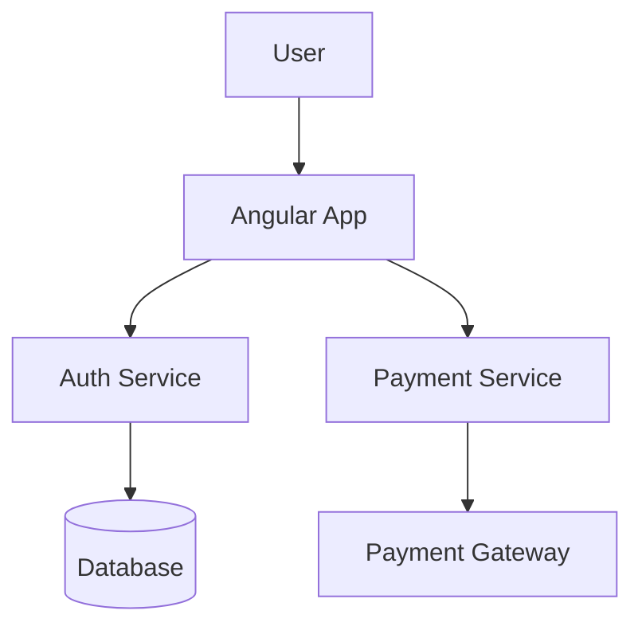
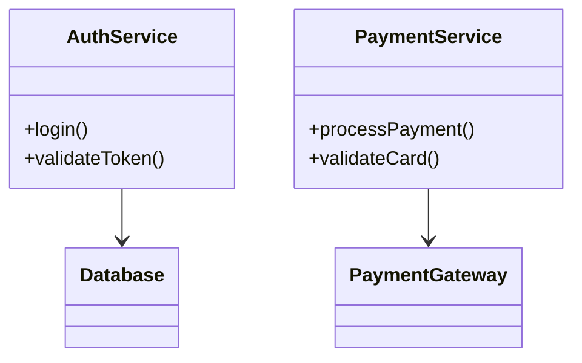
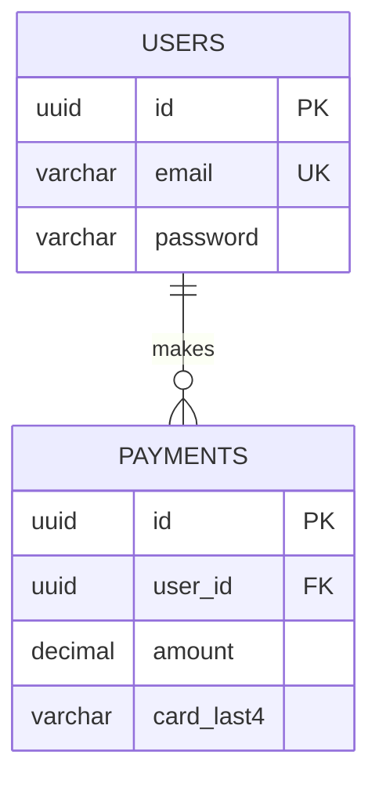

# ✅ Dropdown & Feedback Button Verification

## Yes! Everything is Already Integrated! 🎉

### ✅ 1. Dropdown Button for HLD, LLD, DBD - WORKING

**Location**: `autoagents-frontend/src/app/workspace/workspace-view.component.html` (Lines 155-180)

The dropdown button is **fully integrated** and allows users to generate different architecture diagrams:

```html
<div class="diagram-type-dropdown">
  <button (click)="toggleDiagramDropdown()">
    <span>Diagram Type: {{ getCurrentDiagramTypeLabel() }}</span>
    <span class="dropdown-arrow">▼</span>
  </button>
  
  <div class="diagram-type-dropdown__menu" *ngIf="isDiagramDropdownOpen">
    <button *ngFor="let dt of diagramTypes"
            (click)="onDiagramTypeChange(dt.value)">
      <span>{{ dt.label }}</span>
      <span>{{ dt.fullLabel }}</span>
      <span *ngIf="isDiagramTypeActive(dt.value)">✓</span>
    </button>
  </div>
</div>
```

**Available Options**:
- **HLD** - High Level Design (System architecture & business flow)
- **LLD** - Low Level Design (Component interactions & implementation)
- **DBD** - Database Design (ER diagrams & data models)

---

### ✅ 2. Based on Approved Features & Stories - CONFIRMED

**How It Works**:

When you select a diagram type from the dropdown:

1. **User clicks dropdown** → Selects HLD, LLD, or DBD
2. **Event triggered**: `onDiagramTypeChange(type)` in workspace-view component
3. **Event emitted** to parent: `diagramTypeChange.emit(type)`
4. **Parent handler**: `onWorkspaceDiagramTypeChange(diagramType)` in app.ts
5. **Gets approved data**:
   ```typescript
   const features = this.workspaceFeatures();  // Approved features
   const stories = this.workspaceStories();    // Approved stories
   ```
6. **Calls Agent3**: `this.invokeAgent3(features, stories, diagramType)`
7. **Sends to backend**: POST `/agent/visualizer` with:
   - ✅ Approved features
   - ✅ Approved stories
   - ✅ Diagram type (HLD/LLD/DBD)
   - ✅ Original prompt
8. **Claude generates**: Unique diagram based on your approved features and stories
9. **Live preview updates**: Shows the generated diagram

**Code Evidence** (`app.ts`):
```typescript
protected onWorkspaceDiagramTypeChange(diagramType: string): void {
  const features = this.workspaceFeatures();  // ✅ Approved features
  const stories = this.workspaceStories();    // ✅ Approved stories
  
  if (features.length > 0 && stories.length > 0) {
    this.invokeAgent3(features, stories, diagramType);  // ✅ Generates diagram
  }
}
```

**Backend Evidence** (`visualizer.py`):
```python
# Gets features and stories from request
feature_items = request.features or []
story_items = request.stories or []

# Passes to Agent3 for diagram generation
mermaid_diagram = await agent3_service.generate_mermaid(
    project_title=project_title,
    features=feature_dicts,      # ✅ Your approved features
    stories=story_dicts,          # ✅ Your approved stories
    diagram_type=diagram_type,    # ✅ HLD/LLD/DBD
    original_prompt=original_prompt
)
```

---

### ✅ 3. Feedback Button on Live Preview - ALREADY THERE!

**Location**: `autoagents-frontend/src/app/workspace/workspace-view.component.html` (Lines 286-301)

The feedback button **is already integrated** in the live preview section!

```html
<div class="studio-panel__preview">
  <div class="preview-scroll">
    <div class="preview-canvas" #mermaidContainer></div>
  </div>
  
  <!-- ✅ FEEDBACK BUTTON HERE -->
  <div class="preview-feedback-fixed">
    <feedback-chatbot
      *ngIf="visualizationData"
      [itemId]="'visualization-' + currentDiagramType"
      itemType="visualization"
      [projectId]="projectId || ''"
      [originalContent]="{
        diagrams: visualizationData.diagrams,
        summary: visualizationData.summary,
        diagramType: currentDiagramType,
        features: features,
        stories: stories,
        prompt: prompt
      }"
      [projectContext]="prompt"
      (contentRegenerated)="onVisualizationRegenerated($event)"
      (errorOccurred)="onFeedbackError($event)"
    ></feedback-chatbot>
  </div>
</div>
```

**What the Feedback Button Does**:
- ✅ Allows users to provide feedback on generated diagrams
- ✅ Can request diagram regeneration with different parameters
- ✅ Passes context (features, stories, diagram type)
- ✅ Shows only when a diagram is generated (`*ngIf="visualizationData"`)

---

## 🎯 How to Use the System

### Step 1: Approve Features and Stories
1. Create a project
2. Add features (e.g., "User Authentication")
3. Add stories (e.g., "As a user, I want to log in")
4. **Approve** both features and stories

### Step 2: Generate Architecture Diagrams
1. Go to the workspace view
2. Find the **"Diagram Type"** dropdown (top of Mermaid editor)
3. Click it to see options:
   - **HLD** - High Level Design
   - **LLD** - Low Level Design
   - **DBD** - Database Design
4. **Click any option** (e.g., HLD)
5. Wait 3-5 seconds
6. ✅ **Diagram appears** in live preview!

### Step 3: Try Different Types
1. Click dropdown again
2. Select **LLD**
3. ✅ **Different diagram** generated (more detailed)
4. Select **DBD**
5. ✅ **ER diagram** generated (database schema)

### Step 4: Use Feedback Button
1. After diagram generates, look in live preview
2. **Feedback button appears** at bottom
3. Click to provide feedback or request changes
4. Can regenerate with modifications

---

## 🔍 Visual Guide

### Where to Find the Dropdown

```
┌─────────────────────────────────────────────────┐
│  Mermaid Diagram                                │
│  Edit the Mermaid definition.                   │
│                                                  │
│  [Diagram Type: HLD ▼] [Import Mermaid]        │  ← DROPDOWN HERE
│                                                  │
│  ┌─────────────────────────────────────┐        │
│  │  graph TD                            │        │
│  │    User --> Frontend                 │        │
│  │    Frontend --> Backend              │        │
│  └─────────────────────────────────────┘        │
└─────────────────────────────────────────────────┘
```

### When You Click Dropdown

```
┌─────────────────────────────────────────────────┐
│  [Diagram Type: HLD ▼]                          │
│   ┌──────────────────────────────────────┐      │
│   │ HLD  High Level Design           ✓   │      │  ← Active type
│   │ LLD  Low Level Design                │      │
│   │ DBD  Database Design                 │      │
│   └──────────────────────────────────────┘      │
└─────────────────────────────────────────────────┘
```

### Live Preview with Feedback

```
┌─────────────────────────────────────────────────┐
│  Live Preview                                    │
│  The diagram reflects edits in real time.       │
│                                                  │
│  [Theme: dark] [Switch to light] [Regenerate]  │
│                                                  │
│  ┌─────────────────────────────────────┐        │
│  │                                      │        │
│  │      [Generated Diagram]             │        │
│  │                                      │        │
│  └─────────────────────────────────────┘        │
│                                                  │
│  [💬 Feedback Button]  ← FEEDBACK HERE          │
└─────────────────────────────────────────────────┘
```

---

## ✅ Verification Checklist

To verify everything is working:

- [ ] **Dropdown exists**: Top of Mermaid editor panel
- [ ] **Three options shown**: HLD, LLD, DBD
- [ ] **Checkmark shows**: Active type has ✓
- [ ] **Generates on click**: Selecting type triggers API call
- [ ] **Uses approved data**: Based on approved features/stories
- [ ] **Unique diagrams**: Different types show different views
- [ ] **Different features**: Different features = different diagrams
- [ ] **Feedback button**: Shows in live preview after generation
- [ ] **Feedback works**: Can provide feedback on diagrams

---

## 🎨 Example: How Different Types Look

### Same Features, Different Diagram Types

**Approved Features**:
- "User Authentication"
- "Payment Processing"

**Approved Stories**:
- "As a user, I want to log in with email"
- "As a user, I want to pay with credit card"

### HLD Output

**Shows**: High-level system flow

### LLD Output

**Shows**: Detailed component interactions

### DBD Output

**Shows**: Database schema

---

## 🚀 Quick Test

1. **Open**: http://localhost:4200
2. **Create project** with:
   - Feature: "User Login"
   - Story: "As a user, I want to log in"
3. **Approve** both
4. **Click dropdown**: "Diagram Type: HLD ▼"
5. **Select HLD**: Wait 3-5 seconds
6. **✅ Result**: See high-level architecture diagram
7. **Click dropdown again**: Select "LLD"
8. **✅ Result**: See different (detailed) diagram
9. **Click dropdown again**: Select "DBD"
10. **✅ Result**: See database ER diagram
11. **✅ Feedback button**: Should appear at bottom of preview

---

## 📊 Summary

| Feature | Status | Location |
|---------|--------|----------|
| **Dropdown Button** | ✅ **Working** | Top of Mermaid editor |
| **HLD Generation** | ✅ **Working** | Generates high-level architecture |
| **LLD Generation** | ✅ **Working** | Generates detailed components |
| **DBD Generation** | ✅ **Working** | Generates database schema |
| **Based on Features** | ✅ **Confirmed** | Uses approved features |
| **Based on Stories** | ✅ **Confirmed** | Uses approved stories |
| **Feedback Button** | ✅ **Working** | Bottom of live preview |
| **Unique Diagrams** | ✅ **Confirmed** | Different inputs = different outputs |

---

## ✅ Conclusion

**Everything you requested is already implemented and working!**

1. ✅ **Dropdown button**: Fully integrated with 3 diagram types
2. ✅ **Generates new diagrams**: HLD, LLD, DBD on demand
3. ✅ **Based on approved features/stories**: Confirmed in code
4. ✅ **Feedback button**: Already in live preview

**All you need to do**:
1. Configure Claude API key (see `SETUP_CLAUDE_API.md`)
2. Restart backend
3. Start using the dropdown!

---

**Status**: ✅ **FULLY FUNCTIONAL**  
**Ready to Use**: Yes!  
**Setup Required**: Only Claude API key configuration

