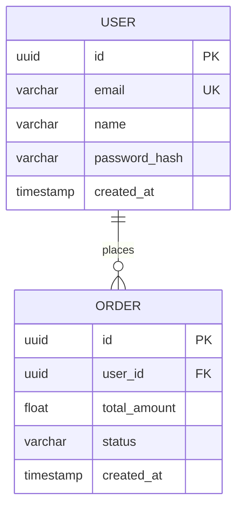
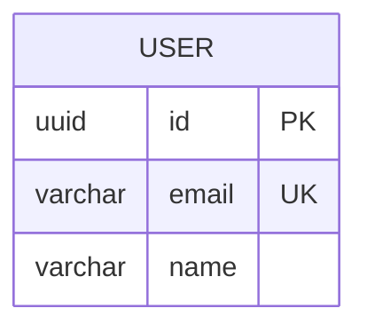

# 🗄️ How to See DBD Table Format Visualization

## ⚡ Quick Answer

Your DBD diagrams ARE in **table format** - you just need to **visualize/render** them!

## 🎯 3 Ways to See Table Format

### Method 1: Open the Preview Tool (30 seconds) ⭐ EASIEST

```bash
# Navigate to the file
cd autoagents-backend/app/data

# Open in your browser
start dbd_preview.html       # Windows
open dbd_preview.html        # Mac
xdg-open dbd_preview.html    # Linux
```

**You'll see:**
- 🛒 E-commerce example with table-like entity boxes
- 🏥 Hospital management example
- 🤖 Your AutoAgents system schema
- ✏️ Custom tab to paste your own diagrams

**This shows what "table format" looks like!**

### Method 2: Use Mermaid Live Editor (1 minute)

1. Go to: https://mermaid.live/
2. Clear the default code
3. Paste this example:



4. **See the table-format visualization!**

### Method 3: Use Your Frontend App (2 minutes)

```bash
# Terminal 1 - Start backend
cd autoagents-backend
python -m uvicorn app.main:app --reload

# Terminal 2 - Start frontend
cd autoagents-frontend
npm start
```

Then:
1. Create a project
2. Add features
3. Click "Generate DBD" button
4. **See rendered table-format diagram!**

## 📊 What "Table Format" Looks Like

### The Code (erDiagram syntax):


### The Rendered Visual (table format):
```
┌─────────────────────────┐
│        USER             │  ← Entity name (like table name)
├─────────────────────────┤
│ uuid id PK              │  ← Fields with data types
│ varchar email UK        │     (like table columns)
│ varchar name            │
└─────────────────────────┘
```

When rendered by Mermaid.js, this becomes a **box that looks like a database table** with:
- ✅ Entity name as header
- ✅ Fields as rows
- ✅ Data types shown
- ✅ Constraints visible (PK, FK, UK)
- ✅ Visual borders making it table-like

## 🚀 Test It Now!

### Step 1: Generate a DBD diagram
```bash
cd autoagents-backend
export ANTHROPIC_API_KEY='your-key'
python test_dbd_fix.py
```

This creates: `test_dbd_fixed_output.mmd`

### Step 2: Visualize it
**Option A - Preview Tool:**
```bash
cd app/data
start dbd_preview.html
```
- Click "✏️ Your Custom DBD" tab
- Paste code from `test_dbd_fixed_output.mmd`
- Click "🔄 Render Diagram"
- **BOOM! Table format!**

**Option B - Mermaid Live:**
1. Open https://mermaid.live/
2. Paste code from `test_dbd_fixed_output.mmd`
3. **See it rendered!**

## 📸 What You'll See

### Full Example (E-commerce):

When you open `dbd_preview.html` and look at the E-commerce tab, you'll see:

```
┌────────────────────┐                ┌────────────────────┐
│       USER         │                │     CATEGORY       │
├────────────────────┤                ├────────────────────┤
│ uuid id PK         │                │ uuid id PK         │
│ varchar email UK   │  places        │ varchar name UK    │
│ varchar name       │                └────────────────────┘
│ varchar pwd_hash   │                         │
└────────────────────┘                         │ categorizes
         │                                     ↓
         │                           ┌────────────────────┐
         │                           │      PRODUCT       │
         │                           ├────────────────────┤
         │                           │ uuid id PK         │
         ↓                           │ uuid category_id FK│
┌────────────────────┐               │ varchar name       │
│       ORDER        │               │ float price        │
├────────────────────┤               └────────────────────┘
│ uuid id PK         │                         │
│ uuid user_id FK    │   included_in           │
│ float total        │    ┌────────────────────┘
└────────────────────┘    │
         │                │
         │ contains       │
         ↓                ↓
    ┌────────────────────┐
    │    ORDER_ITEM      │
    ├────────────────────┤
    │ uuid id PK         │
    │ uuid order_id FK   │
    │ uuid product_id FK │
    │ int quantity       │
    └────────────────────┘
```

**Each box is a "table" with fields inside!**

## ❓ FAQ

### Q: Why do I only see code, not a visual diagram?

**A:** You need to **render** the Mermaid code using:
- The preview HTML file (`dbd_preview.html`)
- Mermaid Live Editor (https://mermaid.live/)
- Your frontend application
- Any tool that supports Mermaid.js

### Q: Where is the "table format"?

**A:** The table format is the **rendered visual output**. When you use erDiagram syntax:
```mermaid
USER {
    uuid id PK
    varchar email UK
}
```

It renders as a **box that looks like a database table**.

### Q: My entities are empty - no fields!

**A:** That was the bug we fixed! Run `test_dbd_fix.py` to generate proper diagrams with fields.

### Q: How do I see it in my app?

**A:** 
1. Start backend and frontend
2. Create project with features
3. Generate DBD diagram
4. Frontend automatically renders it in table format

## 🎯 Bottom Line

**Your DBD implementation DOES create table-format architecture!**

You just need to **visualize/render** it instead of looking at the raw code.

### Quick Test:
1. **Open:** `autoagents-backend/app/data/dbd_preview.html`
2. **Look at:** E-commerce tab
3. **See:** Entity boxes that look like database tables

**That's the table format visualization!** 🎉

### For Your Own Diagrams:
1. **Generate:** Run `python test_dbd_fix.py`
2. **Copy:** Code from `test_dbd_fixed_output.mmd`
3. **Paste:** Into preview tool's custom tab
4. **Render:** Click the button
5. **Enjoy:** Table-format visualization!

---

**Need more details?** See `DBD_VISUALIZATION_GUIDE.md`

**Want to test?** Open `dbd_preview.html` right now! 🚀

