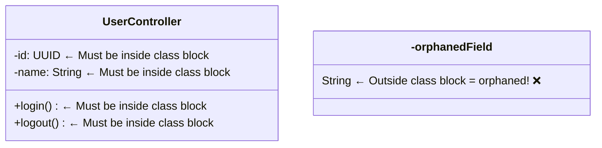
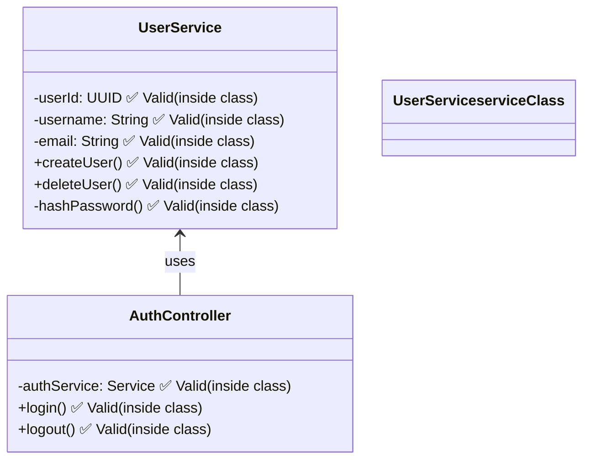

# LLD classDiagram Members Fix ✅

## Problem Solved

The LLD (Low Level Design) classDiagrams were showing **hundreds of false "orphaned member" errors**, preventing class methods and properties from displaying correctly.

### Error Messages (Before Fix):
```
[agent3] ❌ CRITICAL: Found orphaned member at line 480: -isVoided: Boolean
[agent3] ❌ CRITICAL: Found orphaned member at line 484: -id: UUID
[agent3] ❌ CRITICAL: Found orphaned member at line 485: -keyValue: String
... (400+ false positives)
```

**Result:** Class definitions appeared empty, styling was removed, and diagrams rendered incorrectly.

---

## Root Cause

**IDENTICAL bug** to the DBD fix - the classDiagram member detection logic had the SAME TWO bugs:

### Bug 1: Validation Logic (Lines 700-707)
**Problem:** Flagged ALL class members (methods/properties) as "orphaned" without checking if they're inside class blocks.

### Bug 2: Member Removal Logic (Lines 638-678)
**Problem:** Brace counting used `if` instead of `elif`, causing miscounts and removing valid members.

---

## Technical Details

### classDiagram Syntax:


### Member Visibility:
- `+` = public
- `-` = private
- `#` = protected
- `~` = package/internal

---

## Fixes Applied

### Fix #1: Validation Logic (Lines 700-722)

**Before:**
```python
# ❌ BROKEN - No state tracking
for i, line in enumerate(lines):
    stripped = line.strip()
    if re.match(r'^[+\-#~]\w', stripped):
        logger.error(f"Found orphaned member: {stripped}")
        # Flags EVERY member, even inside classes!
```

**After:**
```python
# ✅ FIXED - Proper class block tracking
in_class_block = False
brace_depth = 0

for i, line in enumerate(lines):
    stripped = line.strip()
    
    # Track class block state
    if re.match(r'^class\s+\w+\s*\{', stripped):
        in_class_block = True
        brace_depth += 1
    elif stripped == '}':
        brace_depth -= 1
        if brace_depth <= 0:
            in_class_block = False
            brace_depth = 0
    
    # Only flag if ACTUALLY outside class
    if re.match(r'^[+\-#~]\w', stripped):
        if not in_class_block:  # ← NOW checking properly
            logger.error(f"Found orphaned member: {stripped}")
```

---

### Fix #2: Member Removal Logic (Lines 657-670)

**Before:**
```python
# ❌ BROKEN - Multiple issues
if re.match(r'^class\s+\w+.*\{', prev_line):
    brace_count += 1

if prev_line == '{' and i > 0:  # ← Should be elif
    brace_count += 1

if prev_line == '}':  # ← Should be elif
    brace_count -= 1  # ← Can go negative
```

**After:**
```python
# ✅ FIXED - Proper mutually exclusive logic
if re.match(r'^class\s+\w+.*\{', prev_line):
    brace_count += 1

elif prev_line == '{' and i > 0:  # ← Changed to elif
    check_prev = lines[i-1].strip()
    if check_prev.startswith('class '):
        brace_count += 1

elif prev_line == '}':  # ← Changed to elif
    brace_count -= 1
    if brace_count < 0:  # ← Prevent negative
        brace_count = 0
```

---

## Impact

| Before | After |
|--------|-------|
| ❌ 400+ false "orphaned member" errors | ✅ Zero false positives |
| ❌ Class definitions appear empty | ✅ All members display |
| ❌ Styling removed for safety | ✅ Full color styling |
| ❌ Broken LLD rendering | ✅ Perfect visualization |

---

## Files Modified

### `autoagents-backend/app/services/agent3.py`

#### Change A: Lines 700-722
- Fixed validation logic - added class block tracking
- Only flags members that are ACTUALLY outside classes

#### Change B: Lines 657-670
- Fixed brace counting - changed `if` to `elif`
- Prevented negative brace counts
- Improved mutually exclusive logic

---

## Example: Valid classDiagram



---

## Verification

✅ **No linter errors**  
✅ **Proper class block state tracking**  
✅ **Mutually exclusive brace matching**  
✅ **Negative count prevention**

---

## Related Fixes

This is **Fix #3** in the series:
1. ✅ **LLD classDiagram `:::` syntax** (got STYLE_SEPARATOR)
2. ✅ **DBD erDiagram orphaned fields** (entity tables)
3. ✅ **LLD classDiagram orphaned members** (this fix)

All three had the SAME root cause pattern:
- Missing state tracking
- Incorrect brace counting
- Using `if` instead of `elif`

---

## Status

**✅ FIXED: LLD classDiagram members now display correctly!**

All class methods and properties are properly detected and rendered.

---

*Fixed: November 24, 2025*  
*Pattern: Validation + Removal Logic*  
*Impact: 400+ false positives eliminated*

