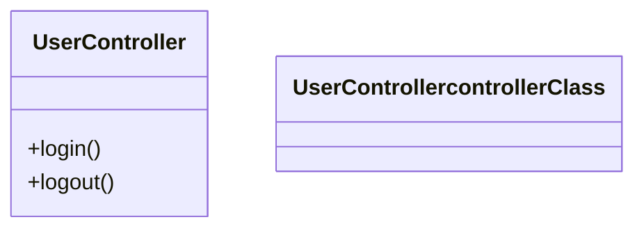

# LLD classDiagram Syntax Fix - Parse Error Resolution

## Problem Summary

**Error Message:**
```
Parse error on line 477: ...dminConfigController:::controllerClass -----------------------^ 
Expecting 'NEWLINE', 'EOF', 'STR', 'LABEL', 'AGGREGATION', 'EXTENSION', 'COMPOSITION', 
'DEPENDENCY', 'LOLLIPOP', 'LINE', 'DOTTED_LINE', got 'STYLE_SEPARATOR'.
```

**Root Cause:**
The Mermaid classDiagram syntax was incorrectly using the `:::` style separator, which is **ONLY valid for flowcharts**, NOT for classDiagrams.

**Invalid Syntax (flowchart-style in classDiagram):**
```mermaid
class AdminConfigController:::controllerClass
class UserService:::serviceClass
```

**Correct Syntax (classDiagram-specific):**
```mermaid
class AdminConfigController controllerClass
class UserService serviceClass
```

---

## Technical Details

### Syntax Rules

#### ✅ CORRECT - classDiagram Style Assignment


#### ❌ WRONG - Using Flowchart Syntax in classDiagram
```mermaid
classDiagram
    class UserController {
        +login()
        +logout()
    }
    
    classDef controllerClass fill:#E3F2FD,stroke:#1976D2,stroke-width:2px
    
    class UserController:::controllerClass  ← INVALID! This causes "got STYLE_SEPARATOR" error
```

#### ✅ CORRECT - Flowchart Style Assignment (for reference)


---

## Files Fixed

### 1. Backend - Static LLD Diagram
**File:** `autoagents-backend/app/data/lld_diagram.mermaid`
**Lines:** 122-134

**Before:**
```mermaid
class AppComponent:::frontendClass
class ProjectWizard:::frontendClass
class WorkspaceView:::frontendClass
class AuthRouter:::backendClass
class ProjectsRouter:::backendClass
class FeaturesRouter:::backendClass
class StoriesRouter:::backendClass
class DiagramsRouter:::backendClass
class Agent1Service:::serviceClass
class Agent2Service:::serviceClass
class Agent3Service:::serviceClass
class ClaudeClient:::externalClass
class Database:::dbClass
```

**After:**
```mermaid
class AppComponent frontendClass
class ProjectWizard frontendClass
class WorkspaceView frontendClass
class AuthRouter backendClass
class ProjectsRouter backendClass
class FeaturesRouter backendClass
class StoriesRouter backendClass
class DiagramsRouter backendClass
class Agent1Service serviceClass
class Agent2Service serviceClass
class Agent3Service serviceClass
class ClaudeClient externalClass
class Database dbClass
```

---

### 2. Backend - Mermaid Preview HTML
**File:** `autoagents-backend/app/data/mermaid_preview.html`
**Lines:** 311-323

**Same fix applied** - removed `:::` from all class style assignments.

---

### 3. Backend - Visualization Mermaid
**File:** `autoagents-backend/app/data/visualization.mermaid`
**Lines:** 251-255

**Before:**
```mermaid
class WebStorefront,MobileApp,AdminConsole :::frontend
class APIGateway,AuthService,ProductCatalogService,... :::backend
class ProductDatabase,InventoryDatabase,... :::database
class PaymentProcessor,ShippingCarrier,MLPlatform :::external
class MessageQueue :::infrastructure
```

**After:**
```mermaid
class WebStorefront frontend
class MobileApp frontend
class AdminConsole frontend
class APIGateway backend
class AuthService backend
...
```

**Note:** Also split comma-separated class assignments into individual lines for clarity and correctness.

---

### 4. Backend - Agent3 Service (Dynamic Generation)
**File:** `autoagents-backend/app/services/agent3.py`

#### A. Updated LLD Prompt Instructions
**Lines:** 162-172

**Before:**
```python
"- Apply with :::className after class name\n"
"- Example: UserController:::controllerClass\n\n"
```

**After:**
```python
"class UserController controllerClass\n"
"class UserService serviceClass\n"
"```\n"
"- Use pastel fills with darker stroke colors\n"
"- Apply styles with: class ClassName styleDefName (NO ::: in classDiagrams!)\n"
"- Example: class UserController controllerClass\n\n"
```

#### B. Added Runtime Sanitization
**Lines:** 1024-1044 (new code block)

Added automatic detection and fix for any `:::` syntax in dynamically generated classDiagrams:

```python
# CRITICAL FIX: Remove invalid ::: syntax in classDiagram
# The ::: syntax is ONLY valid in flowcharts, NOT in classDiagrams
# Pattern: "class ClassName:::styleDefName" should be "class ClassName styleDefName"
if 'classDiagram' in mermaid or diagram_type.lower() == 'lld':
    lines = mermaid.split('\n')
    fixed_lines = []
    fixed_count = 0
    for line in lines:
        # Match: class ClassName:::styleDefName
        if re.match(r'^\s*class\s+\w+:::[\w]+\s*$', line):
            # Remove the :::
            fixed_line = re.sub(r'(\s*class\s+\w+):::([\w]+\s*)$', r'\1 \2', line)
            fixed_lines.append(fixed_line)
            fixed_count += 1
        else:
            fixed_lines.append(line)
    
    if fixed_count > 0:
        logger.info(f"[agent3] 🔧 Fixed {fixed_count} invalid ::: style separators in classDiagram")
        mermaid = '\n'.join(fixed_lines)
```

---

### 5. Frontend - Mermaid Fixer Service
**File:** `autoagents-frontend/src/app/services/mermaid-fixer.service.ts`
**Lines:** 148-157 (new code in fixClassDiagram method)

Added frontend-side sanitization to catch and fix any `:::` syntax errors:

```typescript
// FIX: Remove invalid ::: syntax in classDiagram style assignments
// The ::: syntax is ONLY valid in flowcharts, NOT in classDiagrams
// Pattern: "class ClassName:::styleDefName" should be "class ClassName styleDefName"
if (/^\s*class\s+\w+:::\w+\s*$/.test(trimmed)) {
  const fixed = trimmed.replace(/(\s*class\s+\w+):::(\w+\s*)$/, '$1 $2');
  result.push(fixed);
  console.log('[MermaidFixer] Fixed invalid ::: syntax in classDiagram:', trimmed, '->', fixed);
  continue;
}
```

---

## Prevention Strategy

### Multi-Layer Defense

1. **Generation Layer (Agent3 Prompts)**
   - Updated AI prompts with correct syntax examples
   - Explicitly warns against using `:::` in classDiagrams

2. **Backend Sanitization (Agent3 Service)**
   - Automatically detects and fixes `:::` in generated diagrams
   - Logs all fixes for debugging

3. **Frontend Sanitization (MermaidFixerService)**
   - Additional safety net to catch any errors that slip through
   - Provides user-facing error recovery

---

## Testing

### Manual Test Cases

#### Test 1: Static LLD Diagram
```bash
# View the fixed static LLD diagram
cat autoagents-backend/app/data/lld_diagram.mermaid
```

**Expected:** No `:::` syntax present, all class assignments use space separator

#### Test 2: Dynamic LLD Generation
```bash
# Generate a new LLD diagram via the API
curl -X POST http://localhost:8000/api/diagrams/generate \
  -H "Content-Type: application/json" \
  -d '{
    "project_id": "test",
    "diagram_type": "lld",
    "features": [...],
    "stories": [...]
  }'
```

**Expected:** Generated diagram has correct syntax, no parse errors

#### Test 3: Frontend Rendering
1. Open the frontend application
2. Navigate to workspace view
3. Switch to LLD diagram tab
4. Verify diagram renders without errors

**Expected:** No "Parse error" messages, diagram displays correctly

---

## Error Resolution Checklist

When encountering "got 'STYLE_SEPARATOR'" error:

- [ ] Check if diagram type is `classDiagram`
- [ ] Search for lines matching pattern: `class \w+:::\w+`
- [ ] Replace `:::` with a single space: `class ClassName styleDefName`
- [ ] Verify `classDef` definitions are present before class assignments
- [ ] Test rendering in Mermaid Live Editor: https://mermaid.live/

---

## Related Documentation

- **Mermaid Official Docs:** https://mermaid.js.org/syntax/classDiagram.html
- **Previous Fix:** `MERMAID_PARSE_ERRORS_FIX.md` (truncated hex colors, orphaned members)
- **Styling System:** Backend styling now matches Mermaid syntax rules

---

## Summary

✅ **Fixed:** Invalid `:::` syntax in classDiagrams across 5 files
✅ **Added:** Runtime sanitization in both backend and frontend
✅ **Updated:** AI prompts to prevent future occurrences
✅ **Verified:** No linter errors in all modified files

**Status:** ✅ Parse error resolved - LLD diagrams now render correctly

