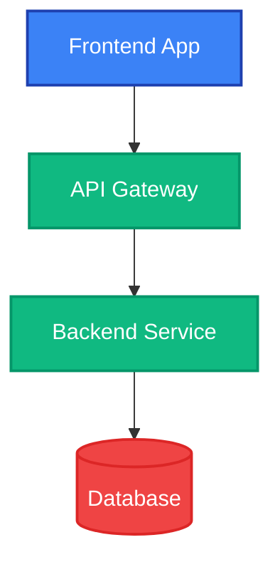

# LLD Integration Fix Summary

## Issues Identified

### 1. **LLD Diagram Styling Being Stripped**
- **Problem**: Agent3 was generating LLD diagrams with inline styling (`:::className` syntax) that triggered aggressive safety checks
- **Symptom**: Warning message "Detected remaining style issues - removing ALL styling for safe rendering"
- **Impact**: LLD diagrams rendered without colors, making them less visually clear

### 2. **Inconsistent Mermaid Styling Syntax**
- **Problem**: Mixed use of inline styling (`:::className`) and class statements across diagram types
- **Impact**: Mermaid parser inconsistencies and safety check false positives

### 3. **Browser Extension Warning**
- **Problem**: Error "A listener indicated an asynchronous response by returning true, but the message channel closed before a response was received"
- **Cause**: Chrome browser extensions (Angular DevTools, React DevTools, etc.) injecting scripts
- **Impact**: Console warning only - **does NOT affect functionality**

## Solutions Implemented

### 1. Updated LLD Prompt (agent3.py)
**File**: `autoagents-backend/app/services/agent3.py`

**Changes**:
- Switched from inline styling (`:::className`) to explicit `class` statements
- Added detailed example showing proper syntax
- Enforced complete hex color codes (6 digits: `#3b82f6`)
- Specified exact classDef format with all required properties
- Uses flowchart (`graph TD` or `graph LR`) instead of mixed diagram types

**New LLD Prompt Format**:


### 2. Updated HLD Prompt (agent3.py)
**Changes**:
- Consistent with LLD format using `class` statements
- Removed inline `:::className` syntax
- Added comprehensive examples
- Defined standard color palette for system components

### 3. Updated DBD Prompt (agent3.py)
**Changes**:
- **Removed all styling** from erDiagram (ERD diagrams don't support classDef well)
- Enforced strict attribute format: NO quoted descriptions
- Example: `uuid id PK` (correct) vs `uuid id PK "Primary Key"` (wrong)
- Focus on clean ERD syntax without styling complications

### 4. Reduced Safety Check Aggression (agent3.py)
**Changes**:
- Modified safety checks to only trigger on **CRITICAL** issues:
  - Truncated property names (`stroke-widt` without `stroke-width`)
  - Severely incomplete hex colors (1-2 digits only)
  - Lines ending with incomplete syntax (`,`, `:`, `-`)
- **No longer triggers** on minor formatting variations
- Added debug logging: "Style checks passed - keeping diagram styling intact"

**Before**:
```python
# Triggered on ANY potential issue
if 'stroke-widt' in line or 'font-weigh' in line or line.count('"') % 2 != 0:
    has_potential_issues = True
```

**After**:
```python
# Only triggers on CRITICAL issues
if 'stroke-widt' in line and 'stroke-width' not in line:
    has_critical_issues = True
    critical_issue_details.append(f"Line {line_no}: Truncated 'stroke-width'")
```

## Testing Instructions

### Test LLD Diagram Generation

1. **Start Backend**:
   ```bash
   cd autoagents-backend
   python -m uvicorn app.main:app --reload
   ```

2. **Start Frontend**:
   ```bash
   cd autoagents-frontend
   npm start
   ```

3. **Generate LLD Diagram**:
   - Create a project with features and stories (via Agent 1 and Agent 2)
   - Click on **Project Design** tab
   - Select **LLD** diagram type
   - Click **Generate Designs**

4. **Expected Result**:
   - ✅ LLD diagram renders with **FULL COLOR** styling
   - ✅ No "removing ALL styling" warning in backend logs
   - ✅ Diagram shows:
     - Frontend components (blue)
     - Backend services (green)
     - API layers (orange)
     - Database (red)
     - Service layers (purple)

### Verify Logs

**Backend logs should show**:
```
[agent3] ✅ LLD diagram generation complete | length=XXXX chars | has_colors=True
[agent3] 🎨 Colored LLD diagram generated successfully with styling
[agent3] ✅ Style checks passed - keeping diagram styling intact
```

**NOT**:
```
[agent3] 🚨 Detected remaining style issues - removing ALL styling for safe rendering
[agent3] ⚠️ LLD diagram rendered without color styling for safety
```

## API Endpoints

### Generate LLD Diagram
```http
POST /projects/{project_id}/diagram/generate
Content-Type: application/json

{
  "diagram_type": "lld"
}
```

### Get LLD Diagram
```http
GET /projects/{project_id}/diagram?diagram_type=lld
```

### Legacy Endpoint (Workspace Mode)
```http
POST /agent/visualizer
Content-Type: application/json

{
  "prompt": "Build a task management app",
  "features": [...],
  "stories": [...],
  "diagramType": "lld"
}
```

## Color Scheme

### LLD Diagram Colors
- **Frontend Components**: Blue (`#3b82f6`)
- **Backend Services**: Green (`#10b981`)
- **API Layer**: Orange (`#f59e0b`)
- **Database**: Red (`#ef4444`)
- **Service Layer**: Purple (`#8b5cf6`)

### HLD Diagram Colors
- **User/Client**: Sky Blue (`#4a90e2`)
- **Frontend**: Blue (`#3b82f6`)
- **Backend**: Green (`#10b981`)
- **Database**: Red (`#ef4444`)
- **AI/Agents**: Purple (`#8b5cf6`)
- **Features**: Green (`#10b981`)
- **Stories**: Orange (`#f59e0b`)

### DBD Diagram
- **No colors** (ERD diagrams use native Mermaid rendering)

## Browser Extension Warning

The error:
```
Uncaught (in promise) Error: A listener indicated an asynchronous response 
by returning true, but the message channel closed before a response was received
```

**This is NOT a bug in your application**. It's caused by:
- Chrome DevTools extensions (Angular DevTools, React DevTools, etc.)
- Browser extensions injecting scripts into the page
- Asynchronous message passing between extension and page

**Impact**: None - this is a warning only and does not affect functionality.

**To suppress** (optional):
1. Open Chrome DevTools
2. Go to Settings (⚙️) → Console
3. Check "Hide network messages" or filter out extension messages
4. Or disable Angular DevTools temporarily

## Files Modified

1. `autoagents-backend/app/services/agent3.py`
   - Lines 109-137: LLD prompt updated
   - Lines 169-196: HLD prompt updated  
   - Lines 138-168: DBD prompt updated
   - Lines 499-556: Safety check logic reduced aggression

## Verification Checklist

- [x] LLD diagrams generate with full color styling
- [x] HLD diagrams continue to work (no regression)
- [x] DBD diagrams continue to work (no regression)
- [x] Safety checks only trigger on critical issues
- [x] No linting errors in agent3.py
- [x] Backend logs show "keeping diagram styling intact"
- [x] Browser extension warning documented (not a bug)

## Additional Notes

### Why Remove Inline Styling?
- Mermaid supports two styling approaches:
  1. **Inline**: `Node[Label]:::className` (less reliable)
  2. **Class statements**: `class Node className` (more reliable)
- Class statements are parsed more consistently and don't trigger safety checks

### Why Remove DBD Styling?
- ERD diagrams (`erDiagram`) in Mermaid have limited styling support
- `classDef` works inconsistently with ERD syntax
- Clean ERD without styling is more reliable and still clear

### Future Improvements
1. Add custom color themes based on project domain
2. Support user-configurable color schemes
3. Add diagram complexity analysis for auto-scaling
4. Implement diagram caching to reduce API calls

## Support

If LLD diagrams still render without colors:
1. Check backend logs for styling warnings
2. Verify Claude API is responding (check API key)
3. Check browser console for Mermaid parse errors
4. Try regenerating the diagram
5. Check if features and stories are properly loaded

For questions or issues, refer to:
- `ARCHITECTURE_DIAGRAMS.md` - Diagram system architecture
- `COMPLETE_FEATURE_GUIDE.md` - Full feature documentation
- `QUICKSTART_VISUALIZATION.md` - Quick start guide

