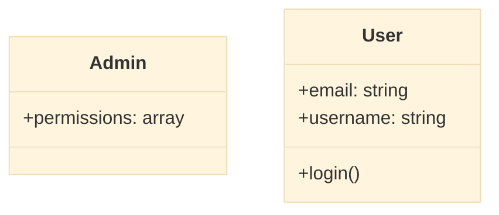
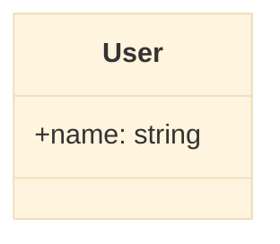
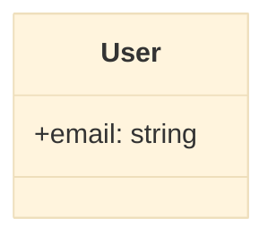
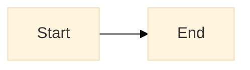
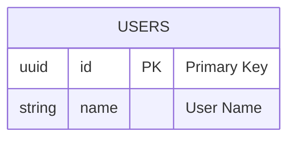
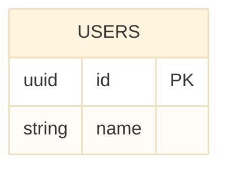
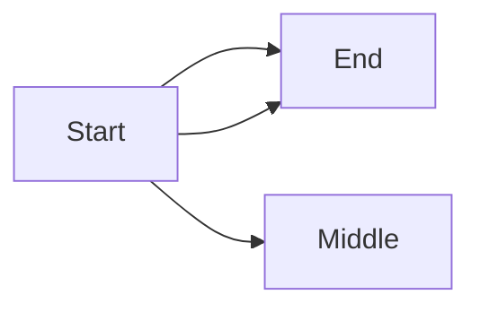
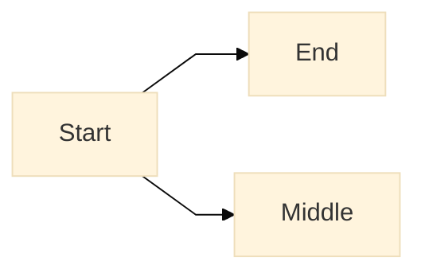
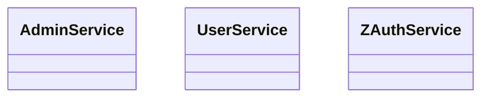

# Mermaid Fixer Quick Start Guide

## 🚀 Quick Copy-Paste Master Prompt for Cursor

Copy this entire prompt and paste it into Cursor when you need to fix a Mermaid diagram:

```
You are a strict Mermaid FIXER. Read my error log and current Mermaid text, then RETURN ONLY one corrected Mermaid diagram that parses cleanly and renders deterministically with mermaid.js. No explanations.

Rules:

1) Auto-detect diagram type:
   - If fields look like ERD columns (e.g., "uuid id", "timestamp created_at", "PK/FK" hints, braces after entity names), use **erDiagram**.
   - If there are class members/methods like "+logout()" or "+bucket: string", use **classDiagram** and put ALL members INSIDE their class blocks.
   - Otherwise default to **flowchart LR**.

2) Syntax guarantees:
   - Balance all braces. Remove stray `}` and any lines outside valid blocks.
   - NO orphaned members: every `+field` / `+method()` must be inside a `class Name { ... }` (classDiagram) or inside `ENTITY { ... }` (erDiagram).
   - For classDiagram: use `+name: type` for fields and `+name()` for methods.
   - For erDiagram: use
       erDiagram
         ENTITY {
           <type> <name>
         }
     Primary/foreign keys: keep as comments or inferred via relationships (no invalid tokens).

3) Deterministic rendering:
   - Add an init line as the very first line:
     %%{init: {"theme":"base","flowchart":{"htmlLabels":true,"curve":"linear"}} }%%
   - For flowcharts, always specify direction (e.g., `flowchart LR`).
   - Use stable, kebab_case IDs. Sort entities/classes and their members alphabetically.
   - Remove duplicate nodes/edges and parallel edges.

4) Output format: RETURN ONLY ONE fenced code block labeled `mermaid`. Nothing else.

INPUT

ERROR_LOG:
<<<PASTE_ERROR_LOGS_HERE>>>

DIAGRAM:
<<<PASTE_CURRENT_MERMAID_HERE>>>
```

## 📝 How to Use

### Step 1: Copy Error Log
When Mermaid fails to render, copy the error message from:
- Browser console (F12 → Console tab)
- Mermaid error banner
- Network response errors

**Example Error Log:**
```
Syntax error in text
Expecting 'PS', 'TAGEND', 'STR', got 'PE'
Parse error on line 5: Unexpected token
```

### Step 2: Copy Current Diagram
Copy your current Mermaid code that's failing.

**Example Broken Diagram:**
```mermaid
classDiagram
    class User {
        +username: string
        +email: string
    +login()
    
    class Admin {
        +permissions: array
```

### Step 3: Use the Master Prompt
1. Open Cursor
2. Paste the master prompt
3. Replace `<<<PASTE_ERROR_LOGS_HERE>>>` with your error log
4. Replace `<<<PASTE_CURRENT_MERMAID_HERE>>>` with your diagram code
5. Run the prompt

### Step 4: Get Fixed Diagram
Cursor will return a corrected diagram:



## 🛠️ Using the MermaidFixerService in Code

### Import and Inject
```typescript
import { MermaidFixerService } from './services/mermaid-fixer.service';

constructor(private mermaidFixer: MermaidFixerService) {}
```

### Fix a Diagram
```typescript
fixMyDiagram() {
  const errorLog = 'Syntax error in line 5: Unexpected token';
  const brokenDiagram = `
classDiagram
    class User {
        +username
    +email
  `;
  
  const fixed = this.mermaidFixer.fixMermaidDiagram(errorLog, brokenDiagram);
  console.log('Fixed:', fixed);
}
```

### Validate Before Rendering
```typescript
validateDiagram() {
  const diagram = `
flowchart LR
    A[Start] --> B[End
  `;
  
  const validation = this.mermaidFixer.validateMermaid(diagram);
  
  if (validation.valid) {
    console.log('✅ Diagram is valid');
    this.renderDiagram(diagram);
  } else {
    console.log('❌ Error:', validation.error);
    const fixed = this.mermaidFixer.fixMermaidDiagram(validation.error, diagram);
    this.renderDiagram(fixed);
  }
}
```

## 🎯 Common Fixes Applied

### 1. Unbalanced Braces
**Before:**
```mermaid
classDiagram
    class User {
        +name: string
    }
    }
```

**After:**


### 2. Orphaned Members
**Before:**
```mermaid
classDiagram
    +username: string
    +login()
    
    class User {
        +email: string
    }
```

**After:**


### 3. Missing Diagram Type
**Before:**
```mermaid
A[Start] --> B[End]
```

**After:**


### 4. ERDiagram Invalid Descriptions
**Before:**


**After:**


### 5. Duplicate Nodes
**Before:**


**After:**


## 🔍 Deterministic Rendering Features

### Always Added Init Directive
Every fixed diagram gets this init directive for consistent rendering:
```mermaid
%%{init: {"theme":"base","flowchart":{"htmlLabels":true,"curve":"linear"}} }%%
```

**Benefits:**
- ✅ Same diagram always renders the same way
- ✅ Linear curves (no random bezier variations)
- ✅ Base theme (consistent colors)
- ✅ HTML labels enabled

### Normalized IDs
All IDs are converted to stable formats:
- `User Service` → `user-service`
- `API_Gateway` → `api-gateway`

### Sorted Output
Entities and classes are sorted alphabetically for consistency:


## ⚡ Quick Troubleshooting

| Issue | Solution |
|-------|----------|
| "Unexpected token" | Use master prompt with error log |
| "Parse error on line X" | Copy line X context and use fixer |
| Diagram changes randomly | Add init directive manually or use fixer |
| Members outside class | Check braces, use fixer to fix orphaned members |
| Empty diagram | Validate with `validateMermaid()` first |

## 📞 Getting Help

If the fixer doesn't work:
1. Check if you pasted the complete error log
2. Ensure you pasted the entire diagram (including declarations)
3. Try the programmatic API: `mermaidFixer.fixMermaidDiagram()`
4. Check browser console for additional errors

## 🎓 Learning More

- **Mermaid Official Docs**: https://mermaid.js.org/
- **Service Documentation**: `autoagents-frontend/src/app/services/README.md`
- **Implementation Summary**: `MERMAID_AGENT3_IMPLEMENTATION_SUMMARY.md`

---

**Pro Tip**: Save the master prompt as a Cursor snippet for instant access!

```json
{
  "Mermaid Fixer": {
    "prefix": "mermaidfix",
    "body": [
      "You are a strict Mermaid FIXER...",
      "<<<PASTE YOUR PROMPT HERE>>>"
    ]
  }
}
```

