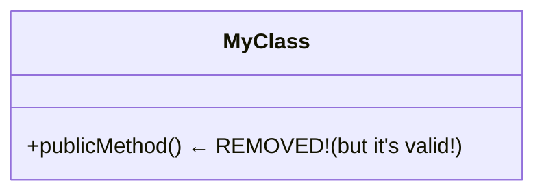

# Mermaid Parse Error Fix Summary

## Problem
Users were experiencing Mermaid parse errors like:
```
Parse error on line 2:
classDiagram    +UIViewController
----------------^
Expecting 'acc_title', 'acc_descr', ..., got 'PLUS'
```

These errors were caused by two issues:
1. **Immediate rendering on every keystroke** - The diagram was being rendered after every single character typed, causing the Mermaid parser to attempt rendering incomplete/invalid syntax
2. **Overly aggressive sanitization** - The sanitizer was removing valid class members because it couldn't distinguish between orphaned members and members inside class definitions

## Root Cause Analysis

### Issue 1: No Debouncing
- Every keystroke triggered `(ngModelChange)="onMermaidInput($event)"` 
- This immediately called `renderMermaid()` without any delay
- While typing "classDiagram", the parser would try to render "classD", "classDi", etc.
- Incomplete syntax like `classDiagram +React` (mid-typing) would cause parse errors

### Issue 2: Faulty Sanitization Logic
In `workspace-view.component.ts` (lines ~802-805), the sanitizer would remove ANY line starting with `+/-/#/~` that appeared after a line containing "classDiagram", even if it was inside a valid class block:

```typescript
// OLD (FAULTY) CODE:
if (prevLine.toLowerCase().includes('classdiagram') && /^\s*[+\-#~]/.test(trimmed)) {
  console.warn(`Removing class member without class context`);
  return false; // Removes the line!
}
```

This would incorrectly remove valid members like:


## Solutions Implemented

### Fix 1: Debounced Rendering (800ms delay)

**Added debounce timer variables** (lines 79-80):
```typescript
private renderDebounceTimer: ReturnType<typeof setTimeout> | null = null;
private readonly RENDER_DEBOUNCE_MS = 800; // Wait 800ms after user stops typing
```

**Created debounced render function** (lines 430-448):
```typescript
private debouncedRenderMermaid(): void {
  // Clear any existing timer
  if (this.renderDebounceTimer) {
    clearTimeout(this.renderDebounceTimer);
  }
  
  // Clear any previous error while user is typing
  this.mermaidError = null;
  
  // Set new timer to render after user stops typing
  this.renderDebounceTimer = setTimeout(() => {
    void this.renderMermaid();
    this.renderDebounceTimer = null;
  }, this.RENDER_DEBOUNCE_MS);
}
```

**Modified setMermaidInput** to use debouncing for user input (lines 414-428):
```typescript
private setMermaidInput(value: string, emitEvent: boolean): void {
  this.mermaidInput = this.sanitizeMermaidDefinition(value);
  this.updateLineNumbers();
  this.lineNumberOffset = 0;
  
  if (emitEvent) {
    // User is typing → use debounced rendering
    this.mermaidChange.emit(this.mermaidInput);
    this.debouncedRenderMermaid();
  } else {
    // Loading from backend → render immediately
    this.mermaidError = null;
    void this.renderMermaid();
  }
}
```

**Added cleanup in ngOnDestroy** (lines 172-175):
```typescript
if (this.renderDebounceTimer) {
  clearTimeout(this.renderDebounceTimer);
  this.renderDebounceTimer = null;
}
```

### Fix 2: Smarter Class Member Detection

**Improved the sanitization logic** to count braces and determine if we're truly inside a class block (lines ~797-835):

```typescript
// NEW (IMPROVED) CODE:
let isInsideClass = false;
if (/^\s*[+\-#~]/.test(trimmed)) {
  // Count unclosed braces to see if we're inside a class definition
  let braceCount = 0;
  for (let j = 0; j < index; j++) {
    const prevLineContent = sanitizeLines[j];
    braceCount += (prevLineContent.match(/\{/g) || []).length;
    braceCount -= (prevLineContent.match(/\}/g) || []).length;
  }
  isInsideClass = braceCount > 0;
}

// Only remove if NOT inside a class
if (prevLine.toLowerCase().includes('classdiagram') && /^\s*[+\-#~]/.test(trimmed) && !isInsideClass) {
  console.warn(`Removing class member without class context`);
  return false;
}
```

Now it correctly identifies when members are inside a class:
```mermaid
classDiagram
    class MyClass {          ← braceCount = 1
        +publicMethod()      ← isInsideClass = true, NOT removed ✓
    }                        ← braceCount = 0
```

## Benefits

1. **No more parse errors during typing** - Diagrams only render after user stops typing
2. **Valid syntax preserved** - Class members inside class blocks are no longer incorrectly removed
3. **Better UX** - No flickering/errors while editing
4. **Performance improvement** - Fewer unnecessary renders
5. **Proper cleanup** - No memory leaks from timers

## Testing Recommendations

1. **Test rapid typing**:
   - Open the Mermaid editor
   - Type quickly: `classDiagram` followed by class definitions
   - Verify no parse errors appear during typing
   - Verify diagram renders correctly after 800ms of inactivity

2. **Test class diagrams**:
   - Create a classDiagram with multiple classes
   - Each class should have public (+), private (-), protected (#) members
   - Verify all members are preserved and rendered correctly

3. **Test loading from backend**:
   - Load a saved diagram from the database
   - Verify it renders immediately (no 800ms delay)
   - Verify no parse errors

## Files Modified

- `autoagents-frontend/src/app/workspace/workspace-view.component.ts`
  - Added debounce timer variables (lines 79-80)
  - Updated `ngOnDestroy()` for cleanup (lines 172-175)
  - Modified `setMermaidInput()` to use debouncing (lines 414-428)
  - Added `debouncedRenderMermaid()` method (lines 430-448)
  - Improved class member detection logic (lines ~805-822)

## Migration Notes

No breaking changes. This is a pure bug fix that improves the editor experience.

