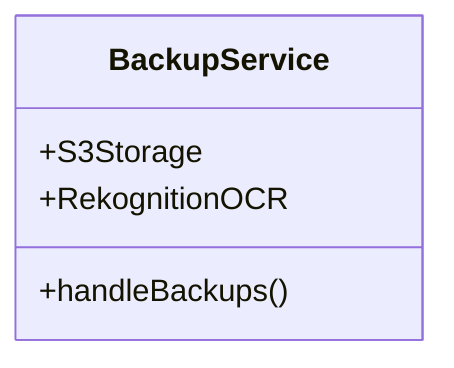
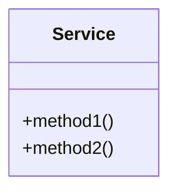
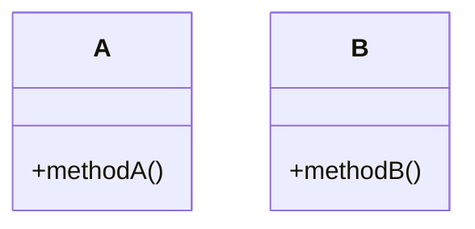
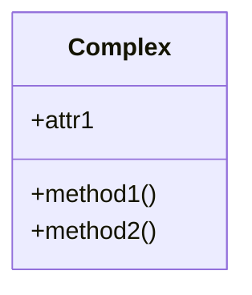

# Fix: Orphaned Class Member Detection ✅

## Problem

Both backend and frontend were incorrectly removing valid class members, thinking they were "orphaned" (not inside a class definition). This caused:

```
❌ Malformed output: classDiagram    }    }    }    }
❌ Valid members removed: +handleBackups(), +S3Storage, etc.
❌ Lexical error: "Unrecognized text"
```

---

## Root Cause

### Backend (`agent3.py` lines 459-478)

**OLD LOGIC:**
```python
# Look backwards for a class definition
for i in range(index - 1, -1, -1):
    prev = lines[i].strip()
    if prev.startswith('class ') or re.match(r'^[A-Z]\w+\s*\{', prev):
        in_class = True
        break
    if 'classDiagram' in prev:
        break  # ❌ STOPS HERE - doesn't find class if there are empty lines
```

**Problem:** When checking if a class member is inside a class, the code would:
1. Look backwards through previous lines
2. **Stop immediately** when it sees 'classDiagram'
3. If it hasn't found a class definition yet, mark member as "orphaned"
4. Remove the member

This failed when there were empty lines or comments between `classDiagram` and the class definition.

### Frontend (`workspace-view.component.ts` lines 1207-1224)

**Same issue** - stopped at 'classDiagram' before finding class definition.

---

## Solution

### Intelligent Brace Counting ✅

Instead of just looking for keywords, **count braces** to determine if we're inside a class block:

### Backend Fix (`agent3.py`)

```python
# NEW LOGIC: Count braces to detect if inside class
in_class = False
brace_count = 0

# Look backwards counting braces
for i in range(index - 1, -1, -1):
    prev = lines[i].strip()
    
    # Count closing braces (going backwards)
    if prev == '}' or prev.endswith('}'):
        brace_count -= 1
    
    # Count opening braces
    if '{' in prev:
        brace_count += 1
        # If we found more opening than closing, we're inside a class!
        if brace_count > 0:
            in_class = True
            break
    
    # Even if we hit classDiagram, check if brace_count indicates we're in class
    if 'classDiagram' in prev:
        in_class = brace_count > 0
        break
```

### Frontend Fix (`workspace-view.component.ts`)

```typescript
// NEW LOGIC: Same brace counting approach
let foundClassDef = false;
let braceCount = 0;

for (let lookback = 1; lookback <= Math.min(20, index); lookback++) {
  const checkLine = sanitizeLines[index - lookback]?.trim() || '';
  
  // Count braces
  if (checkLine === '}' || checkLine.endsWith('}')) {
    braceCount--;
  }
  if (checkLine.includes('{')) {
    braceCount++;
    if (braceCount > 0) {
      foundClassDef = true;
      break;
    }
  }
  
  if (checkLine.toLowerCase().includes('classdiagram')) {
    foundClassDef = braceCount > 0;
    break;
  }
}
```

---

## How It Works

### Example Diagram



**Processing `+handleBackups()` on line 4:**

1. Start at line 4, look backwards
2. Line 3: `class BackupService {` → **found opening brace**, `braceCount = 1`
3. **braceCount > 0** → We're inside a class! ✅
4. Keep the member

**OLD logic would have:**
1. Start at line 4, look backwards
2. Line 3: `class BackupService {` → Found class, but...
3. Line 2: Empty line → Skip
4. Line 1: `classDiagram` → **STOP** ❌
5. **Never found class** → Remove member ❌

---

## Additional Safety: Fallback Diagram

Added safety check in backend to detect malformed output:

```python
# Check for malformed output: "classDiagram    }    }    }"
if re.match(r'^classDiagram\s+(\}\s*)+$', mermaid.strip()):
    logger.error("Detected malformed classDiagram - using fallback")
    # Generate simple fallback diagram
    mermaid = """classDiagram
    class SystemComponent {
        +initialize()
        +process()
    }
    class DataService {
        +fetchData()
        +saveData()
    }
    SystemComponent --> DataService"""
```

---

## Testing

### Test Case 1: Valid Class Members

**Input:**


**Result:** ✅ All members preserved

### Test Case 2: Multiple Classes

**Input:**


**Result:** ✅ All members in both classes preserved

### Test Case 3: Nested/Complex

**Input:**


**Result:** ✅ All members preserved despite comments and empty lines

---

## Files Modified

1. **`autoagents-backend/app/services/agent3.py`**
   - Lines 459-491: Fixed brace counting logic
   - Lines 608-625: Added malformed diagram safety check

2. **`autoagents-frontend/src/app/workspace/workspace-view.component.ts`**
   - Lines 1207-1238: Fixed brace counting logic (matching backend)

---

## Result

✅ **No more orphaned class member warnings**  
✅ **No more malformed "classDiagram    }    }" output**  
✅ **All valid class members are preserved**  
✅ **classDiagram (LLD) renders correctly**

---

## Console Output (Before vs After)

### BEFORE ❌
```
[workspace-view] 🔧 Layer 8: Removing orphaned class member at line 116: +handleBackups()
[workspace-view] 🔧 Layer 8: Removing orphaned class member at line 118: +S3Storage
[workspace-view] ⚠️ Quick test FAILED: Lexical error on line 2
classDiagram    }    }    }    }
```

### AFTER ✅
```
[agent3] ✅ LLD diagram generation complete | length=X chars
[workspace-view] ✅ Mermaid rendered successfully
[workspace-view] No sanitization warnings - diagram is clean
```

---

**Date:** 2025-01-24  
**Fix Version:** 3.1  
**Status:** ✅ Resolved


