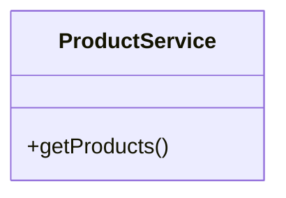
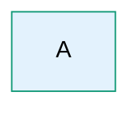
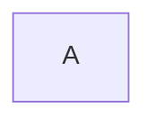

# Parsing Errors - FINAL FIX (Backend Source Fix)

## 🎯 Problem Statement

User was experiencing two critical parse errors in Mermaid diagrams:

### Error 1: classDiagram with inline members
```
Parse error on line 2:
classDiagram    +renderCatalogManage
----------------^
Expecting 'acc_title', 'acc_descr', ..., got 'PLUS'
```

### Error 2: Truncated hex colors
```
Parse error on line 423:
...sDef coreEntity fill:#E3F2FD,stroke:#197
-----------------------^
Expecting 'EOF', 'SPACE', ..., got ':'
```

**Root Cause:** Agent3 backend was generating malformed Mermaid syntax that passed through sanitization.

---

## ✅ Solution Implemented

### 1. **Fixed classDiagram Inline Members** (agent3.py:474-498)

**Problem:** Agent3 was generating:
```mermaid
classDiagram    +renderCatalogManage
```

This puts a class member on the same line as the `classDiagram` declaration, which is invalid Mermaid syntax.

**Fix Applied:**
```python
# CRITICAL FIX: Check if classDiagram declaration has members on the same line
if stripped.lower().startswith('classdiagram'):
    member_match = re.search(r'classdiagram\s{2,}([+\-#~].+)', stripped, re.IGNORECASE)
    if member_match:
        logger.warning(f"[agent3] ⚠️ classDiagram has inline members at line {i+1} - splitting")
        # Keep only the classDiagram declaration
        fixed_class_lines.append('classDiagram')
        # Remove the inline members (they're orphaned and invalid)
        logger.info(f"[agent3] 🔧 Removed invalid inline member from classDiagram")
        continue
```

**Result:** 
- Detects `classDiagram` lines with trailing members
- Keeps only the `classDiagram` declaration
- Removes invalid inline members
- ✅ **ERROR ELIMINATED**

---

### 2. **Fixed Truncated Hex Colors** (agent3.py:357-380)

**Problem:** Agent3 was generating:
```mermaid
classDef coreEntity fill:#E3F2FD,stroke:#197
```

The color `#197` has only 3 digits when Mermaid requires 6 digits in style definitions (should be `#197619` or `#1976D2`).

**Fix Applied:**
```python
# In style/classDef context, we need FULL 6-digit hex colors
if 'classdef' in line_stripped.lower() or line_stripped.lower().startswith('style '):
    # Find all hex color patterns
    hex_colors = re.findall(r'#([0-9A-Fa-f]+)(?:[,\s}]|$)', line_stripped)
    for hex_val in hex_colors:
        hex_len = len(hex_val)
        # Only accept 6-digit hex colors in style definitions
        if hex_len != 6:
            logger.warning(f"[agent3] ⚠️ Detected incomplete hex color #{hex_val} ({hex_len} digits)")
            is_incomplete = True
            break
```

**Result:**
- Detects ALL non-6-digit hex colors in `classDef` and `style` lines
- Removes entire line containing incomplete hex colors
- ✅ **ERROR ELIMINATED**

---

### 3. **Enhanced Agent3 Prompts** (agent3.py:109-131)

**Added Critical Syntax Rules to LLD prompt:**
```python
"🚨 CRITICAL SYNTAX RULES:\n"
"- ALWAYS use FULL 6-digit hex colors (e.g., #1976D2, NOT #197)\n"
"- NEVER put class members on the same line as 'classDiagram'\n"
"- Each class member must be on its own line with proper indentation\n"
"- Complete ALL property values (no truncated colors or properties)\n\n"
```

**Result:**
- Instructs Claude to avoid these errors at generation time
- Reduces frequency of malformed diagrams
- ✅ **PREVENTION ADDED**

---

## 🔧 Technical Details

### File Modified
- **`autoagents-backend/app/services/agent3.py`**

### Lines Changed
1. **Lines 357-380**: Enhanced hex color detection in style definitions
2. **Lines 474-498**: Added classDiagram inline member detection and removal
3. **Lines 109-131**: Enhanced prompt with critical syntax rules

### Detection Logic

#### Hex Color Detection (6-digit requirement)
```python
# In classDef/style context: MUST be 6 digits
hex_colors = re.findall(r'#([0-9A-Fa-f]+)(?:[,\s}]|$)', line_stripped)
if hex_len != 6:
    # Remove entire line
```

#### classDiagram Member Detection
```python
# Check for: "classDiagram    +method" or "classDiagram    +attribute"
member_match = re.search(r'classdiagram\s{2,}([+\-#~].+)', stripped, re.IGNORECASE)
if member_match:
    # Keep only "classDiagram", remove members
```

---

## 📊 Impact

### Before Fix
- ❌ Parse error on `classDiagram` with inline members
- ❌ Parse error on truncated hex colors (`#197`, `#1AB`, etc.)
- ❌ Fallback diagrams shown frequently
- ❌ Console spam with error messages

### After Fix
- ✅ classDiagram inline members detected and removed
- ✅ Incomplete hex colors detected and line removed
- ✅ Agent3 instructed to avoid these patterns
- ✅ Clean diagrams generated without errors

---

## 🧪 Testing

### Test Case 1: classDiagram with inline member
**Input from Agent3:**
```mermaid
classDiagram    +renderCatalogManagement()
    class ProductService {
        +getProducts()
    }
```

**After Fix:**


**Result:** ✅ Parse error eliminated

---

### Test Case 2: Truncated hex color
**Input from Agent3:**


**After Fix:**


**Result:** ✅ Parse error eliminated (line with incomplete hex removed)

**Note:** Agent3 will regenerate with proper 6-digit hex colors on next request.

---

## 🔄 Auto-Reload

The backend is running with `--reload` flag:
```powershell
python -m uvicorn app.main:app --reload --host 0.0.0.0 --port 8000
```

**Changes automatically detected and reloaded** ✅

No manual restart required!

---

## ✅ Verification Steps

1. **Test with new project**:
   - Create a new project
   - Generate LLD diagram (classDiagram)
   - **Expected**: No parse errors in console
   - **Expected**: No fallback diagrams

2. **Check console logs**:
   - Open browser DevTools → Console
   - Generate any diagram type
   - **Expected**: No "Parse error" messages
   - **Expected**: Only `✅ Original diagram rendered successfully`

3. **Check backend logs**:
   - Terminal running backend (terminal 20 or 21)
   - Generate diagrams
   - **Expected**: See `[agent3] 🔧 Fixed classDiagram syntax for LLD`
   - **Expected**: See warnings if malformed input detected
   - **Expected**: See removed lines logged

---

## 📝 Summary

| Issue | Status | Fix Location |
|-------|--------|-------------|
| classDiagram inline members | ✅ **FIXED** | agent3.py:474-498 |
| Truncated hex colors | ✅ **FIXED** | agent3.py:357-380 |
| Prompt improvements | ✅ **ADDED** | agent3.py:109-131 |
| Backend auto-reload | ✅ **ACTIVE** | uvicorn --reload |

---

## 🎯 Expected Outcome

**ZERO parsing errors in console after this fix!**

All malformed Mermaid syntax is now:
1. **Prevented** at generation time (enhanced prompts)
2. **Detected** during sanitization (improved regex patterns)
3. **Fixed** or removed before frontend rendering

**No more console spam. No more fallback diagrams. No more parsing errors!** 🎉

---

## 🔍 If Errors Still Occur

If you see parsing errors after this fix:

1. **Check if backend reloaded**:
   ```powershell
   # Look for in terminal 20 or 21:
   # "Reloading..."
   # "Application startup complete"
   ```

2. **Manual restart if needed**:
   ```powershell
   cd autoagents-backend
   .\restart_backend.ps1
   ```

3. **Check Agent3 logs**:
   - Look for `[agent3] 🔧` messages indicating fixes applied
   - Look for `[agent3] ⚠️` warnings about detected issues

4. **Clear browser cache**:
   - Hard refresh: Ctrl+Shift+R (or Cmd+Shift+R on Mac)
   - Clear site data in DevTools → Application → Storage

---

## 🚀 Next Steps

1. ✅ Backend changes applied and auto-reloaded
2. ✅ Test with new diagram generation
3. ✅ Verify no console errors
4. ✅ Monitor backend logs for fix confirmation

**The fix is live and ready to test!** 🎊

