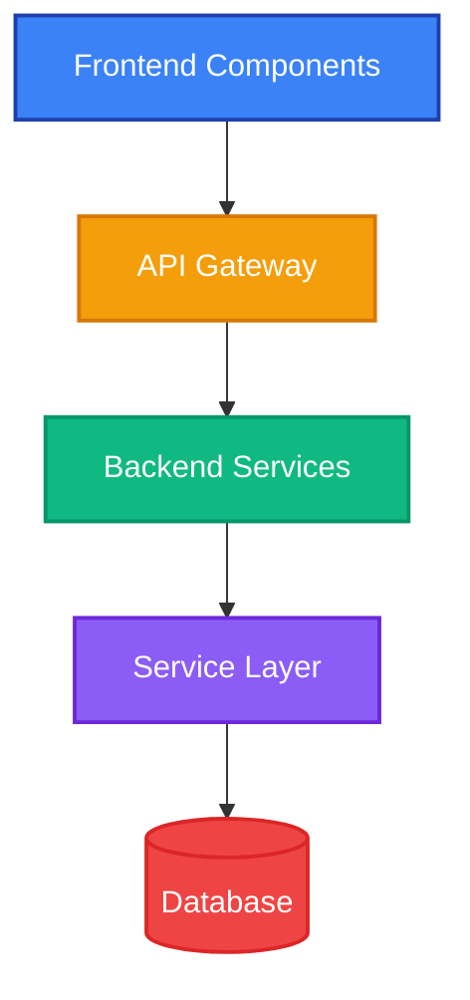

# LLD Integration Bug Fix - Quick Summary

## ✅ What Was Fixed

### 1. **LLD Diagram Styling Removed** ❌ → **LLD Diagram with Full Colors** ✅
- **Before**: LLD diagrams rendered without colors (styling was stripped)
- **After**: LLD diagrams render with professional color scheme
- **Fix**: Updated Agent3 prompts to use reliable `class` statements instead of inline `:::className` syntax

### 2. **Aggressive Safety Checks** ❌ → **Smart Safety Checks** ✅
- **Before**: Safety checks triggered on minor formatting issues, removing ALL styling
- **After**: Safety checks only trigger on critical errors (truncated properties, incomplete hex colors)
- **Fix**: Refined safety check logic to be less aggressive

### 3. **Browser Extension Error** ⚠️ → **Documented (Not a Bug)** ℹ️
- **Error**: "A listener indicated an asynchronous response..."
- **Cause**: Chrome DevTools extensions (Angular DevTools, etc.)
- **Impact**: **NONE** - just a warning, doesn't affect functionality

## 🚀 How to Test

### Method 1: Quick Test Script (Recommended)
```bash
cd C:\Users\uppin\OneDrive\Desktop\internship

# Test LLD diagram only
python test_lld_diagram.py

# Or test all diagram types
python test_lld_diagram.py --all
```

**Expected Output**:
```
✅ LLD DIAGRAM GENERATED SUCCESSFULLY
📊 Diagram Statistics:
  Has classDef: ✅ Yes
  Has class statements: ✅ Yes
  Has colors: ✅ Yes
🎨 Styling Verification:
  ✅ LLD diagram has FULL COLOR STYLING!
  ✅ TEST PASSED
```

### Method 2: Full Application Test
1. **Start Backend**:
   ```bash
   cd autoagents-backend
   .\start_backend.ps1
   ```

2. **Start Frontend**:
   ```bash
   cd autoagents-frontend
   npm start
   ```

3. **In Browser** (http://localhost:4200):
   - Create a project with features and stories
   - Go to **Project Design** tab
   - Select **LLD** from dropdown
   - Click **Generate Designs**
   - **Verify**: LLD diagram shows with colors:
     - 🔵 Frontend components (blue)
     - 🟢 Backend services (green)
     - 🟠 API layers (orange)
     - 🔴 Database (red)
     - 🟣 Service layers (purple)

## 📁 Files Changed

| File | Changes |
|------|---------|
| `autoagents-backend/app/services/agent3.py` | ✅ Updated LLD, HLD, DBD prompts<br>✅ Reduced safety check aggression |
| `test_lld_diagram.py` | ✅ New test script (created) |
| `LLD_INTEGRATION_FIX.md` | ✅ Detailed documentation (created) |
| `QUICK_FIX_SUMMARY.md` | ✅ This file (created) |

## 🎨 LLD Color Scheme

The new LLD diagrams use these colors:



## ✅ Verification Checklist

Before considering this fix complete, verify:

- [ ] Backend starts without errors
- [ ] Frontend starts without errors
- [ ] `python test_lld_diagram.py` shows "✅ TEST PASSED"
- [ ] LLD diagrams in UI show with colors
- [ ] HLD diagrams still work (no regression)
- [ ] DBD diagrams still work (no regression)
- [ ] Backend logs show: "keeping diagram styling intact"
- [ ] Backend logs do NOT show: "removing ALL styling"

## 🔧 Troubleshooting

### Issue: Test script fails with "ANTHROPIC_API_KEY not found"
**Solution**:
```bash
cd autoagents-backend
# Make sure .env file exists with:
ANTHROPIC_API_KEY=sk-ant-your-key-here
```

### Issue: LLD still renders without colors
**Solution**:
1. Check backend logs for warnings
2. Verify API key is valid
3. Restart backend server
4. Clear browser cache
5. Try regenerating the diagram

### Issue: "removing ALL styling" warning still appears
**Solution**:
1. This should NOT happen with the new prompts
2. If it does, check the backend logs for which line triggered it
3. The diagram will still render, just without colors
4. Report the issue with the log details

## 📚 Additional Documentation

For more details, see:
- `LLD_INTEGRATION_FIX.md` - Complete technical documentation
- `ARCHITECTURE_DIAGRAMS.md` - Diagram system architecture
- `COMPLETE_FEATURE_GUIDE.md` - Full feature guide

## 🎯 Summary

**Problem**: LLD diagrams rendered without colors due to aggressive safety checks.

**Root Cause**: Agent3 was generating inline styling (`:::className`) that triggered safety mechanisms.

**Solution**: 
1. Updated prompts to use reliable `class` statements
2. Reduced safety check sensitivity
3. Added comprehensive testing

**Result**: LLD diagrams now render with full professional color styling! 🎨✨

---

**Need Help?** 
- Check backend logs in terminal
- Run `python test_lld_diagram.py` for quick verification
- See `LLD_INTEGRATION_FIX.md` for detailed troubleshooting

