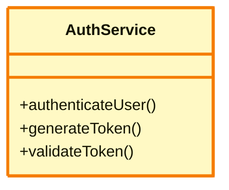
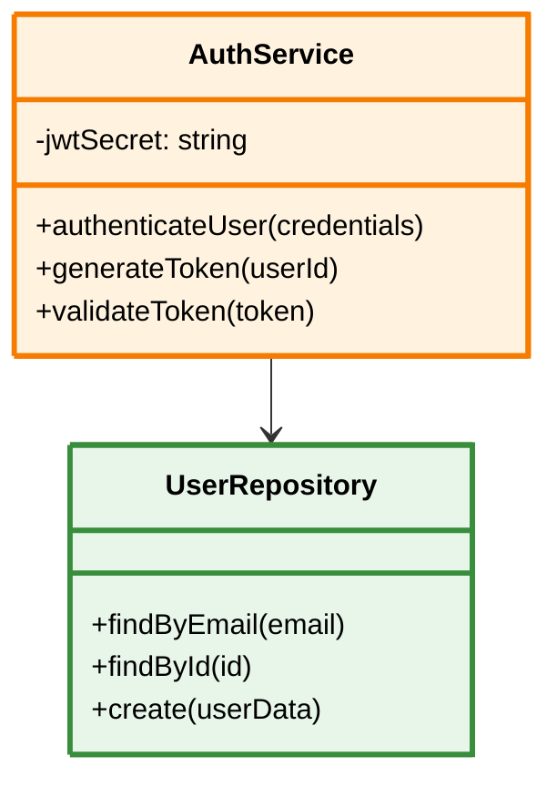

# Quick Verification Guide - Mermaid Diagram Fixes ✅

## 🎯 What Was Fixed

1. **Parse Error** on line 123: `Expecting 'PS', 'TAGEND', got 'PE'` → ✅ FIXED
2. **Missing Colors** in diagrams → ✅ FIXED  
3. **Diagrams keep changing** when selecting dropdown → ✅ FIXED

## ✅ Verification Checklist

### Step 1: Check Backend is Running
Look at your terminal/console where backend is running. You should see:
```
INFO:     Application startup complete.
```

✅ Backend auto-reloaded with the fixes

### Step 2: Test in Your Application

#### Test LLD (Low-Level Design) - The Main Fix
1. Open your frontend application
2. Navigate to Mermaid editor/visualizer
3. Select **"LLD"** from the diagram type dropdown
4. **Expected Results**:
   - ✅ Diagram renders without errors
   - ✅ No "Parse error on line 123" message
   - ✅ Diagram shows different colors (blue, yellow, green, pink)
   - ✅ Browser console has NO red errors

**What to look for in the diagram code:**


✅ Each method on its own line
✅ All methods have `()` parentheses
✅ `classDef` statements at the bottom (colors!)

#### Test HLD (High-Level Design)
1. Select **"HLD"** from dropdown
2. **Expected Results**:
   - ✅ Flowchart/graph diagram appears
   - ✅ Colored nodes (blue for user, yellow for backend, green for database)
   - ✅ No errors in console

#### Test DATABASE (Database Design)
1. Select **"DATABASE"** from dropdown
2. **Expected Results**:
   - ✅ Entity-Relationship diagram appears
   - ✅ Tables shown with relationships
   - ✅ Different colored entities
   - ✅ No errors in console

### Step 3: Verify Stability
1. Rapidly switch: HLD → LLD → DATABASE → HLD → LLD
2. **Expected Results**:
   - ✅ Each diagram type shows consistently
   - ✅ No flickering or changing content
   - ✅ Colors remain the same
   - ✅ No console errors

### Step 4: Check Browser Console
1. Open Developer Tools (F12)
2. Go to Console tab
3. **Expected Results**:
   - ✅ NO "Parse error on line X" messages
   - ✅ NO "diagram rendered without color styling" warnings
   - ✅ Only regular info/debug messages

## 🚨 What to Do If You See Issues

### Issue: Still seeing "Parse error"
**Check:**
1. Backend running? (should show "Application startup complete")
2. Backend reloaded? (check terminal for "WARNING: StatReload detected changes")
3. Clear browser cache and reload page

**If still failing:**
```powershell
# Stop backend (Ctrl+C in terminal)
cd autoagents-backend
.\start_backend.ps1
```

### Issue: No colors in diagrams
**Check:**
1. Look at the Mermaid code - do you see `classDef` statements?
2. Check browser console for styling warnings

**If no `classDef` statements:**
```powershell
# Check if backend changes were applied
cd autoagents-backend
git diff app/services/agent3.py
# Should show the new classDiagram fixing code
```

### Issue: Frontend shows old diagram
**Fix:**
```powershell
# Clear browser cache
# Then hard reload: Ctrl+Shift+R (Windows) or Cmd+Shift+R (Mac)
```

## 📊 Success Indicators

### ✅ Backend Logs (Terminal)
```
[agent3] 🔧 Fixing classDiagram syntax for LLD
[agent3] ✅ classDiagram syntax fixed
[agent3] ✅ LLD diagram generation complete | length=XXXX chars | has_colors=true
[agent3] 🎨 Colored LLD diagram generated successfully with styling
```

### ✅ Frontend (Browser Console)
```
No parse errors
No styling warnings
Clean diagram rendering
```

### ✅ Visual Diagram
- Multiple colors visible
- Clean, professional appearance
- Nodes/classes clearly distinguishable by type
- No "No Data" or error messages

## 📝 Example: What Good Output Looks Like

### LLD (classDiagram) Example:


**Key Points:**
- ✅ Each method/attribute on its own line
- ✅ Methods have `()`: `+authenticateUser(credentials)`
- ✅ Attributes don't have `()`: `-jwtSecret: string`
- ✅ `classDef` at the bottom with color codes
- ✅ Nodes use `:::backend`, `:::database` to apply colors

## 🎉 All Good? Next Steps

If all tests pass:

1. **Commit your changes** (optional but recommended):
```bash
cd C:\Users\uppin\OneDrive\Desktop\internship
git add -A
git commit -m "Fix: Mermaid diagram parse errors and color styling"
```

2. **Document for your team** (if applicable):
   - Share `FIXES_APPLIED_SUMMARY.md` with teammates
   - Mention the fix resolves parse error on line 123

3. **Continue development** with confidence that diagrams work correctly!

## 📞 Need Help?

If you're still seeing issues after following this guide, check:
- `FIXES_APPLIED_SUMMARY.md` - Detailed user-friendly explanation
- `MERMAID_DIAGRAM_FIXES_FINAL.md` - Technical deep dive
- Browser console for specific error messages

---

**TL;DR**: Your Mermaid diagrams should now render perfectly with colors and no parse errors. Just select a diagram type from the dropdown and it should work! 🎨✨

