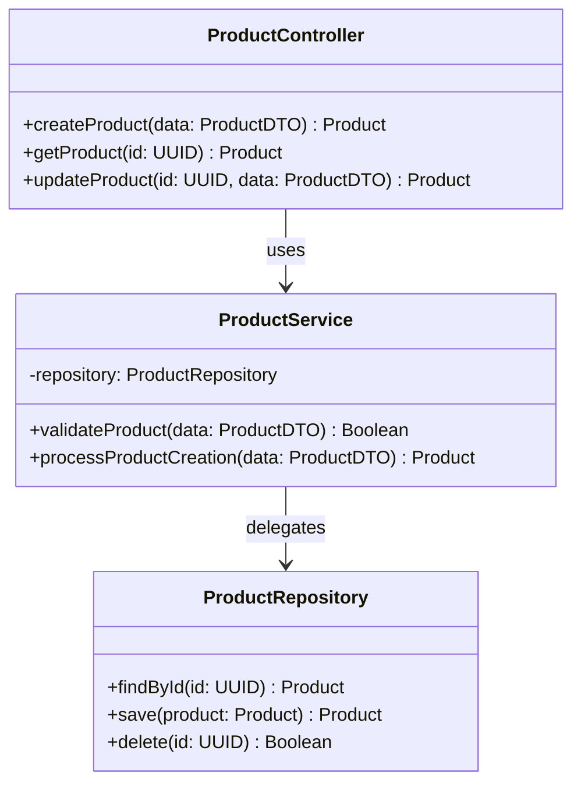
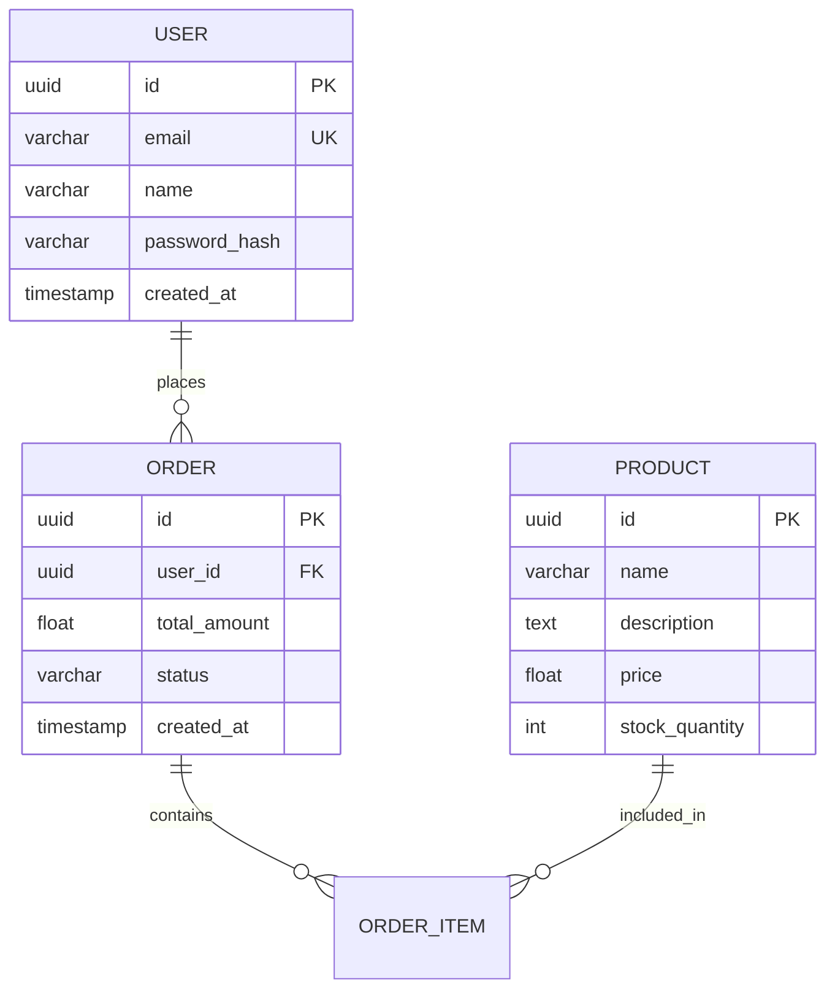

# Quick Test Guide - LLD & DBD Diagram Generation

## 🚀 Quick Start (5 minutes)

### Step 1: Start Servers
```bash
# Terminal 1 - Backend
cd autoagents-backend
uvicorn app.main:app --reload --port 8000

# Terminal 2 - Frontend  
cd autoagents-frontend
npm start
```

### Step 2: Test LLD & DBD Generation

1. **Open app**: http://localhost:4200
2. **Start chat**: Type a project idea
   ```
   "Build an e-commerce platform with products, cart, and checkout"
   ```
3. **Approve Agent 1 features** (click thumbs up)
4. **Approve Agent 2 stories** (click approve)
5. **Workspace opens** with HLD diagram

### Step 3: Switch Diagrams

**Test LLD:**
- Click dropdown → "LLD - Low Level Design"
- ✅ Should show: `ProductController`, `CartService`, `OrderRepository`, etc.
- ❌ Should NOT show: Generic "ApplicationService"

**Test DBD:**
- Click dropdown → "DBD - Database Design"
- ✅ Should show: `PRODUCT`, `CART`, `ORDER`, `USER` tables
- ✅ Should have fields: `uuid id PK`, `varchar name`, etc.
- ❌ Should NOT show: Only "APPLICATION_DATA"

## 🔍 What to Check

### Console Output (F12 → Console)

**Good signs:**
```
[app] Agent 3 response received | hasMermaid=true | mermaidLength=3245
[app] Using AI-generated LLD diagram from backend | length=3245
[app] LLD diagram successfully set
```

**Bad signs:**
```
[app] Backend returned empty LLD, using fallback AST builder
Error: Parse error on line X
```

### Visual Check

**LLD Diagram Should Have:**
- ✅ Classes matching your features (e.g., `ProductController`, `OrderService`)
- ✅ Methods with parameters (e.g., `+createOrder(userId: UUID)`)
- ✅ Relationships between classes (arrows)
- ✅ Different colors for controllers, services, repositories

**DBD Diagram Should Have:**
- ✅ Tables from your domain (e.g., `PRODUCT`, `ORDER`, `CUSTOMER`)
- ✅ Data types (uuid, varchar, int, float, datetime)
- ✅ Constraints (PK, FK, UK)
- ✅ Relationships with labels (e.g., `USER ||--o{ ORDER : places`)

## 🐛 Troubleshooting

### Problem: Empty or Generic Diagrams

**Check:**
1. Is Claude API key set?
   ```bash
   echo $CLAUDE_API_KEY
   # or
   echo $ANTHROPIC_API_KEY
   ```

2. Backend logs show generation?
   ```
   [visualizer] Generating LLD diagram | features=5 | stories=8
   [agent3] Successfully generated LLD diagram
   ```

3. Features and stories exist?
   - Need at least 1 feature AND 1 story

### Problem: Parse Errors

**Check backend logs for:**
```
[agent3] ❌ CRITICAL: Found orphaned member
[agent3] Generating fallback classDiagram
```

This means Agent3's fallback kicked in - diagram should still work.

### Problem: No Diagram Showing

1. Check browser console for errors
2. Verify Mermaid.js loaded: Console should show `Mermaid initialized`
3. Try clicking "Regenerate" button
4. Clear cache and reload (Ctrl+Shift+R)

## 📊 Expected Results

### Example LLD Output


### Example DBD Output


## ✅ Success Criteria

After your test, you should be able to:
- [x] Generate LLD with project-specific classes
- [x] Generate DBD with project-specific tables
- [x] Switch between HLD, LLD, and DBD smoothly
- [x] See detailed, AI-generated diagrams (not generic templates)
- [x] Regenerate any diagram type on demand

## 📝 What Changed

**The Fix:**
- Frontend now uses AI-generated diagrams from backend (Claude)
- Local fallback builders only used if backend fails
- File changed: `autoagents-frontend/src/app/app.ts`

**Before:** Always used generic local templates  
**After:** Uses AI-generated, project-specific diagrams ✨

## Need Help?

Check full documentation: `LLD_DBD_DIAGRAM_FIX.md`
