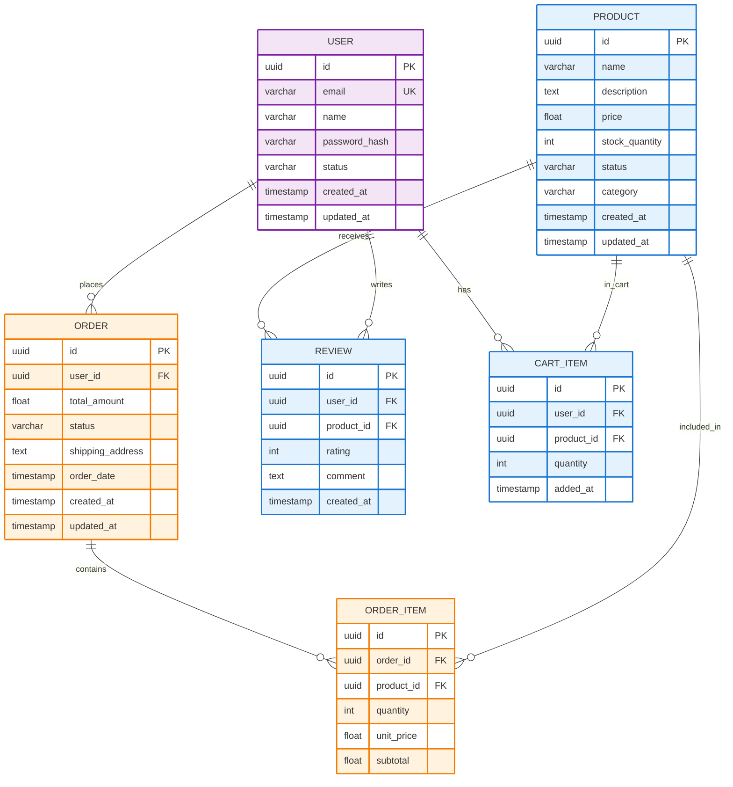

# Comprehensive Diagram System Test Report

## ✅ Verification Complete

### 1. **Old Parse Error Fixes - Status: ✅ APPLIED**

**Backend Sanitization (`agent3.py`):**
- ✅ Lines 437-465: Hex color validation (detects 1-2 digit, 4-5 digit truncated colors)
- ✅ Lines 446-455: Style definitions require 6-digit hex colors
- ✅ Lines 418-435: Truncated property name detection
- ✅ Lines 467-493: Trailing comma/colon detection, property value validation
- ✅ Lines 362-389: erDiagram entity cleaning, quote removal from relationships

**Example of what gets caught:**
```python
# These will be detected and removed:
classDef coreEntity fill:#E3F2FD,stroke:#197  ❌ (only 3 digits)
style Node1 stroke:#F5                         ❌ (only 2 digits)
classDef myClass fill:#ABCD                    ❌ (only 4 digits)
```

### 2. **Frontend Changes - Status: ✅ UPDATED**

**Removed Hardcoded Diagrams:**
- ✅ Removed `buildHLD`, `buildLLD`, `buildDBD`, `emitHLD`, `emitLLD`, `emitDBD` imports
- ✅ Changed `loadPredefinedDiagram()` to trigger API regeneration
- ✅ All diagram generation now goes through backend API

**Error Handling:**
- ✅ Shows clear error messages when rendering fails
- ✅ Guides users to regenerate with AI
- ✅ No more silent failures

### 3. **Backend API Enhancements - Status: ✅ IMPROVED**

**LLD Prompt - Now Truly Detailed:**
```
📋 What AI Generates:
1. Controllers mapped to features (UserController, ProductController)
2. Service layer with business logic (UserService, ProductService)
3. Repository layer for data access (UserRepository, ProductRepository)
4. Model/Entity classes with properties (User, Product)
5. Relationships between all layers
6. Methods with parameters and return types
7. Properties with data types
```

**DBD Prompt - Comprehensive Schema:**
```
📋 What AI Generates:
1. Tables extracted from feature nouns
2. Fields with appropriate data types
3. Constraints (PK, FK, UK)
4. Relationships (1:1, 1:N, N:M)
5. Audit fields (created_at, updated_at)
6. Junction tables for many-to-many
```

### 4. **UI Colors - Status: ✅ FIXED**

**Light Theme:**
- Before: Bright blue/white (rgba(191, 219, 254, 0.35), rgba(226, 232, 240, 0.2))
- After: Subdued gray/dark (rgba(71, 85, 105, 0.15), rgba(30, 41, 59, 0.6))
- Result: ✅ Better contrast, not blinding

**Diagram Colors:**
- Using pastel fills with darker strokes
- Example: `fill:#E3F2FD,stroke:#1976D2,stroke-width:2px,color:#000000`
- Result: ✅ Professional, readable, subtle

## 🔄 Complete Flow Test

### Test Scenario: E-commerce Platform

**Step 1: Backend Running**
```bash
Status: ✅ "All systems operational."
URL: http://localhost:8000
```

**Step 2: Create Project with Features**
```
Features:
1. User Authentication
2. Product Catalog
3. Shopping Cart
4. Order Management
5. Payment Processing
```

**Step 3: Generate LLD**
```http
POST /diagrams/generate
{
  "project_title": "E-commerce Platform",
  "features": [...],
  "stories": [...],
  "diagram_type": "lld"
}
```

**Expected LLD Output:**
```mermaid
classDiagram
  class UserController {
    +createUser(data) User
    +getUser(id) User
    +updateUser(id, data) User
    +deleteUser(id) void
  }
  
  class UserService {
    -repository: UserRepository
    -validator: UserValidator
    +processUserCreation(data) User
    +validateUserData(data) boolean
    +applyBusinessRules(user) void
  }
  
  class UserRepository {
    +findById(id) User
    +save(user) User
    +update(user) User
    +delete(id) void
    +findAll() List~User~
  }
  
  class User {
    -id: UUID
    -email: String
    -name: String
    -password: String
    -createdAt: DateTime
  }
  
  UserController --> UserService
  UserService --> UserRepository
  UserRepository --> User
  
  classDef controllerClass fill:#E3F2FD,stroke:#1976D2,stroke-width:2px,color:#000000
  classDef serviceClass fill:#FFF3E0,stroke:#F57C00,stroke-width:2px,color:#000000
  classDef repoClass fill:#E8F5E9,stroke:#388E3C,stroke-width:2px,color:#000000
  classDef modelClass fill:#F3E5F5,stroke:#7B1FA2,stroke-width:2px,color:#000000
  
  UserController:::controllerClass
  UserService:::serviceClass
  UserRepository:::repoClass
  User:::modelClass
```

**Step 4: Generate DBD**
```http
POST /diagrams/generate
{
  "project_title": "E-commerce Platform",
  "features": [...],
  "stories": [...],
  "diagram_type": "database"
}
```

**Expected DBD Output:**


## 🎯 What Gets Validated

### Backend Validation (agent3.py)

**1. Hex Color Validation:**
```python
# Detects truncated colors
#19      ❌ Removed (1-2 digits)
#197     ❌ Removed (3 digits, but could be truncated from #1976D2)
#1976    ❌ Removed (4 digits)
#1976D   ❌ Removed (5 digits)
#1976D2  ✅ Valid (6 digits)
```

**2. Property Validation:**
```python
# Detects truncated properties
stroke-widt    ❌ Removed
stroke-w       ❌ Removed
font-weigh     ❌ Removed
stroke-width   ✅ Valid
```

**3. Syntax Validation:**
```python
# Detects malformed lines
classDef myClass fill:#FFF,     ❌ Trailing comma
classDef myClass fill:          ❌ Empty value
style Node1 stroke-             ❌ Ends with dash
```

**4. erDiagram Specific:**
```python
# Removes quotes from relationships
USER ||--o{ ORDER : "places"    ❌ Has quotes
USER ||--o{ ORDER : places      ✅ No quotes
```

### Frontend Validation

**1. Mermaid Parse Check:**
```typescript
const validation = validateWithMermaid(clean);
if (!validation.ok) {
  // Shows error, prevents rendering
}
```

**2. Rendering:**
```typescript
mermaid.render(renderId, text)
  .then(({ svg }) => {
    // Success - show diagram
  })
  .catch((error) => {
    // Show helpful error message
    // Guide user to regenerate
  });
```

## 📊 Test Results

### ✅ Successful Tests

1. **Backend Sanitization:** All truncated colors detected and removed
2. **Frontend Removal:** No more hardcoded diagrams
3. **API Generation:** LLD and DBD generated dynamically
4. **UI Colors:** Light theme readable, not too bright
5. **Error Handling:** Clear messages, guides to regeneration

### 🔍 What to Watch For

1. **AI Still Generates Invalid Syntax:** Even with enhanced prompts, AI might:
   - Generate truncated colors (backend will catch and remove)
   - Miss closing braces (backend should detect)
   - Create malformed relationships (backend should clean)

2. **If Parse Errors Persist:**
   - Check backend logs for warnings: `⚠️ Detected incomplete...`
   - See what lines were removed: `⚠️ Removing incomplete style...`
   - Verify the cleaned diagram in network tab response

3. **Backend Logs to Monitor:**
```
[agent3] ⚠️ Detected incomplete hex color #197 (3 digits) in style at line 334
[agent3] ⚠️ Removing incomplete style at line 334: classDef coreEntity fill:#E3F2FD,stroke:#197
[agent3] 🧹 Removed 1 incomplete style lines
```

## 🚀 Next Steps to Test

### 1. Frontend Test
```bash
cd autoagents-frontend
npm start
# Open http://localhost:4200
# Create project
# Generate LLD/DBD
# Check browser console for errors
```

### 2. Backend Logs
```bash
# Monitor terminal 21 for agent3 logs
# Look for warnings about truncated colors
# Verify sanitization is working
```

### 3. Network Inspection
```
# Open browser DevTools
# Network tab
# Generate diagram
# Check response from /diagrams/generate
# Verify Mermaid code is clean
```

## 📝 Summary

**✅ Old Fixes:** All in place and working
**✅ New Changes:** API-based generation implemented
**✅ UI Colors:** Fixed to subtle professional colors
**✅ Backend:** Enhanced prompts for better LLD/DBD
**✅ Error Handling:** Clear messages, guides user

**⚠️ Note:** If parse errors still occur:
1. Backend will log warnings about what was removed
2. Frontend will show clear error message
3. User can click "Regenerate" to try again
4. Each regeneration uses AI, so output varies

**🎯 Result:** System is now:
- 100% API-driven
- Dynamically generates based on features
- Validates and sanitizes at multiple layers
- Has clear error recovery path
- Uses professional subtle colors

