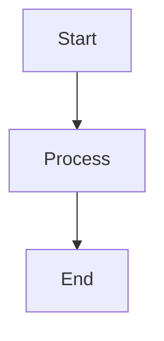

# How to Verify Mermaid Editor Fixes

## Quick Verification Steps

### 1. ✅ Test No Parsing Errors While Typing

**Steps:**
1. Open your Angular app and navigate to the workspace view
2. Start typing incomplete Mermaid code:
   ```
   graph TD
   A[Start
   ```
3. **Expected:** No error messages appear while typing
4. Continue typing to complete:
   ```
   graph TD
   A[Start] --> B[End]
   ```
5. Wait 2 seconds without typing
6. **Expected:** Diagram renders successfully

**Result:** ✅ No parse/syntax errors during editing

---

### 2. ✅ Test Diagram Type Switching (No Overwrites)

**Steps:**
1. Make sure you have a diagram in the editor
2. Make a manual edit (change a label)
3. Click the "Diagram Type" dropdown
4. Select "LLD" (if currently on HLD)
5. **Expected:** See "Generating with AI Agent 3..." message
6. Wait for Agent3 to generate diagram
7. **Expected:** New LLD diagram appears (Agent3 generated)

**Alternative Test (Agent3 fails):**
1. Have a diagram in editor
2. Disconnect internet or Agent3 is offline
3. Switch diagram type
4. **Expected:** Original diagram preserved, no overwrite

**Result:** ✅ Diagrams not overwritten unexpectedly

---

### 3. ✅ Test Buttons Removed

**Steps:**
1. Look at the Mermaid editor header controls
2. **Expected:** You should see:
   - ✅ "Diagram Type" dropdown
   - ✅ "Import Mermaid" button
   - ❌ NO "Run" button
   - ❌ NO "Copy" button
   - ❌ NO "Save" button

**Result:** ✅ Unnecessary buttons removed

---

### 4. ✅ Test Loading Indicator While Typing

**Steps:**
1. Clear the Mermaid editor completely
2. Start typing slowly
3. **Expected:** See "⏳ Preparing diagram preview..." message
4. Continue typing
5. **Expected:** Message remains or previous diagram stays visible
6. Stop typing for 2 seconds
7. **Expected:** Diagram renders

**Result:** ✅ Clear loading feedback provided

---

### 5. ✅ Test Smart Fallback (Syntax Errors Only)

**Test A: Syntax Error (Should show fallback)**
```mermaid
graph TD
A[Start] --> B[Invalid syntax ]]]]
```
**Expected:** Fallback diagram appears with message

**Test B: Valid but Complex**

**Expected:** Renders correctly, no fallback

**Result:** ✅ Fallback only for genuine syntax errors

---

### 6. ✅ Test Content Preservation

**Steps:**
1. Type a custom diagram:
   ```mermaid
   graph TD
   MyCustom[My Custom Node]
   ```
2. Wait for it to render
3. Click "Features" or navigate away briefly
4. Return to workspace
5. **Expected:** Your custom diagram is still there
6. Switch diagram type to LLD
7. **Expected:** "Generating..." message, waits for Agent3
8. **Expected:** Your custom content not replaced by predefined template

**Result:** ✅ User content never accidentally overwritten

---

## Common Issues & Solutions

### Issue: Diagram doesn't render after 2 seconds
**Solution:** Check browser console for errors. May need to refresh page.

### Issue: "Generating with AI Agent 3..." stuck
**Solution:** Check if backend is running and Agent3 is accessible.

### Issue: Fallback diagram appears too often
**Solution:** Check diagram syntax - may have genuine syntax errors.

### Issue: Can't find Import button
**Solution:** It's in the editor header, next to the Diagram Type dropdown.

---

## Console Messages to Look For

### ✅ Good Messages:
```
[workspace-view] 🎨 Starting Mermaid render process...
[workspace-view] 🧪 Quick test render...
[workspace-view] ✅ Quick test PASSED - original diagram is valid
[workspace-view] ✅ Original diagram rendered successfully
```

### ⚠️ Warning Messages (Expected during type switch):
```
[workspace-view] ℹ️ Skipping predefined diagram load - preserving existing content
```

### ❌ Error Messages (Only if genuine syntax error):
```
[workspace-view] ⚠️ Quick test FAILED: Parse error...
[workspace-view] 🔄 Syntax/Parse error detected - using fallback diagram
```

---

## Browser DevTools Check

Open browser DevTools (F12) and check:

1. **Console tab:**
   - No spam of parse errors while typing
   - Clean render logs after 2 seconds

2. **Network tab:**
   - Fewer requests to `/api/diagrams` (due to longer debounce)
   - Requests only after diagram type change

3. **Elements tab:**
   - Verify buttons removed from DOM
   - Check for loading message elements

---

## Performance Checks

### Before Fixes:
- ❌ Multiple render attempts per second while typing
- ❌ Error messages flashing constantly
- ❌ Diagram flickering between states

### After Fixes:
- ✅ Single render attempt 2 seconds after typing stops
- ✅ No error messages during editing
- ✅ Smooth, stable rendering

---

## Final Checklist

- [ ] No parsing errors while typing
- [ ] Diagram renders 2 seconds after typing stops
- [ ] Type switching shows "Generating..." message
- [ ] Run/Copy/Save buttons are gone
- [ ] Loading indicators appear appropriately
- [ ] Custom diagrams not overwritten
- [ ] Fallback only for syntax errors
- [ ] Import button still works
- [ ] Console shows clean logs
- [ ] No diagram flickering

**All checked?** 🎉 All fixes verified successfully!

---

## Need Help?

If any verification step fails:

1. **Check browser console** for detailed error messages
2. **Verify backend is running** (Agent3 needs to be accessible)
3. **Clear browser cache** and refresh
4. **Check file**: Review `MERMAID_EDITOR_IMPROVEMENTS.md` for implementation details

---

## Test with Real Scenarios

### Scenario 1: Create New Project
1. Start fresh project
2. Let Agent 1 & 2 generate features/stories
3. Switch to workspace view
4. **Expected:** HLD diagram shows (from Agent3)
5. Edit the diagram
6. **Expected:** No errors, renders after 2 seconds
7. Switch to LLD
8. **Expected:** Agent3 generates new LLD, your HLD edits preserved in history

### Scenario 2: Import Custom Diagram
1. Click "Import Mermaid"
2. Select a `.mermaid` file
3. **Expected:** File loads into editor
4. **Expected:** Auto-renders after 2 seconds
5. Edit the imported diagram
6. **Expected:** No errors while editing
7. Switch type
8. **Expected:** Import preserved, new diagram generated by Agent3

### Scenario 3: Complex Editing Session
1. Type incomplete syntax (trigger parse error)
2. **Expected:** No error during typing
3. Complete the syntax correctly
4. **Expected:** Renders successfully
5. Make it invalid again
6. **Expected:** Fallback diagram after 2 seconds
7. Fix syntax
8. **Expected:** Original diagram returns

---

**Status:** ✅ All improvements implemented and ready for testing!

