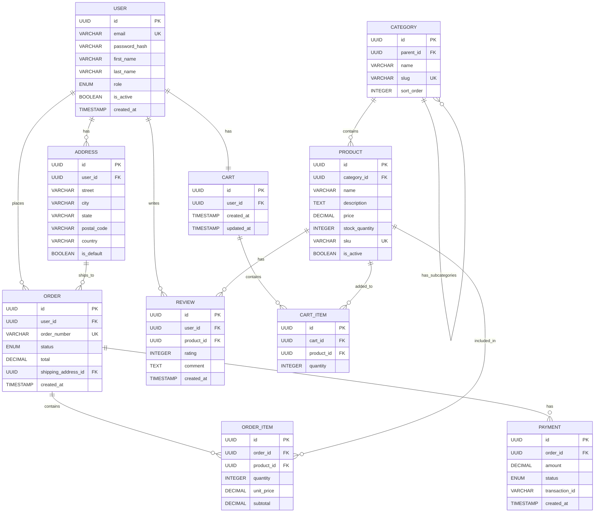

# AutoAgents Database Design Architecture

## Data Flow Overview

```
┌─────────────────┐    ┌─────────────────┐    ┌─────────────────┐    ┌─────────────────┐
│   USER PROMPT   │───▶│    AGENT-1      │───▶│    AGENT-2      │───▶│    AGENT-3      │
│                 │    │ Product         │    │ Product         │    │ Software        │
│ "Build an      │    │ Strategist      │    │ Owner           │    │ Architect       │
│  e-commerce    │    │                 │    │                 │    │                 │
│  platform"     │    │ Extracts        │    │ Generates       │    │ Creates         │
│                 │    │ 8-12 Features   │    │ 2-3 Stories/    │    │ Database        │
│                 │    │                 │    │ Feature         │    │ Schema          │
└─────────────────┘    └─────────────────┘    └─────────────────┘    └─────────────────┘
        │                      │                      │                      │
        ▼                      ▼                      ▼                      ▼
┌─────────────────┐    ┌─────────────────┐    ┌─────────────────┐    ┌─────────────────┐
│   PROJECTS      │    │   FEATURES      │    │   STORIES       │    │   DESIGNS       │
│   Collection    │    │   Collection    │    │   Collection    │    │   Collection    │
└─────────────────┘    └─────────────────┘    └─────────────────┘    └─────────────────┘
```

---

## Agent Pipeline - Input/Output Relationship

| Stage | Agent | Input | Processing | Output | Stored In |
|-------|-------|-------|------------|--------|-----------|
| 1 | **User** | Project Idea | Enters requirements | User Prompt + Title | `PROJECTS` |
| 2 | **Agent-1** | Project Prompt | AI Analysis | 8-12 Features | `FEATURES` |
| 3 | **Agent-2** | Features List | Story Generation | 2-3 Stories/Feature | `STORIES` |
| 4 | **Agent-3** | Features + Stories | Schema Design | HLD, LLD, DBD Tables | `DESIGNS` |

---

## Database Collections Schema (Table Format)

### 1. USERS Collection

| Field | Type | Constraints | Description |
|-------|------|-------------|-------------|
| `_id` | ObjectId | PK | Unique identifier |
| `name` | String | Required | User display name |
| `email` | String | Unique, Required | User email address |
| `password_hash` | String | Required | Bcrypt hashed password |
| `created_at` | DateTime | Auto | Account creation timestamp |
| `updated_at` | DateTime | Auto | Last modification time |
| `is_active` | Boolean | Default: true | Account status |

**Relationships:**
- `USERS` → `PROJECTS` (1:N) - A user owns many projects
- `USERS` → `SESSIONS` (1:N) - A user has many sessions

---

### 2. PROJECTS Collection

| Field | Type | Constraints | Description |
|-------|------|-------------|-------------|
| `_id` | ObjectId | PK | Unique identifier |
| `user_id` | ObjectId | FK → USERS | Owner reference |
| `title` | String | 3-180 chars | Project name |
| `prompt` | Text | Min 10 chars | User requirements/idea |
| `status` | String | Enum | created, processing, completed, failed |
| `created_at` | DateTime | Auto | Project creation time |
| `updated_at` | DateTime | Auto | Last modification time |

**Relationships:**
- `PROJECTS` → `FEATURES` (1:N) - A project has many features
- `PROJECTS` → `STORIES` (1:N) - A project has many stories
- `PROJECTS` → `DESIGNS` (1:1) - A project has one design document

---

### 3. FEATURES Collection (Agent-1 Output)

| Field | Type | Constraints | Description |
|-------|------|-------------|-------------|
| `_id` | ObjectId | PK | Unique identifier |
| `project_id` | String | FK → PROJECTS | Parent project |
| `feature_text` | String | Required | Feature title + description |
| `order_index` | Integer | 1-12 | Display order |
| `acceptance_criteria` | Array[String] | Optional | List of criteria |
| `created_at` | DateTime | Auto | Generation timestamp |
| `generated_by` | String | Default: agent1 | Source (agent1/manual) |

**Relationships:**
- `FEATURES` → `STORIES` (1:N) - A feature has 2-3 stories

**Example Data:**
```json
{
  "_id": "feat_001",
  "project_id": "proj_123",
  "feature_text": "Product Catalog Management: Browse and search products with filters",
  "order_index": 1,
  "acceptance_criteria": [
    "Users can view product list",
    "Users can filter by category",
    "Users can search by keyword"
  ],
  "generated_by": "agent1"
}
```

---

### 4. STORIES Collection (Agent-2 Output)

| Field | Type | Constraints | Description |
|-------|------|-------------|-------------|
| `_id` | ObjectId | PK | Unique identifier |
| `project_id` | String | FK → PROJECTS | Parent project |
| `feature_id` | String | FK → FEATURES | Parent feature |
| `story_text` | String | Required | "As a... I want... So that..." |
| `acceptance_criteria` | Array[String] | Required | Given-When-Then criteria |
| `implementation_notes` | Array[String] | Optional | Technical notes |
| `created_at` | DateTime | Auto | Generation timestamp |
| `generated_by` | String | Default: agent2 | Source (agent2/manual) |

**Relationships:**
- Many stories belong to one feature
- Many stories belong to one project

**Example Data:**
```json
{
  "_id": "story_001",
  "project_id": "proj_123",
  "feature_id": "feat_001",
  "story_text": "As a customer, I want to browse products by category so that I can find items easily",
  "acceptance_criteria": [
    "Given I am on the homepage, When I click a category, Then I see filtered products",
    "Given I am viewing products, When I apply filters, Then the list updates"
  ],
  "implementation_notes": [
    "Use lazy loading for product images",
    "Implement client-side caching"
  ],
  "generated_by": "agent2"
}
```

---

### 5. DESIGNS Collection (Agent-3 Output)

| Field | Type | Constraints | Description |
|-------|------|-------------|-------------|
| `_id` | ObjectId | PK | Unique identifier |
| `project_id` | String | FK → PROJECTS, Unique | Parent project (1:1) |
| `hld_mermaid` | Text | Required | High-Level Design diagram code |
| `lld_mermaid` | Text | Required | Low-Level Design diagram code |
| `dbd_mermaid` | Text | Required | Database Design diagram code |
| `dbd_tables` | Array[Object] | Required | **Table-formatted DB schema** |
| `style_config` | JSON | Optional | Mermaid styling configuration |
| `created_at` | DateTime | Auto | Generation timestamp |
| `updated_at` | DateTime | Auto | Last regeneration time |
| `version` | String | Default: 1.0 | Schema version |

**DBD Tables Structure (Agent-3 Table Format Output):**

```json
{
  "dbd_tables": [
    {
      "table_name": "USER",
      "type": "primary",
      "columns": [
        {"name": "id", "type": "UUID", "constraints": "PK"},
        {"name": "email", "type": "VARCHAR(255)", "constraints": "UNIQUE, NOT NULL"},
        {"name": "password_hash", "type": "VARCHAR(255)", "constraints": "NOT NULL"},
        {"name": "created_at", "type": "TIMESTAMP", "constraints": "DEFAULT NOW()"}
      ],
      "relationships": [
        {"target": "ORDER", "type": "1:N", "foreign_key": "user_id"}
      ]
    }
  ]
}
```

---

### 6. FEEDBACK Collection

| Field | Type | Constraints | Description |
|-------|------|-------------|-------------|
| `_id` | ObjectId | PK | Unique identifier |
| `project_id` | String | FK → PROJECTS | Parent project |
| `design_id` | String | FK → DESIGNS | Related design |
| `diagram_type` | String | Enum | hld, lld, dbd |
| `user_message` | String | Required | User feedback text |
| `ai_response` | String | Required | Chatbot response |
| `suggestions` | Array[String] | Optional | Improvement suggestions |
| `applied` | Boolean | Default: false | Whether suggestion was used |
| `created_at` | DateTime | Auto | Feedback timestamp |

---

## Agent-3 Database Design Output Format

When Agent-3 generates a database design, it produces output in this table format:

### Generated Tables for E-Commerce Example

| Table Name | Type | Description |
|------------|------|-------------|
| USER | Primary | Customer/Admin accounts |
| PRODUCT | Primary | Product catalog items |
| CATEGORY | Secondary | Product categories |
| ORDER | Primary | Customer orders |
| ORDER_ITEM | Junction | Links orders to products |
| CART | Primary | Shopping cart |
| CART_ITEM | Junction | Links cart to products |
| PAYMENT | Secondary | Payment transactions |
| ADDRESS | Secondary | Shipping/billing addresses |
| REVIEW | Secondary | Product reviews |

### USER Table

| Column | Data Type | Constraints | Description |
|--------|-----------|-------------|-------------|
| id | UUID | PRIMARY KEY | Unique user identifier |
| email | VARCHAR(255) | UNIQUE, NOT NULL | Login email |
| password_hash | VARCHAR(255) | NOT NULL | Encrypted password |
| first_name | VARCHAR(100) | NOT NULL | User first name |
| last_name | VARCHAR(100) | NOT NULL | User last name |
| phone | VARCHAR(20) | NULL | Contact phone |
| role | ENUM | DEFAULT 'customer' | customer, admin |
| is_active | BOOLEAN | DEFAULT true | Account status |
| created_at | TIMESTAMP | DEFAULT NOW() | Registration date |
| updated_at | TIMESTAMP | ON UPDATE | Last modification |

### PRODUCT Table

| Column | Data Type | Constraints | Description |
|--------|-----------|-------------|-------------|
| id | UUID | PRIMARY KEY | Unique product ID |
| category_id | UUID | FOREIGN KEY | Reference to CATEGORY |
| name | VARCHAR(255) | NOT NULL | Product name |
| description | TEXT | NULL | Product details |
| price | DECIMAL(10,2) | NOT NULL | Base price |
| stock_quantity | INTEGER | DEFAULT 0 | Available inventory |
| sku | VARCHAR(50) | UNIQUE | Stock keeping unit |
| image_url | VARCHAR(500) | NULL | Product image |
| is_active | BOOLEAN | DEFAULT true | Listing status |
| created_at | TIMESTAMP | DEFAULT NOW() | Added date |

### ORDER Table

| Column | Data Type | Constraints | Description |
|--------|-----------|-------------|-------------|
| id | UUID | PRIMARY KEY | Unique order ID |
| user_id | UUID | FOREIGN KEY | Reference to USER |
| order_number | VARCHAR(20) | UNIQUE | Display order number |
| status | ENUM | NOT NULL | pending, confirmed, shipped, delivered, cancelled |
| subtotal | DECIMAL(10,2) | NOT NULL | Items total |
| tax | DECIMAL(10,2) | DEFAULT 0 | Tax amount |
| shipping_cost | DECIMAL(10,2) | DEFAULT 0 | Delivery fee |
| total | DECIMAL(10,2) | NOT NULL | Final amount |
| shipping_address_id | UUID | FOREIGN KEY | Delivery address |
| created_at | TIMESTAMP | DEFAULT NOW() | Order date |

### ORDER_ITEM Table (Junction)

| Column | Data Type | Constraints | Description |
|--------|-----------|-------------|-------------|
| id | UUID | PRIMARY KEY | Unique item ID |
| order_id | UUID | FOREIGN KEY | Reference to ORDER |
| product_id | UUID | FOREIGN KEY | Reference to PRODUCT |
| quantity | INTEGER | NOT NULL | Items ordered |
| unit_price | DECIMAL(10,2) | NOT NULL | Price at purchase |
| subtotal | DECIMAL(10,2) | NOT NULL | quantity × unit_price |

### CATEGORY Table

| Column | Data Type | Constraints | Description |
|--------|-----------|-------------|-------------|
| id | UUID | PRIMARY KEY | Unique category ID |
| parent_id | UUID | FOREIGN KEY (self) | Parent category (NULL = root) |
| name | VARCHAR(100) | NOT NULL | Category name |
| slug | VARCHAR(100) | UNIQUE | URL-friendly name |
| description | TEXT | NULL | Category description |
| image_url | VARCHAR(500) | NULL | Category image |
| sort_order | INTEGER | DEFAULT 0 | Display order |

---

## Relationships Summary

| From Table | To Table | Relationship | Foreign Key | Description |
|------------|----------|--------------|-------------|-------------|
| USER | ORDER | 1:N | order.user_id | User places many orders |
| USER | CART | 1:1 | cart.user_id | User has one active cart |
| USER | ADDRESS | 1:N | address.user_id | User has multiple addresses |
| USER | REVIEW | 1:N | review.user_id | User writes many reviews |
| CATEGORY | PRODUCT | 1:N | product.category_id | Category contains products |
| CATEGORY | CATEGORY | 1:N (self) | category.parent_id | Subcategories |
| ORDER | ORDER_ITEM | 1:N | order_item.order_id | Order has many items |
| PRODUCT | ORDER_ITEM | 1:N | order_item.product_id | Product in many orders |
| PRODUCT | REVIEW | 1:N | review.product_id | Product has many reviews |
| CART | CART_ITEM | 1:N | cart_item.cart_id | Cart has many items |
| PRODUCT | CART_ITEM | 1:N | cart_item.product_id | Product in many carts |
| ORDER | PAYMENT | 1:N | payment.order_id | Order has payment records |
| ADDRESS | ORDER | 1:N | order.shipping_address_id | Address used in orders |

---

## Visual ER Diagram



---

## Agent Data Flow Summary

```
┌────────────────────────────────────────────────────────────────────────────────────┐
│                            AUTOAGENTS DATA FLOW                                    │
├────────────────────────────────────────────────────────────────────────────────────┤
│                                                                                    │
│  USER INPUT                                                                        │
│  ─────────                                                                         │
│  "Build an e-commerce platform with product catalog, shopping cart, and checkout" │
│                                           │                                        │
│                                           ▼                                        │
│  ┌─────────────────────────────────────────────────────────────────────┐          │
│  │ AGENT-1 (Product Strategist)                                        │          │
│  │ ─────────────────────────────                                       │          │
│  │ INPUT:  User prompt + Project title                                 │          │
│  │ OUTPUT: 8-12 Features                                               │          │
│  │                                                                     │          │
│  │ ┌─────────────────────────────────────────────────────────────────┐ │          │
│  │ │ Feature 1: Product Catalog Management                           │ │          │
│  │ │ Feature 2: Shopping Cart Functionality                          │ │          │
│  │ │ Feature 3: Checkout and Payment Processing                      │ │          │
│  │ │ Feature 4: User Account Management                              │ │          │
│  │ │ Feature 5: Order Management System                              │ │          │
│  │ │ Feature 6: Inventory Tracking                                   │ │          │
│  │ │ Feature 7: Customer Reviews and Ratings                         │ │          │
│  │ │ Feature 8: Search and Filtering                                 │ │          │
│  │ └─────────────────────────────────────────────────────────────────┘ │          │
│  └─────────────────────────────────────────────────────────────────────┘          │
│                                           │                                        │
│                                           ▼                                        │
│  ┌─────────────────────────────────────────────────────────────────────┐          │
│  │ AGENT-2 (Product Owner)                                             │          │
│  │ ─────────────────────────                                           │          │
│  │ INPUT:  Features list + Original prompt                             │          │
│  │ OUTPUT: 2-3 User Stories per Feature                                │          │
│  │                                                                     │          │
│  │ ┌─────────────────────────────────────────────────────────────────┐ │          │
│  │ │ Story 1.1: As a customer, I want to browse products...          │ │          │
│  │ │ Story 1.2: As a customer, I want to filter by category...       │ │          │
│  │ │ Story 2.1: As a customer, I want to add items to cart...        │ │          │
│  │ │ Story 2.2: As a customer, I want to update quantities...        │ │          │
│  │ │ Story 3.1: As a customer, I want to enter payment details...    │ │          │
│  │ │ ... (16-36 total stories)                                       │ │          │
│  │ └─────────────────────────────────────────────────────────────────┘ │          │
│  └─────────────────────────────────────────────────────────────────────┘          │
│                                           │                                        │
│                                           ▼                                        │
│  ┌─────────────────────────────────────────────────────────────────────┐          │
│  │ AGENT-3 (Software Architect)                                        │          │
│  │ ───────────────────────────                                         │          │
│  │ INPUT:  Features + Stories + Original prompt                        │          │
│  │ OUTPUT: HLD, LLD, DBD (Table Format)                                │          │
│  │                                                                     │          │
│  │ ┌─────────────────────────────────────────────────────────────────┐ │          │
│  │ │ DATABASE DESIGN (Table Format):                                 │ │          │
│  │ │                                                                 │ │          │
│  │ │ Table: USER                                                     │ │          │
│  │ │ ├── id (UUID, PK)                                              │ │          │
│  │ │ ├── email (VARCHAR, UNIQUE)                                    │ │          │
│  │ │ └── password_hash (VARCHAR)                                    │ │          │
│  │ │                                                                 │ │          │
│  │ │ Table: PRODUCT                                                  │ │          │
│  │ │ ├── id (UUID, PK)                                              │ │          │
│  │ │ ├── category_id (UUID, FK)                                     │ │          │
│  │ │ ├── name (VARCHAR)                                             │ │          │
│  │ │ └── price (DECIMAL)                                            │ │          │
│  │ │                                                                 │ │          │
│  │ │ Table: ORDER                                                    │ │          │
│  │ │ ├── id (UUID, PK)                                              │ │          │
│  │ │ ├── user_id (UUID, FK → USER)                                  │ │          │
│  │ │ └── total (DECIMAL)                                            │ │          │
│  │ └─────────────────────────────────────────────────────────────────┘ │          │
│  └─────────────────────────────────────────────────────────────────────┘          │
│                                                                                    │
└────────────────────────────────────────────────────────────────────────────────────┘
```

---

## Quick Reference: Data Type Mapping

| MongoDB Type | SQL Equivalent | Usage |
|--------------|----------------|-------|
| ObjectId | UUID | Primary keys |
| String | VARCHAR(n) | Names, emails |
| Text | TEXT | Long descriptions |
| Number (int) | INTEGER | Quantities, counts |
| Number (float) | DECIMAL(p,s) | Prices, amounts |
| Boolean | BOOLEAN | Flags, status |
| Date | TIMESTAMP | Dates, times |
| Array | JSON/ARRAY | Lists |
| Object | JSON | Nested data |

---

**Generated by AutoAgents - Agent-3 (Software Architect)**  
**Last Updated:** 2025-11-25

