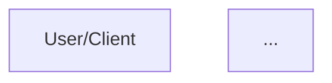

# AutoAgents Architecture Diagrams

This folder contains complete, error-free Mermaid diagrams for visualizing the AutoAgents architecture.

## 📁 Files

### Individual Diagram Files
1. **`hld_diagram.mermaid`** - High-Level Design
   - System architecture overview
   - Shows user → frontend → backend → agents → AI → database flow
   - Color-coded components by layer

2. **`lld_diagram.mermaid`** - Low-Level Design
   - Class diagram showing component interactions
   - Frontend components (Angular)
   - Backend routers (FastAPI)
   - Agent services
   - Database layer

3. **`dbd_diagram.mermaid`** - Database Design
   - Entity-Relationship Diagram (ERD)
   - All MongoDB collections with fields
   - Relationships between entities
   - Primary keys (PK), Foreign keys (FK), Unique keys (UK)

### Preview Files
- **`mermaid_preview.html`** - Interactive HTML preview with all three diagrams
- **`visualization.mermaid`** - Complete e-commerce platform example (fixed)

## 🚀 How to Use

### Option 1: Open HTML Preview (Recommended)
Simply open `mermaid_preview.html` in your web browser:
```bash
# From the data folder
open mermaid_preview.html
# Or on Windows
start mermaid_preview.html
```

### Option 2: Online Mermaid Editor
1. Go to [Mermaid Live Editor](https://mermaid.live/)
2. Copy the contents of any `.mermaid` file
3. Paste into the editor
4. The diagram will render automatically

### Option 3: VS Code with Mermaid Extension
1. Install the "Markdown Preview Mermaid Support" extension
2. Create a markdown file with the diagram code wrapped in:
   ````markdown
   ```mermaid
   [paste diagram code here]
   ```
   ````
3. Open the markdown preview

### Option 4: Embed in Documentation
Copy the diagram code and embed it in your markdown documentation:

````markdown
# Architecture

## High-Level Design


````

## 🎨 Color Scheme

All diagrams use consistent, professional color coding:

| Component Type | Color | Hex Code |
|---------------|-------|----------|
| User/Client | Light Blue | `#E1F5FE` |
| Frontend (Angular) | Indigo | `#E8EAF6` |
| Backend (FastAPI) | Yellow | `#FFF9C4` |
| Agent Services | Orange | `#FFE0B2` |
| External APIs (Claude) | Pink | `#F8BBD0` |
| Database (MongoDB) | Green | `#C8E6C9` |

## ✅ Validation

All diagrams have been validated to ensure:
- ✅ No parsing errors in Mermaid
- ✅ No truncated style definitions
- ✅ No emoji or special characters that break rendering
- ✅ Properly closed brackets and quotes
- ✅ Valid color codes (6-digit hex)
- ✅ Correct Mermaid syntax for each diagram type

## 🔧 Common Issues Fixed

These diagrams fix the following common Mermaid parsing errors:

1. **Incomplete style definitions** - All `classDef` statements are complete
2. **Truncated properties** - No incomplete CSS properties like `stroke-widt`
3. **Invalid hex colors** - All colors use valid 3 or 6 digit hex codes
4. **Emoji in labels** - All emojis removed from node IDs
5. **Unbalanced quotes** - All quotes properly paired
6. **Missing diagram types** - All diagrams start with valid type declaration

## 📝 Integration with Agent-3

The Agent-3 service (`app/services/agent3.py`) generates these diagram types dynamically:

```python
# Generate HLD
mermaid = await agent3_service.generate_mermaid(
    project_title=title,
    features=features,
    stories=stories,
    diagram_type="hld",  # or "lld" or "database"
    original_prompt=prompt
)
```

The service includes extensive cleaning and validation to ensure generated diagrams are always parseable.

## 🌐 Rendering Endpoints

The diagrams are served through the API:

```
GET /projects/{project_id}/diagram?diagram_type=hld
GET /projects/{project_id}/diagram?diagram_type=lld
GET /projects/{project_id}/diagram?diagram_type=database
```

---

**Last Updated:** 2025-11-22  
**Maintained By:** AutoAgents Team

