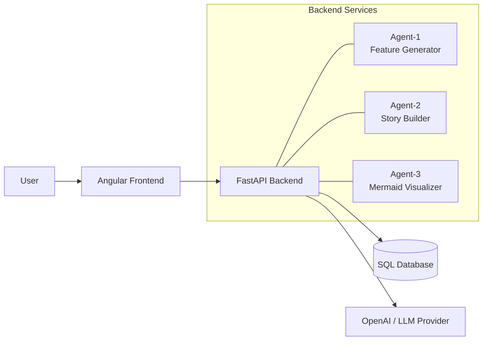

# AutoAgents High-Level Design (HLD)

## 1. Purpose and Scope
AutoAgents is a web application that helps product teams move from an initial project idea to an actionable delivery plan. The goal is to capture a user’s concept, let AI agents propose features, stories, and visual diagrams, and persist the results for ongoing collaboration. This HLD covers the architecture for the Angular frontend, FastAPI backend, three AI agents, SQL database, and the OpenAI-based language model integration. The focus is on a demo-friendly, internship-style project, emphasising clarity and extensibility rather than enterprise-level complexity.

## 2. Overall Architecture Overview
The solution follows a client–server model:
- The Angular SPA handles user interactions, approvals, and real-time updates.
- The FastAPI backend exposes REST endpoints for project creation, agent coordination, and data persistence.
- Three AI agents run as orchestrated services behind the backend. They call OpenAI for natural-language generation tasks and return structured payloads.
- A SQL database stores projects, generated artefacts, and audit trails.
- All data flows through the backend, which mediates requests to the agents/LLM and writes results to the database before returning them to the UI.

High-level flow: User logs in → provides a project idea → backend creates a project → agents generate features, stories, and diagrams → backend stores outputs → frontend renders live updates.

## 3. Main Components
### Frontend (Angular)
- Provides login and session handling (integrates with backend auth).
- Collects the project idea prompt and displays agent outputs.
- Manages approval steps for features/stories and renders Mermaid diagrams.
- Offers a project wizard, workspace view, and manual editing forms.

### Backend (FastAPI + Python)
- REST API endpoints (Project, Features, Stories, Visualization).
- Authentication middleware (session/JWT) and role handling.
- Task orchestration layer to invoke agents in sequence and manage retries.
- Persistence layer (SQLAlchemy) to write/read project data.
- Event/websocket module (optional) for pushing updates to the frontend.

### Agents (Agent-1 / Agent-2 / Agent-3)
- Agent-1: Generates feature specs (title, description, acceptance criteria).
- Agent-2: Converts approved features into user stories with criteria and notes.
- Agent-3: Produces Mermaid diagrams describing flows or architecture.
- Each agent receives structured input, calls OpenAI, post-processes the response, and returns JSON back to FastAPI.

### Database (SQL – Postgres or similar)
- Tables: `users`, `projects`, `features`, `stories`, `diagrams`, `audit_logs`.
- Stores both AI-generated content and user manual edits.
- Supports soft deletion, versioning (optional), and timestamps for traceability.

### LLM Provider (OpenAI)
- Model: GPT-style completions or function-calling interface.
- Access via backend only; never expose API keys to the client.
- Rate-limits, retries, and prompt templates managed in backend agent wrappers.

## 4. High-Level Data Flow
1. **User Authentication**: User signs in; Angular stores session token and calls FastAPI with auth headers.
2. **Project Creation**: User submits a project idea; FastAPI creates a `Project` record and returns an ID.
3. **Agent-1 Invocation**: Backend sends prompt → Agent-1 → OpenAI → receives feature set; results stored in `features`.
4. **Feature Approval**: Angular shows features; user approves/dismisses; decisions sent back to backend and persisted.
5. **Agent-2 Invocation**: Backend passes approved features → Agent-2 → OpenAI → receives stories; stories saved in DB.
6. **Story Approval**: UI displays stories; user approves/dismisses; backend updates DB.
7. **Agent-3 Invocation**: Backend calls Agent-3 with approved scope → OpenAI → returns Mermaid diagram; stored in `diagrams`.
8. **UI Refresh**: Angular retrieves final artefacts and renders workspace view with features, stories, and diagram.

## 5. Technology Stack
- **Frontend**: Angular 17+, TypeScript, Angular Material/Tailwind (optional), RxJS/Signals, Mermaid.js for rendering diagrams.
- **Backend**: FastAPI, Python 3.11+, Pydantic, SQLAlchemy, Uvicorn/Gunicorn.
- **Agents / LLM**: Custom Python services calling OpenAI GPT APIs, prompt templates stored in backend.
- **Database**: PostgreSQL (Cloud-hosted or Dockerised).
- **Infrastructure**: Docker Compose for local dev; CI/CD pipeline (GitHub Actions) for build/deploy; optional Kubernetes for scaling.

## 6. Non-Functional Considerations
- **Performance**: Cache agent responses when prompts repeat; use async I/O in FastAPI; stream responses to UI for better UX.
- **Security**: HTTPS everywhere; store OpenAI keys in secrets manager; enforce role-based access; validate and sanitise user input before sending to LLM.
- **Scalability**: Stateless FastAPI containers; use message queue (future) to offload long-running agent tasks; horizontal scale DB with read replicas if needed.
- **Observability & Logging**: Structured logging (JSON) for backend and agents; log prompts/responses with redaction; integrate with monitoring (Grafana/Prometheus or ELK); add basic analytics for agent usage.
- **Reliability**: Retry policies for LLM calls; circuit breakers; graceful degradation (show cached data or fallback message when agents are down).
- **Maintainability**: Modularised agent wrappers; shared Pydantic schemas; comprehensive README/docs; unit/integration tests for agent flows.

_Last updated: 2025-11-13_

