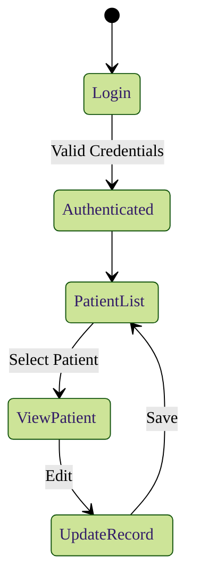

# Agent 3 Refactoring Summary

## Overview

Agent 3 has been refactored to:
1. Accept original customer prompt as additional context
2. Call style generator function BEFORE generating Mermaid syntax
3. Inject custom Mermaid theme directives using %%init%% syntax
4. Vary diagram types based on complexity analysis
5. Implement shape variation logic for different node types

## Key Changes

### 1. Style Generation (Before Diagram Generation)

**Location**: `agent3.py::generate_mermaid()`

**Step 1**: Style configuration is generated BEFORE calling Claude API
```python
# STEP 1: Generate style configuration BEFORE generating diagram
style_config = generate_style_from_prompt(original_prompt, project_title)
```

This ensures:
- Style information is available for prompt guidance
- Consistent styling across all diagrams for a project
- Domain-specific colors are determined early

### 2. Complexity Analysis

**Location**: `diagram_complexity.py::analyze_complexity()`

**Step 2**: Project complexity is analyzed to determine appropriate diagram type
```python
# STEP 2: Analyze complexity to determine diagram type
complexity_info = analyze_complexity(features, stories, original_prompt)
```

**Complexity Factors**:
- Number of features (weight: 2x)
- Number of stories (weight: 1x)
- State indicators (+10 points)
- Data flow indicators (+8 points)
- Workflow indicators (+5 points)

**Diagram Type Selection**:
- **Simple systems** (score < 10): `flowchart TD`
- **Complex workflows** (score 10-15): `flowchart LR`
- **State-heavy** (score > 15 + state indicators): `stateDiagram-v2`
- **Data flows** (score > 12 + data flow): `graph TB` with subgraphs

### 3. Shape Variation Logic

**Location**: `diagram_complexity.py::get_shape_instructions()`

**Shape Mapping**:
- **Entry points**: Stadium/rounded - `(EntryPoint)`
- **Processes**: Rectangle - `[Process]`
- **Decisions**: Diamond - `{Decision}`
- **Data stores**: Cylinder - `[(DataStore)]`
- **External systems**: Parallelogram - `[/External\]`

Shape instructions are included in prompts to guide Claude's diagram generation.

### 4. Style Injection with %%init%% Syntax

**Location**: `mermaid_style_generator.py::inject_theme_directive()`

**Step 5**: Style is injected AFTER diagram generation using Mermaid's %%init%% directive:
```python
# STEP 5: Apply style configuration to mermaid source
styled_mermaid = apply_style_to_mermaid(mermaid, style_config)
```

**Init Directive Format**:
```mermaid
%%{init: {'theme':'forest', 'themeVariables':{'primaryColor':'#5DADE2', ...}}}%%
```

The directive includes:
- Theme name (default, forest, dark, neutral, base)
- Theme variables (colors, fonts, sizes)
- Domain-specific color schemes

### 5. Enhanced Prompt Context

**Original Prompt Integration**:
```python
prompt_context = f"\n\n=== ORIGINAL CUSTOMER REQUIREMENTS ===\n{original_prompt.strip()}\n=== END REQUIREMENTS ===\n\n"
```

The original customer prompt is now:
- Emphasized with clear delimiters
- Included in all diagram type prompts
- Used for domain detection and style generation

### 6. Comprehensive Debug Logging

**Debug Points**:
1. Style config generation (domain, theme, colors)
2. Complexity analysis (score, recommended type, reason)
3. Prompt building (lengths, content preview)
4. API call (tokens, response)
5. Diagram extraction (raw length, cleaning steps)
6. Style injection (before/after lengths)
7. Final diagram preview (first 5 lines)

**Example Log Output**:
```
[agent3] Starting Mermaid diagram generation | model=claude-sonnet-4-5-20250929 | type=hld | features=5 | stories=12 | prompt_length=156
[agent3] STEP 1: Generating style configuration from prompt
[agent3] Style config generated | domain=healthcare | theme=forest | colors=#5DADE2
[agent3] STEP 2: Analyzing project complexity
[agent3] Complexity analysis complete | score=18 | recommended_type=flowchart LR
[agent3] STEP 3: Building prompts with style and complexity guidance
[agent3] Prompts built | system_prompt_length=245 | user_prompt_length=1234
[agent3] Attempting API call | model=claude-sonnet-4-5-20250929 | max_tokens=1500 | temperature=0.3
[agent3] API call successful | input_tokens=456 | output_tokens=789
[agent3] STEP 4: Extracting Mermaid diagram from response
[agent3] Raw response extracted | length=1234 chars
[agent3] Removed ```mermaid code fence
[agent3] Valid diagram type detected | first_line=flowchart LR
[agent3] STEP 5: Applying style configuration to Mermaid diagram
[agent3] Mermaid diagram generation complete | original_length=1200 chars | styled_length=1456 chars | domain=healthcare | theme=forest | complexity_score=18 | diagram_type=flowchart LR
[agent3] Final diagram preview (first 5 lines):
%%{init: {'theme':'forest', 'themeVariables':{'primaryColor':'#5DADE2', ...}}}%%
flowchart LR
    Start([User Login])
    Process[Authenticate]
    ...
```

## Flow Diagram

```
User Request
    ↓
[STEP 1] Generate Style Config from Prompt
    ↓
[STEP 2] Analyze Complexity (features, stories, prompt)
    ↓
[STEP 3] Build Prompts with:
    - Original customer prompt (emphasized)
    - Style guidance
    - Complexity-based diagram type
    - Shape variation instructions
    ↓
[STEP 4] Call Claude API
    ↓
[STEP 5] Extract & Clean Mermaid Code
    ↓
[STEP 6] Inject Style via %%init%% Directive
    ↓
Return Styled Mermaid Diagram
```

## Example Output

**Input**:
- Prompt: "Build a healthcare patient management system with state tracking"
- Features: 5
- Stories: 12

**Processing**:
1. Style: healthcare domain → medical blue theme
2. Complexity: score=18, state indicators → `stateDiagram-v2`
3. Shapes: stadium for entry, rectangles for processes, diamonds for decisions

**Output**:


## Files Modified

1. **`app/services/agent3.py`**
   - Added style generation before API call
   - Added complexity analysis
   - Enhanced prompts with style/shape guidance
   - Added comprehensive debug logging
   - Improved diagram extraction and cleaning

2. **`app/services/mermaid_style_generator.py`**
   - Added `inject_theme_directive()` function
   - Improved %%init%% syntax formatting
   - Added color manipulation helpers
   - Enhanced debug logging

3. **`app/services/diagram_complexity.py`** (NEW)
   - Complexity analysis function
   - Shape variation logic
   - Diagram type guidance
   - Shape syntax helpers

## Testing Recommendations

1. **Test with different domains**: Verify domain-specific colors are applied
2. **Test complexity variations**: Simple vs complex systems
3. **Test shape application**: Verify correct shapes for node types
4. **Test style injection**: Verify %%init%% directive is properly formatted
5. **Check debug logs**: Verify all debug points are logging correctly

## Debugging Tips

If diagrams don't render correctly:
1. Check logs for style config generation
2. Verify complexity analysis results
3. Check if %%init%% directive is properly formatted
4. Verify diagram type is valid Mermaid syntax
5. Check first 5 lines of final diagram in logs

