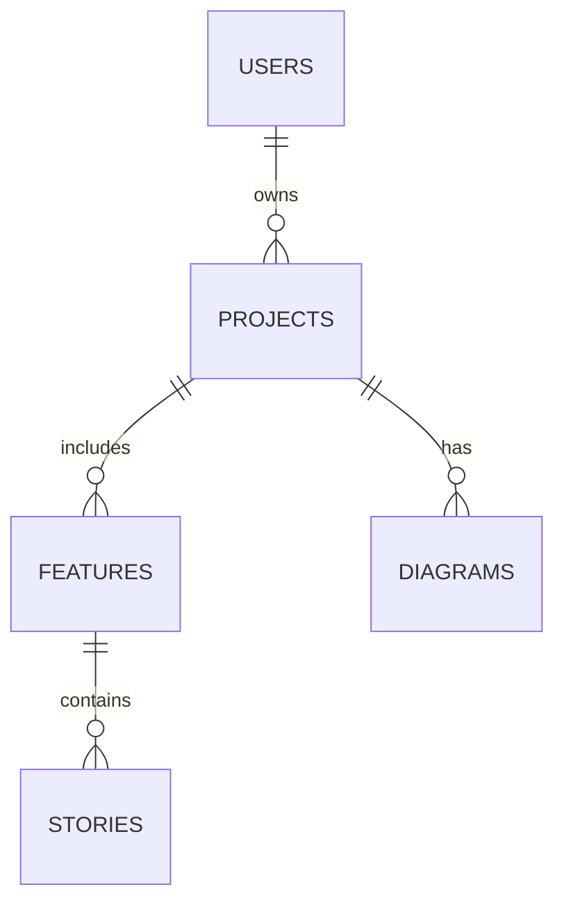

# AutoAgents Database Design

You are designing the AutoAgents database for a simple, student-level project. The app uses PostgreSQL (or any SQL database). Users sign in, create a project by typing an idea, and three agents generate features, stories, and diagrams. The following tables cover the core data.

## users
- **Primary key:** `id` (UUID)
- **Important columns**
  - `email` (VARCHAR) – unique login email
  - `password_hash` (VARCHAR) – hashed password
  - `name` (VARCHAR) – display name
  - `created_at`, `updated_at` (TIMESTAMP)
- **Relationships**
  - One user can own many `projects` (`projects.owner_id`).
- **Purpose**
  - Stores account credentials and profile info for each person who uses the system.

## projects
- **Primary key:** `id` (UUID)
- **Important columns**
  - `owner_id` (UUID FK → `users.id`) – user who created the project
  - `name` (VARCHAR) – friendly project name
  - `idea_prompt` (TEXT) – original prompt such as “Build a banking website”
  - `status` (VARCHAR) – e.g., `draft`, `active`, `archived`
  - `created_at`, `updated_at` (TIMESTAMP)
- **Relationships**
  - Belongs to a `user` via `owner_id`.
  - Has many `features`, `stories`, and `diagrams`.
- **Purpose**
  - Top-level container that represents one product idea and the artefacts generated for it.

## features
- **Primary key:** `id` (UUID)
- **Important columns**
  - `project_id` (UUID FK → `projects.id`)
  - `title` (VARCHAR) – name of the feature
  - `description` (TEXT) – summary returned by Agent-1
  - `acceptance_criteria` (TEXT or JSON) – list of criteria
  - `source` (VARCHAR) – `agent` or `manual`
  - `status` (VARCHAR) – `suggested`, `approved`, `rejected`
  - `created_at`, `updated_at` (TIMESTAMP)
- **Relationships**
  - Belongs to one `project`.
  - Has many `stories`.
- **Purpose**
  - Holds the feature ideas that Agent-1 creates or the user adds manually.

## stories
- **Primary key:** `id` (UUID)
- **Important columns**
  - `feature_id` (UUID FK → `features.id`)
  - `project_id` (UUID FK → `projects.id`) – handy for quick lookups
  - `user_story` (TEXT) – story text from Agent-2
  - `acceptance_criteria` (TEXT or JSON) – list of criteria
  - `implementation_notes` (TEXT or JSON) – optional developer notes
  - `status` (VARCHAR) – `suggested`, `approved`, `rejected`
  - `created_at`, `updated_at` (TIMESTAMP)
- **Relationships**
  - Belongs to one `feature` and indirectly to a `project`.
- **Purpose**
  - Stores the user stories that Agent-2 proposes for each approved feature.

## diagrams
- **Primary key:** `id` (UUID)
- **Important columns**
  - `project_id` (UUID FK → `projects.id`)
  - `mermaid_source` (TEXT) – raw Mermaid diagram from Agent-3
  - `svg_cache` (TEXT) – optional rendered SVG string for faster display
  - `created_at`, `updated_at` (TIMESTAMP)
- **Relationships**
  - Belongs to one `project`.
- **Purpose**
  - Captures the Mermaid visualisation produced by Agent-3 so it can be re-rendered or edited later.

---
_Last updated: 2025-11-13_

