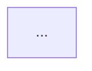

# Styling System Integration - Quick Reference

## 🎯 Integration Points Summary

### 1. Style Generator Call Location

**File**: `app/services/agent3.py`  
**Method**: `Agent3Service.generate_mermaid()`

```python
# STEP 1: Generate style BEFORE diagram generation
style_generator = StyleConfigGenerator(original_prompt, project_id)
full_config = style_generator.generate_full_config(features, stories)

# STEP 5: Apply style AFTER diagram extraction
styled_mermaid = f"{full_config['init_directive']}\n{mermaid}"
```

### 2. Prompt Propagation Flow

```
Project Creation
    ↓ (store prompt in project.prompt)
Agent 1: generate_features(project_title, project_prompt)
    ↓ (features stored)
Agent 2: generate_stories(features, original_prompt=project.prompt)
    ↓ (stories stored)
Agent 3: generate_mermaid(..., original_prompt=project.prompt)
    ↓ (styled diagram generated)
```

**Key Files to Modify**:
- `app/services/agent2.py` - Add `original_prompt` parameter
- `app/services/agent3.py` - Add `original_prompt` parameter
- `app/routers/projects.py` - Retrieve prompt from project document

### 3. Caching Strategy

**Option 1: Store in Project Document** (Recommended)
```python
# In generate_designs_for_project()
project = await db["projects"].find_one({"_id": object_id})
cached_style = project.get("style_config")

if cached_style and cached_style.get("prompt_hash") == hash(project_prompt):
    # Use cached style
else:
    # Generate and cache new style
    await db["projects"].update_one(
        {"_id": object_id},
        {"$set": {"style_config": style_config_to_cache}}
    )
```

**Option 2: Separate Cache Collection**
```python
# Create style_cache collection
cache_doc = {
    "project_id": project_id,
    "prompt_hash": hash(prompt),
    "style_config": {...},
    "created_at": datetime.utcnow()
}
await db["style_cache"].update_one(
    {"project_id": project_id, "prompt_hash": prompt_hash},
    {"$set": cache_doc},
    upsert=True
)
```

### 4. Complete Styled Output Structure



**Components**:
1. `%%init%%` directive at top
2. Mermaid diagram code
3. `classDef` blocks (for flowcharts)
4. `class` assignments (for flowcharts)

### 5. Multi-Diagram Consistency

**Same Style Config for All**:
```python
# Generate once
style_generator = StyleConfigGenerator(project_prompt, project_id)
full_config = style_generator.generate_full_config(features, stories)

# Apply to all
hld_styled = apply_style(hld_raw, full_config)
lld_styled = apply_style(lld_raw, full_config)
dbd_styled = apply_style(dbd_raw, full_config)
```

**Diagram-Specific Adaptations**:
- **HLD**: Uses `flowchart` with subgraphs + classDef
- **LLD**: Uses `classDiagram` or detailed `flowchart` + classDef
- **DBD**: Uses `erDiagram` (theme variables only)

---

## 📝 Code Snippets

### Retrieve Original Prompt in Agent 2

```python
# In generate_stories_for_project()
project = await db["projects"].find_one({"_id": ObjectId(project_id)})
project_prompt = project.get("prompt") or project.get("description") or ""

generated_stories = await agent2_service.generate_stories(
    feature_list,
    original_prompt=project_prompt  # ← Pass here
)
```

### Retrieve Original Prompt in Agent 3

```python
# In generate_designs_for_project()
project = await db["projects"].find_one({"_id": object_id})
project_prompt = project.get("prompt") or project.get("description") or ""

style_generator = StyleConfigGenerator(project_prompt, project_id)
full_config = style_generator.generate_full_config(features, stories)
```

### Apply Style to Mermaid

```python
# Remove existing init directive
if "%%{init:" in mermaid:
    lines = mermaid.split("\n")
    mermaid = "\n".join([l for l in lines if "%%{init:" not in l])

# Prepend new init directive
styled_mermaid = f"{init_directive}\n{mermaid}"
```

### Cache Style Config

```python
# Check cache
cached_style = project.get("style_config")
if cached_style and cached_style.get("prompt_hash") == hash(project_prompt):
    style_config = cached_style
else:
    # Generate and cache
    style_config = generate_style(...)
    await db["projects"].update_one(
        {"_id": object_id},
        {"$set": {"style_config": style_config}}
    )
```

---

## 🔍 Key Functions

| Function | Location | Purpose |
|----------|----------|---------|
| `StyleConfigGenerator` | `app/services/style_config_generator.py` | Generate style from prompt |
| `generate_full_config()` | `StyleConfigGenerator` | Get complete style config |
| `apply_style_to_mermaid()` | `app/services/mermaid_style_generator.py` | Apply style to diagram |
| `inject_theme_directive()` | `app/services/mermaid_style_generator.py` | Inject %%init%% directive |
| `NodeShapeSelector` | `app/services/node_shape_selector.py` | Select node shapes |
| `get_diagram_type_guidance()` | `app/services/diagram_complexity.py` | Get diagram type guidance |

---

## ✅ Integration Checklist

- [ ] Modify `Agent2Service.generate_stories()` to accept `original_prompt` parameter
- [ ] Modify `generate_stories_for_project()` to retrieve and pass prompt
- [ ] Modify `Agent3Service.generate_mermaid()` to accept `original_prompt` parameter
- [ ] Call `StyleConfigGenerator` BEFORE Claude API call in Agent 3
- [ ] Apply `init_directive` AFTER diagram extraction in Agent 3
- [ ] Implement style caching (project document or separate collection)
- [ ] Apply same style config to HLD, LLD, DBD
- [ ] Store style config with generated designs
- [ ] Test with different domains (healthcare, finance, e-commerce)
- [ ] Verify style consistency across all diagram types

---

## 🧪 Testing Examples

### Test 1: Healthcare Domain
```python
prompt = "Build a healthcare patient management system"
# Expected: Healthcare green colors (#10B981), forest theme
```

### Test 2: Finance Domain
```python
prompt = "Create a banking application with transaction processing"
# Expected: Finance navy/gold colors (#1E3A8A, #F59E0B), base theme
```

### Test 3: E-commerce Domain
```python
prompt = "Build an online shopping platform"
# Expected: E-commerce blue/orange colors (#2563EB, #F97316), default theme
```

---

## 📚 Related Documentation

- `STYLING_SYSTEM_INTEGRATION.md` - Full integration guide
- `STYLING_INTEGRATION_CODE_EXAMPLES.py` - Code examples
- `AGENT3_REFACTOR.md` - Agent 3 refactoring details
- `MERMAID_STYLE_SYSTEM.md` - Styling system overview

