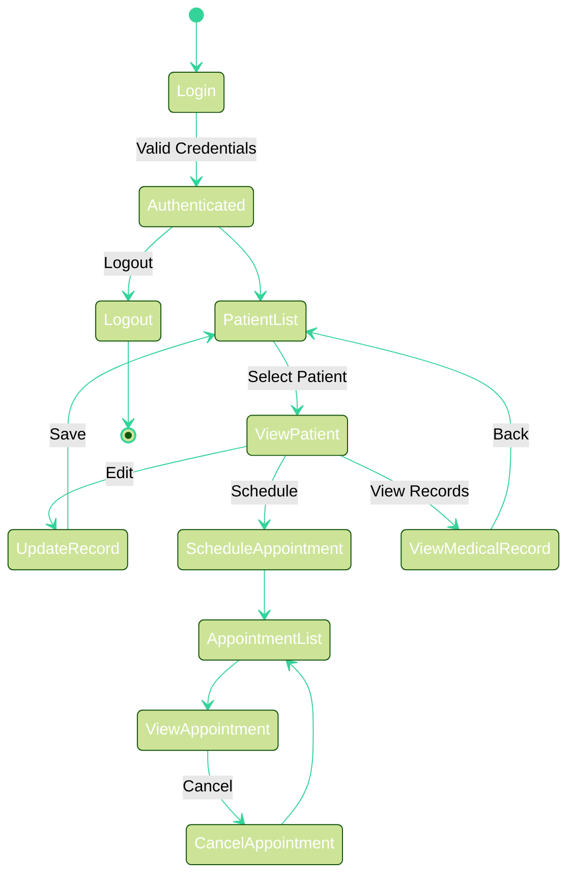
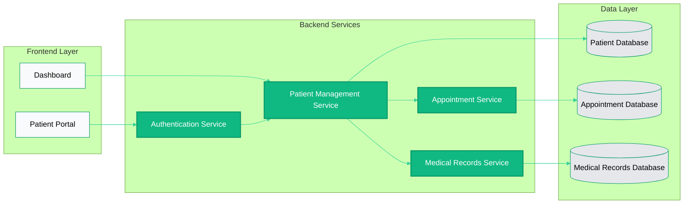
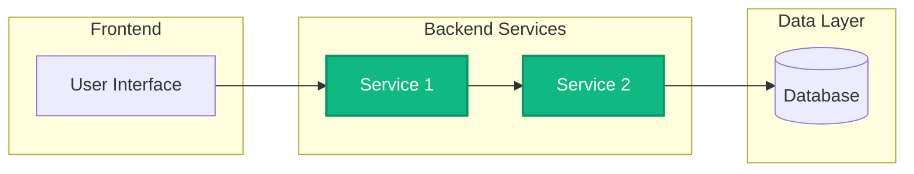
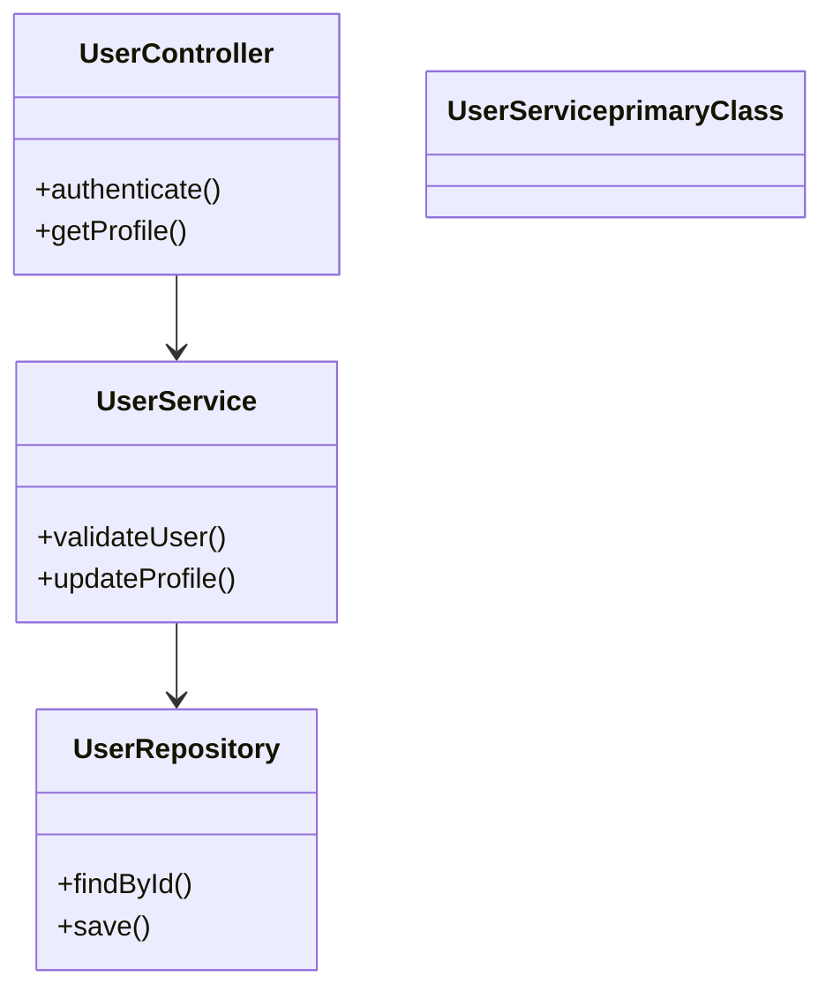
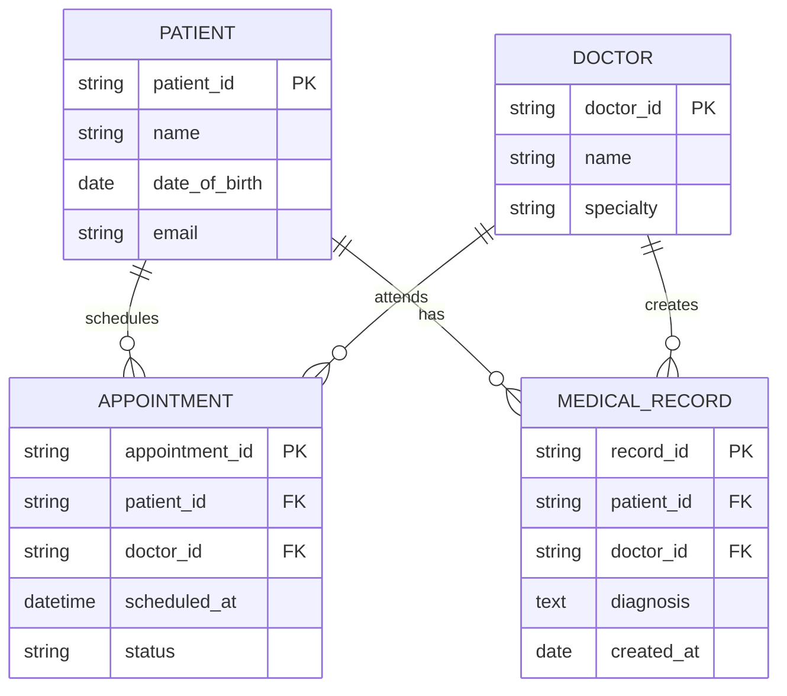

# Styling System Integration Guide

This guide shows how to integrate the styling system into your existing Agent 3 workflow, covering prompt propagation, style generation, caching, and multi-diagram support.

## Table of Contents

1. [Where to Call the Style Generator](#1-where-to-call-the-style-generator)
2. [Passing Original Prompt Through Agent Pipeline](#2-passing-original-prompt-through-agent-pipeline)
3. [Caching Style Decisions](#3-caching-style-decisions)
4. [Complete Mermaid Output Example](#4-complete-mermaid-output-example)
5. [Multiple Diagram Types with Consistent Styles](#5-multiple-diagram-types-with-consistent-styles)

---

## 1. Where to Call the Style Generator

The style generator should be called **BEFORE** generating the Mermaid diagram in Agent 3. Here's the integration point:

### Current Implementation Location

**File**: `app/services/agent3.py`

**Method**: `Agent3Service.generate_mermaid()`

### Integration Point

```python
async def generate_mermaid(
    self,
    project_title: str,
    features: List[Dict],
    stories: List[Dict],
    diagram_type: str = "hld",
    original_prompt: str = "",  # ← Original prompt passed here
) -> str:
    """Generate a Mermaid diagram with styling."""
    
    # STEP 1: Generate style configuration BEFORE diagram generation
    logger.debug("[agent3] STEP 1: Generating style configuration")
    style_generator = StyleConfigGenerator(original_prompt, project_id)
    full_config = style_generator.generate_full_config(features, stories)
    
    # Extract style components
    style_config_dict = {
        "theme": full_config["theme"],
        "primaryColor": full_config["colors"]["primary"],
        "secondaryColor": full_config["colors"]["secondary"],
        "accentColor": full_config["colors"]["tertiary"],
        "domain": full_config["domain"],
    }
    complexity_info = full_config["complexity"]
    init_directive = full_config["init_directive"]
    
    # STEP 2: Use style config in prompts (for guidance)
    # ... build prompts with style guidance ...
    
    # STEP 3: Call Claude API to generate diagram
    # ... API call ...
    
    # STEP 4: Extract and clean Mermaid code
    mermaid = extract_text(response).strip()
    
    # STEP 5: Apply style via %%init%% directive
    styled_mermaid = f"{init_directive}\n{mermaid}"
    
    return styled_mermaid
```

### Key Points

- **Call style generator FIRST** (before API call) so style info is available for prompt guidance
- Style config is used in two places:
  1. **Prompt guidance** - informs Claude about desired colors/theme
  2. **Post-processing** - injects `%%init%%` directive after diagram generation

---

## 2. Passing Original Prompt Through Agent Pipeline

The original customer prompt must flow through all three agents. Here's how to implement it:

### Agent 1 → Agent 2 → Agent 3 Flow

#### Step 1: Agent 1 - Store Original Prompt

**File**: `app/services/agent1.py`

```python
async def generate_features(
    self, 
    project_title: str, 
    project_prompt: str  # ← Original prompt
) -> List[str]:
    """Generate features - prompt is already available here."""
    
    # Store prompt in project document (already done in router)
    # The prompt is stored in projects collection with key "prompt"
    
    user_prompt = (
        f"Project: {project_title or 'Untitled'}\n"
        f"User Prompt: {project_prompt or 'No prompt provided.'}\n\n"
        "Generate 8-12 features that directly address the prompt..."
    )
    # ... rest of implementation
```

#### Step 2: Agent 2 - Retrieve and Use Original Prompt

**File**: `app/services/agent2.py`

```python
async def generate_stories(
    self, 
    features: List[Dict], 
    original_prompt: str = ""  # ← Pass prompt here
) -> List[Dict]:
    """Generate stories with original prompt context."""
    
    # Include original prompt in context
    prompt_context = ""
    if original_prompt and original_prompt.strip():
        prompt_context = (
            f"\n\nOriginal User Prompt/Requirements:\n"
            f"{original_prompt.strip()}\n\n"
            f"Use this context to ensure stories align with the original user intent.\n"
        )
    
    user_prompt = (
        "You are Agent-2, a senior product owner. "
        "Generate user stories based on features AND the original user prompt.\n"
        f"{prompt_context}"  # ← Include original prompt
        f"Features:\n{feature_outline}"
    )
    # ... rest of implementation
```

**File**: `app/services/agent2.py` - `generate_stories_for_project()`

```python
async def generate_stories_for_project(project_id: str, db):
    """Generate stories - retrieve original prompt from project."""
    
    # Get project to retrieve original prompt
    project = await db["projects"].find_one({"_id": ObjectId(project_id)})
    project_prompt = project.get("prompt") or project.get("description") or ""
    
    # Pass original prompt to Agent2Service
    generated_stories = await agent2_service.generate_stories(
        feature_list, 
        original_prompt=project_prompt  # ← Pass prompt here
    )
    # ... rest of implementation
```

#### Step 3: Agent 3 - Use Original Prompt for Style Generation

**File**: `app/services/agent3.py`

```python
async def generate_mermaid(
    self,
    project_title: str,
    features: List[Dict],
    stories: List[Dict],
    diagram_type: str = "hld",
    original_prompt: str = "",  # ← Original prompt parameter
) -> str:
    """Generate Mermaid diagram with original prompt context."""
    
    # STEP 1: Generate style from original prompt
    style_generator = StyleConfigGenerator(original_prompt, project_id)
    full_config = style_generator.generate_full_config(features, stories)
    
    # Include original prompt in diagram generation context
    prompt_context = ""
    if original_prompt and original_prompt.strip():
        prompt_context = (
            f"\n\n=== ORIGINAL CUSTOMER REQUIREMENTS ===\n"
            f"{original_prompt.strip()}\n"
            f"=== END REQUIREMENTS ===\n\n"
        )
    
    user_prompt = (
        f"Project: {project_title or 'Untitled Project'}\n"
        f"{prompt_context}"  # ← Include original prompt
        f"Features from Agent1:\n{feature_details}\n\n"
        f"User Stories from Agent2:\n{story_outline}\n\n"
        # ... rest of prompt
    )
    # ... rest of implementation
```

**File**: `app/services/agent3.py` - `generate_designs_for_project()`

```python
async def generate_designs_for_project(project_id: str, db):
    """Generate all designs - retrieve original prompt."""
    
    # Get project to retrieve original prompt
    project = await db["projects"].find_one({"_id": object_id})
    project_title = project.get("title") or "Untitled Project"
    project_description = project.get("prompt") or project.get("description") or ""
    
    # Generate style configuration from prompt (consistent across all diagrams)
    style_generator = StyleConfigGenerator(project_description, project_id)
    full_config = style_generator.generate_full_config(features, stories)
    
    # Use original prompt in diagram generation
    user_prompt = (
        f"PROJECT CONTEXT:\n"
        f"Project Title: {project_title}\n"
        f"Project Description: {project_description}\n\n"  # ← Original prompt
        # ... rest of prompt
    )
    # ... rest of implementation
```

### Router Integration

**File**: `app/routers/projects.py`

```python
@router.post("/{project_id}/designs/generate")
async def generate_project_designs(project_id: str) -> Dict[str, Any]:
    """Trigger Agent-3 to generate designs."""
    db = get_database()
    
    # The generate_designs_for_project function already retrieves
    # the original prompt from the project document
    designs = await generate_designs_for_project(project_id, db)
    return designs
```

### Complete Flow Diagram

```
User creates project with prompt
    ↓
[Project stored in DB with "prompt" field]
    ↓
Agent 1: generate_features(project_title, project_prompt)
    ↓
[Features generated, stored in DB]
    ↓
Agent 2: generate_stories(features, original_prompt=project.prompt)
    ↓
[Stories generated, stored in DB]
    ↓
Agent 3: generate_mermaid(..., original_prompt=project.prompt)
    ↓
[Style generated from prompt → Diagram generated → Style applied]
    ↓
[Styled diagram stored in DB]
```

---

## 3. Caching Style Decisions

Style decisions should be cached per project to ensure consistency across all diagrams for the same project.

### Storage Strategy

Store style configuration in the **project document** or in a separate **style_cache** collection.

#### Option 1: Store in Project Document (Recommended)

**File**: `app/services/agent3.py`

```python
async def generate_designs_for_project(project_id: str, db):
    """Generate designs with cached style configuration."""
    
    project = await db["projects"].find_one({"_id": object_id})
    project_prompt = project.get("prompt") or ""
    
    # Check if style config is already cached in project
    cached_style = project.get("style_config")
    
    if cached_style and cached_style.get("prompt_hash") == hash(project_prompt):
        # Use cached style configuration
        logger.info(f"[agent3] Using cached style config for project {project_id}")
        style_config = cached_style
        full_config = {
            "domain": style_config["domain"],
            "theme": style_config["theme"],
            "colors": {
                "primary": style_config["primaryColor"],
                "secondary": style_config["secondaryColor"],
                "tertiary": style_config["accentColor"],
            },
            "complexity": style_config.get("complexity", {}),
            "init_directive": style_config.get("init_directive", ""),
        }
    else:
        # Generate new style configuration
        logger.info(f"[agent3] Generating new style config for project {project_id}")
        style_generator = StyleConfigGenerator(project_prompt, project_id)
        full_config = style_generator.generate_full_config(features, stories)
        
        # Cache style configuration in project document
        style_config_to_cache = {
            "prompt_hash": hash(project_prompt),
            "domain": full_config["domain"],
            "theme": full_config["theme"],
            "primaryColor": full_config["colors"]["primary"],
            "secondaryColor": full_config["colors"]["secondary"],
            "accentColor": full_config["colors"]["tertiary"],
            "complexity": full_config["complexity"],
            "init_directive": full_config["init_directive"],
            "generated_at": datetime.utcnow(),
        }
        
        # Update project document with style config
        await db["projects"].update_one(
            {"_id": object_id},
            {"$set": {"style_config": style_config_to_cache}}
        )
        logger.info(f"[agent3] Cached style config for project {project_id}")
    
    # Use full_config for diagram generation
    # ... rest of implementation
```

#### Option 2: Separate Style Cache Collection

**File**: `app/services/style_cache.py` (NEW)

```python
"""Style cache service for storing and retrieving style configurations."""

import hashlib
import logging
from datetime import datetime
from typing import Dict, Optional

from bson import ObjectId

logger = logging.getLogger(__name__)


def hash_prompt(prompt: str) -> str:
    """Generate hash for prompt to detect changes."""
    return hashlib.sha256(prompt.encode('utf-8')).hexdigest()


async def get_cached_style(project_id: str, prompt: str, db) -> Optional[Dict]:
    """Retrieve cached style configuration for a project."""
    prompt_hash = hash_prompt(prompt)
    
    cache_doc = await db["style_cache"].find_one({
        "project_id": project_id,
        "prompt_hash": prompt_hash,
    })
    
    if cache_doc:
        logger.info(f"[style_cache] Cache hit for project {project_id}")
        return cache_doc.get("style_config")
    
    logger.info(f"[style_cache] Cache miss for project {project_id}")
    return None


async def cache_style(project_id: str, prompt: str, style_config: Dict, db):
    """Cache style configuration for a project."""
    prompt_hash = hash_prompt(prompt)
    
    cache_doc = {
        "project_id": project_id,
        "prompt_hash": prompt_hash,
        "style_config": style_config,
        "created_at": datetime.utcnow(),
    }
    
    # Upsert: update if exists, insert if not
    await db["style_cache"].update_one(
        {"project_id": project_id, "prompt_hash": prompt_hash},
        {"$set": cache_doc},
        upsert=True
    )
    
    logger.info(f"[style_cache] Cached style for project {project_id}")
```

**Usage in Agent 3**:

```python
from .style_cache import get_cached_style, cache_style

async def generate_designs_for_project(project_id: str, db):
    """Generate designs with cached style."""
    
    project = await db["projects"].find_one({"_id": object_id})
    project_prompt = project.get("prompt") or ""
    
    # Try to get cached style
    cached_style = await get_cached_style(project_id, project_prompt, db)
    
    if cached_style:
        full_config = cached_style
    else:
        # Generate new style
        style_generator = StyleConfigGenerator(project_prompt, project_id)
        full_config = style_generator.generate_full_config(features, stories)
        
        # Cache it
        await cache_style(project_id, project_prompt, full_config, db)
    
    # Use full_config for diagram generation
    # ... rest of implementation
```

### Database Schema for Style Cache

If using Option 2, create a `style_cache` collection:

```javascript
{
  "_id": ObjectId("..."),
  "project_id": "project_id_string",
  "prompt_hash": "sha256_hash_of_prompt",
  "style_config": {
    "domain": "healthcare",
    "theme": "forest",
    "primaryColor": "#5DADE2",
    "secondaryColor": "#58D68D",
    "accentColor": "#F7DC6F",
    "complexity": {
      "complexity_score": 18,
      "recommended_type": "flowchart LR"
    },
    "init_directive": "%%{init: {'theme':'forest', ...}}%%"
  },
  "created_at": ISODate("...")
}
```

### Consistency Guarantees

- **Same prompt → Same style**: Style is deterministic based on prompt hash
- **Project-level consistency**: All diagrams for a project use the same style
- **Cache invalidation**: If prompt changes, new style is generated and cached

---

## 4. Complete Mermaid Output Example

Here's a complete example of a styled Mermaid diagram output:

### Input

- **Project Title**: "Healthcare Patient Management System"
- **Original Prompt**: "Build a healthcare patient management system with state tracking, appointment scheduling, and medical record management"
- **Domain**: Healthcare (detected automatically)
- **Features**: 5 features
- **Stories**: 12 stories

### Generated Style Configuration

```python
{
    "domain": "healthcare",
    "theme": "forest",
    "colors": {
        "primary": "#10B981",      # Healthcare green
        "secondary": "#F9FAFB",     # White
        "tertiary": "#E5E7EB",      # Light gray
    },
    "complexity": {
        "complexity_score": 18,
        "recommended_type": "stateDiagram-v2",
        "reason": "State-heavy system detected"
    },
    "init_directive": "%%{init: {'theme':'forest', 'themeVariables':{'primaryColor':'#10B981', 'primaryTextColor':'#FFFFFF', 'primaryBorderColor':'#059669', 'lineColor':'#34D399', 'secondaryColor':'#F9FAFB', 'tertiaryColor':'#E5E7EB'}}}%%"
}
```

### Complete Mermaid Output



### Styled Flowchart Example (HLD)



### Key Features of Styled Output

1. **%%init%% directive** at the top with theme and color variables
2. **Domain-specific colors** (healthcare green in this case)
3. **Consistent styling** across all nodes
4. **classDef blocks** for additional node styling
5. **Theme variables** for global styling

---

## 5. Multiple Diagram Types with Consistent Styles

All diagram types (HLD, LLD, Database) should use the **same style configuration** but with **diagram-specific adaptations**.

### Implementation Strategy

**File**: `app/services/agent3.py`

```python
async def generate_designs_for_project(project_id: str, db):
    """Generate HLD, LLD, and DBD with consistent styling."""
    
    project = await db["projects"].find_one({"_id": object_id})
    project_prompt = project.get("prompt") or ""
    
    # STEP 1: Generate style configuration ONCE (shared across all diagrams)
    style_generator = StyleConfigGenerator(project_prompt, project_id)
    full_config = style_generator.generate_full_config(features, stories)
    
    # Extract shared style components
    shared_style = {
        "domain": full_config["domain"],
        "theme": full_config["theme"],
        "colors": full_config["colors"],
        "init_directive": full_config["init_directive"],
    }
    
    # STEP 2: Generate all three diagrams with same style
    # (This is done in a single API call in the current implementation)
    
    # STEP 3: Apply style to each diagram type
    hld_mermaid = apply_style_to_mermaid(hld_mermaid_raw, shared_style)
    lld_mermaid = apply_style_to_mermaid(lld_mermaid_raw, shared_style)
    dbd_mermaid = apply_style_to_mermaid(dbd_mermaid_raw, shared_style)
    
    # Store all diagrams with style config
    document = {
        "project_id": project_id,
        "hld_mermaid": hld_mermaid,
        "lld_mermaid": lld_mermaid,
        "dbd_mermaid": dbd_mermaid,
        "style_config": shared_style,  # Store style config for reference
        "created_at": datetime.utcnow(),
    }
    
    await db["designs"].insert_one(document)
    return document
```

### Diagram-Specific Adaptations

While using the same base style, each diagram type can have slight variations:

#### High-Level Design (HLD)



**Characteristics**:
- Uses `flowchart` with subgraphs
- Focus on high-level components
- Stadium shapes for controllers: `([Controller])`
- Rectangles for services: `[Service]`
- Cylinders for databases: `[(Database)]`

#### Low-Level Design (LLD)



**Characteristics**:
- Uses `classDiagram` or detailed `flowchart`
- Shows internal structure and methods
- Same color scheme as HLD
- More detailed node labels

#### Database Design (DBD)



**Characteristics**:
- Uses `erDiagram` syntax
- Same color scheme applied to entities
- Focus on relationships and attributes
- Entity names use primary color

### Style Consistency Helper Function

**File**: `app/services/agent3.py`

```python
def apply_consistent_style(
    mermaid_source: str, 
    style_config: Dict, 
    diagram_type: str
) -> str:
    """Apply consistent style to any diagram type with type-specific adaptations."""
    
    # Base init directive (same for all)
    init_directive = style_config["init_directive"]
    
    # Remove any existing init directive
    if "%%{init:" in mermaid_source:
        lines = mermaid_source.split("\n")
        mermaid_source = "\n".join([l for l in lines if "%%{init:" not in l])
    
    # Prepend init directive
    styled = f"{init_directive}\n{mermaid_source}"
    
    # Add diagram-type-specific styling
    if diagram_type == "hld":
        # Add subgraph styling for HLD
        if "subgraph" in styled and "classDef" not in styled:
            class_defs = [
                f"classDef primaryNode fill:{style_config['colors']['primary']},stroke:{style_config['colors']['primaryBorder']},stroke-width:2px,color:#FFFFFF",
                f"classDef secondaryNode fill:{style_config['colors']['secondary']},stroke:{style_config['colors']['primaryBorder']},stroke-width:1px",
            ]
            styled = f"{init_directive}\n{'\n'.join(class_defs)}\n{mermaid_source}"
    
    elif diagram_type == "lld":
        # Add class styling for LLD
        if "classDiagram" in styled and "classDef" not in styled:
            class_def = f"classDef primaryClass fill:{style_config['colors']['primary']},stroke:{style_config['colors']['primaryBorder']},stroke-width:2px,color:#FFFFFF"
            styled = f"{init_directive}\n{class_def}\n{mermaid_source}"
    
    elif diagram_type == "database":
        # ER diagrams use theme variables automatically
        # No additional styling needed
        pass
    
    return styled
```

### Usage Example

```python
# Generate style once
style_generator = StyleConfigGenerator(project_prompt, project_id)
full_config = style_generator.generate_full_config(features, stories)

# Apply to all diagram types
hld_styled = apply_consistent_style(hld_raw, full_config, "hld")
lld_styled = apply_consistent_style(lld_raw, full_config, "lld")
dbd_styled = apply_consistent_style(dbd_raw, full_config, "database")
```

### Consistency Checklist

- ✅ Same `%%init%%` directive for all diagrams
- ✅ Same color palette (primary, secondary, tertiary)
- ✅ Same theme (forest, dark, neutral, etc.)
- ✅ Same domain detection
- ✅ Diagram-specific adaptations (shapes, classDef) while maintaining color consistency

---

## Summary

### Integration Checklist

1. **Style Generator Call**: ✅ Called in `Agent3Service.generate_mermaid()` before API call
2. **Prompt Propagation**: ✅ Pass `original_prompt` parameter through all agents
3. **Caching**: ✅ Store style config in project document or separate cache collection
4. **Complete Output**: ✅ Includes `%%init%%` directive + diagram code + classDef
5. **Multi-Diagram Support**: ✅ Same style config applied to HLD, LLD, DBD with type-specific adaptations

### Key Files Modified

- `app/services/agent3.py` - Main integration point
- `app/services/agent2.py` - Pass prompt through
- `app/services/style_config_generator.py` - Style generation
- `app/services/mermaid_style_generator.py` - Style application
- `app/routers/projects.py` - Endpoint integration

### Testing Recommendations

1. Test with different domains (healthcare, finance, e-commerce)
2. Verify style consistency across HLD, LLD, DBD
3. Test prompt propagation through all agents
4. Verify caching works correctly
5. Check that `%%init%%` directive is properly formatted

