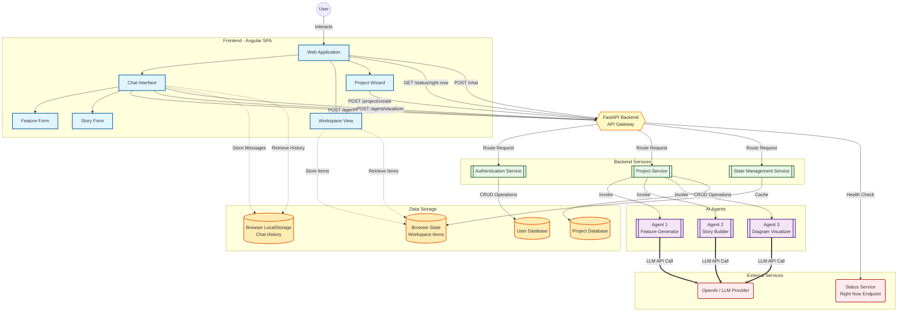

# System Architecture Diagram

This diagram shows the overall system architecture with all layers, components, and external integrations.

```mermaid
graph TD
    %% ============================================
    %% User Interface Layer
    %% ============================================
    User((User))
    
    subgraph Frontend["Frontend - Angular SPA"]
        WebApp[Web Application]
        ChatUI[Chat Interface]
        WorkspaceUI[Workspace View]
        WizardUI[Project Wizard]
        FeatureForm[Feature Form]
        StoryForm[Story Form]
    end
    
    %% ============================================
    %% API Gateway Layer
    %% ============================================
    APIGateway{{FastAPI Backend<br/>API Gateway}}
    
    %% ============================================
    %% Service Layer
    %% ============================================
    subgraph BackendServices["Backend Services"]
        AuthService[[Authentication Service]]
        ProjectService[[Project Service]]
        StateService[[State Management Service]]
    end
    
    %% ============================================
    %% AI Agent Layer
    %% ============================================
    subgraph AIAgents["AI Agents"]
        Agent1[[Agent 1<br/>Feature Generator]]
        Agent2[[Agent 2<br/>Story Builder]]
        Agent3[[Agent 3<br/>Diagram Visualizer]]
    end
    
    %% ============================================
    %% Data Layer
    %% ============================================
    subgraph DataStorage["Data Storage"]
        UserDB[(User Database)]
        ProjectDB[(Project Database)]
        ChatCache[(Browser LocalStorage<br/>Chat History)]
        WorkspaceCache[(Browser State<br/>Workspace Items)]
    end
    
    %% ============================================
    %% External Systems
    %% ============================================
    subgraph External["External Services"]
        LLMProvider(OpenAI / LLM Provider)
        StatusService(Status Service<br/>Right Now Endpoint)
    end
    
    %% ============================================
    %% Connections - User to Frontend
    %% ============================================
    User -->|Interacts| WebApp
    WebApp --> ChatUI
    WebApp --> WorkspaceUI
    WebApp --> WizardUI
    ChatUI --> FeatureForm
    ChatUI --> StoryForm
    
    %% ============================================
    %% Connections - Frontend to Backend
    %% ============================================
    ChatUI -->|POST /agent/features| APIGateway
    ChatUI -->|POST /agent/stories| APIGateway
    ChatUI -->|POST /agent/visualizer| APIGateway
    WizardUI -->|POST /project/create| APIGateway
    WebApp -->|GET /status/right-now| APIGateway
    WebApp -->|POST /chat| APIGateway
    
    %% ============================================
    %% Connections - API Gateway to Services
    %% ============================================
    APIGateway -->|Route Request| AuthService
    APIGateway -->|Route Request| ProjectService
    APIGateway -->|Route Request| StateService
    
    %% ============================================
    %% Connections - Services to Agents
    %% ============================================
    ProjectService -->|Invoke| Agent1
    ProjectService -->|Invoke| Agent2
    ProjectService -->|Invoke| Agent3
    
    %% ============================================
    %% Connections - Agents to External
    %% ============================================
    Agent1 ==>|LLM API Call| LLMProvider
    Agent2 ==>|LLM API Call| LLMProvider
    Agent3 ==>|LLM API Call| LLMProvider
    
    %% ============================================
    %% Connections - Services to Data
    %% ============================================
    AuthService -->|CRUD Operations| UserDB
    ProjectService -->|CRUD Operations| ProjectDB
    StateService -->|Cache| WorkspaceCache
    
    %% ============================================
    %% Connections - Frontend to Local Storage
    %% ============================================
    ChatUI -.->|Store Messages| ChatCache
    ChatUI -.->|Retrieve History| ChatCache
    WorkspaceUI -.->|Store Items| WorkspaceCache
    WorkspaceUI -.->|Retrieve Items| WorkspaceCache
    
    %% ============================================
    %% Connections - Status Service
    %% ============================================
    APIGateway -->|Health Check| StatusService
    
    %% ============================================
    %% Styling
    %% ============================================
    classDef uiLayer fill:#e1f5ff,stroke:#01579b,stroke-width:2px
    classDef apiLayer fill:#fff9c4,stroke:#f57f17,stroke-width:2px
    classDef serviceLayer fill:#e8f5e9,stroke:#1b5e20,stroke-width:2px
    classDef agentLayer fill:#f3e5f5,stroke:#4a148c,stroke-width:2px
    classDef dataLayer fill:#ffecb3,stroke:#e65100,stroke-width:2px
    classDef externalLayer fill:#ffebee,stroke:#b71c1c,stroke-width:2px
    
    class WebApp,ChatUI,WorkspaceUI,WizardUI,FeatureForm,StoryForm uiLayer
    class APIGateway apiLayer
    class AuthService,ProjectService,StateService serviceLayer
    class Agent1,Agent2,Agent3 agentLayer
    class UserDB,ProjectDB,ChatCache,WorkspaceCache dataLayer
    class LLMProvider,StatusService externalLayer
```

