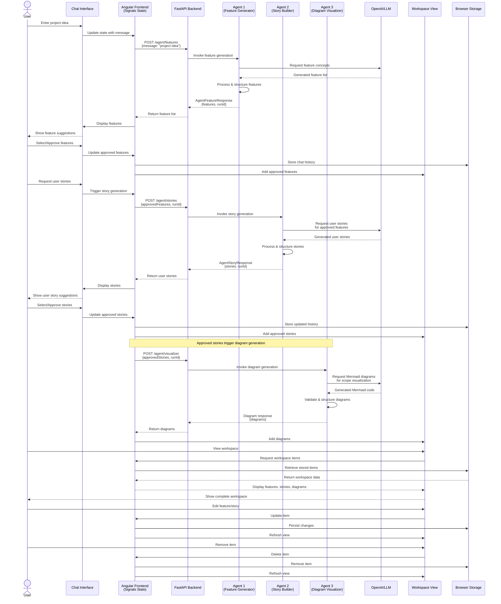

# User Journey Sequence Diagram

This diagram shows the complete interaction flow from user input through all three agents to the final workspace view.

```mermaid
sequenceDiagram
    actor User
    participant ChatUI as Chat Interface
    participant Frontend as Angular Frontend<br/>(Signals State)
    participant API as FastAPI Backend
    participant Agent1 as Agent 1<br/>(Feature Generator)
    participant Agent2 as Agent 2<br/>(Story Builder)
    participant Agent3 as Agent 3<br/>(Diagram Visualizer)
    participant LLM as OpenAI/LLM
    participant Workspace as Workspace View
    participant LocalStorage as Browser Storage
    
    %% ============================================
    %% Initial Project Idea Input
    %% ============================================
    User->>ChatUI: Enter project idea
    ChatUI->>Frontend: Update state with message
    Frontend->>API: POST /agent/features<br/>{message: "project idea"}
    
    %% ============================================
    %% Agent 1: Feature Generation
    %% ============================================
    API->>Agent1: Invoke feature generation
    Agent1->>LLM: Request feature concepts
    LLM-->>Agent1: Generated feature list
    Agent1->>Agent1: Process & structure features
    Agent1-->>API: AgentFeatureResponse<br/>{features, runId}
    API-->>Frontend: Return feature list
    Frontend->>ChatUI: Display features
    ChatUI-->>User: Show feature suggestions
    
    %% ============================================
    %% User Approval Workflow
    %% ============================================
    User->>ChatUI: Select/Approve features
    ChatUI->>Frontend: Update approved features
    Frontend->>LocalStorage: Store chat history
    Frontend->>Workspace: Add approved features
    
    %% ============================================
    %% Agent 2: Story Generation
    %% ============================================
    User->>ChatUI: Request user stories
    ChatUI->>Frontend: Trigger story generation
    Frontend->>API: POST /agent/stories<br/>{approvedFeatures, runId}
    API->>Agent2: Invoke story generation
    Agent2->>LLM: Request user stories<br/>for approved features
    LLM-->>Agent2: Generated user stories
    Agent2->>Agent2: Process & structure stories
    Agent2-->>API: AgentStoryResponse<br/>{stories, runId}
    API-->>Frontend: Return user stories
    Frontend->>ChatUI: Display stories
    ChatUI-->>User: Show user story suggestions
    
    %% ============================================
    %% User Story Approval
    %% ============================================
    User->>ChatUI: Select/Approve stories
    ChatUI->>Frontend: Update approved stories
    Frontend->>LocalStorage: Store updated history
    Frontend->>Workspace: Add approved stories
    
    %% ============================================
    %% Agent 3: Diagram Generation
    %% ============================================
    Note over Frontend,Agent3: Approved stories trigger diagram generation
    Frontend->>API: POST /agent/visualizer<br/>{approvedStories, runId}
    API->>Agent3: Invoke diagram generation
    Agent3->>LLM: Request Mermaid diagrams<br/>for scope visualization
    LLM-->>Agent3: Generated Mermaid code
    Agent3->>Agent3: Validate & structure diagrams
    Agent3-->>API: Diagram response<br/>{diagrams}
    API-->>Frontend: Return diagrams
    Frontend->>Workspace: Add diagrams
    
    %% ============================================
    %% Workspace View
    %% ============================================
    User->>Workspace: View workspace
    Workspace->>Frontend: Request workspace items
    Frontend->>LocalStorage: Retrieve stored items
    LocalStorage-->>Frontend: Return workspace data
    Frontend-->>Workspace: Display features, stories, diagrams
    Workspace-->>User: Show complete workspace
    
    %% ============================================
    %% Editing Workflow
    %% ============================================
    User->>Workspace: Edit feature/story
    Workspace->>Frontend: Update item
    Frontend->>LocalStorage: Persist changes
    Frontend->>Workspace: Refresh view
    
    User->>Workspace: Remove item
    Workspace->>Frontend: Delete item
    Frontend->>LocalStorage: Remove item
    Frontend->>Workspace: Refresh view
```

