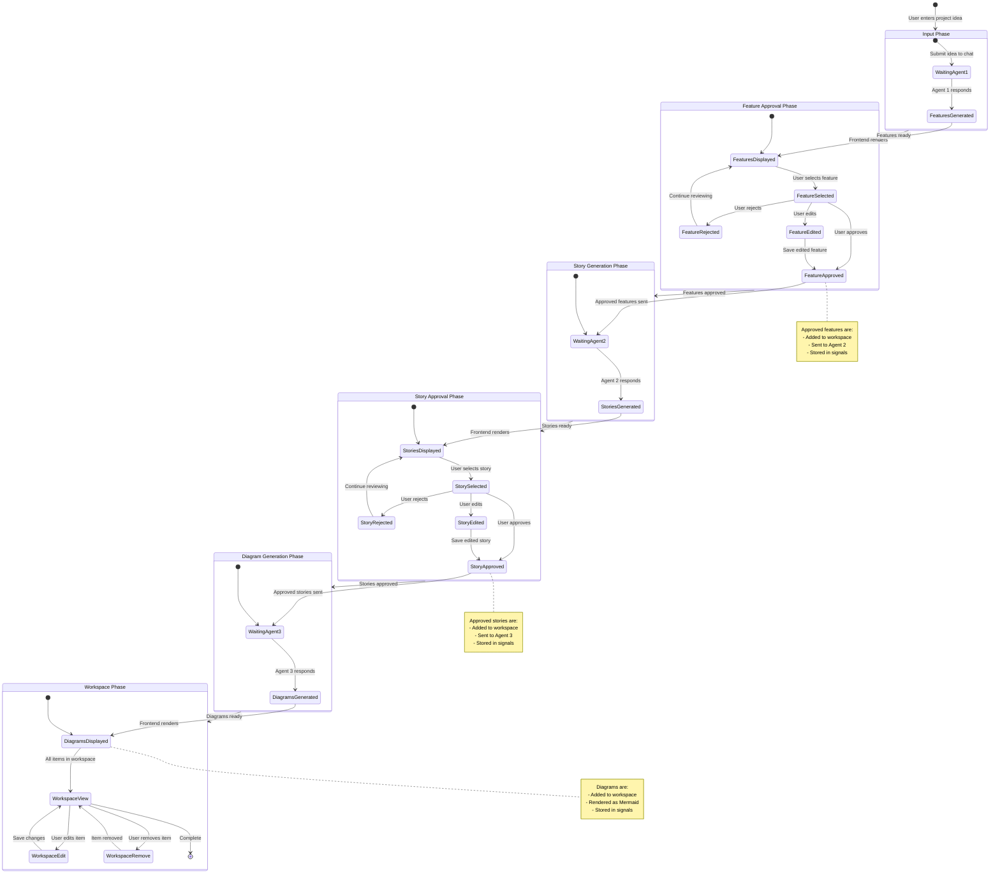

# State Flow Diagram - Approval Workflow

This diagram shows the state transitions for features, stories, and diagrams through the approval workflow.

```mermaid
stateDiagram-v2
    [*] --> Input: User enters project idea
    
    state "Input Phase" as Input {
        [*] --> WaitingAgent1: Submit idea to chat
        WaitingAgent1 --> FeaturesGenerated: Agent 1 responds
        FeaturesGenerated --> FeaturesDisplayed: Frontend renders
    }
    
    state "Feature Approval Phase" as FeatureApproval {
        [*] --> FeaturesDisplayed
        FeaturesDisplayed --> FeatureSelected: User selects feature
        FeatureSelected --> FeatureApproved: User approves
        FeatureSelected --> FeatureRejected: User rejects
        FeatureSelected --> FeatureEdited: User edits
        FeatureEdited --> FeatureApproved: Save edited feature
        FeatureRejected --> FeaturesDisplayed: Continue reviewing
        FeatureApproved --> WaitingAgent2: Approved features sent
    }
    
    state "Story Generation Phase" as StoryGeneration {
        [*] --> WaitingAgent2
        WaitingAgent2 --> StoriesGenerated: Agent 2 responds
        StoriesGenerated --> StoriesDisplayed: Frontend renders
    }
    
    state "Story Approval Phase" as StoryApproval {
        [*] --> StoriesDisplayed
        StoriesDisplayed --> StorySelected: User selects story
        StorySelected --> StoryApproved: User approves
        StorySelected --> StoryRejected: User rejects
        StorySelected --> StoryEdited: User edits
        StoryEdited --> StoryApproved: Save edited story
        StoryRejected --> StoriesDisplayed: Continue reviewing
        StoryApproved --> WaitingAgent3: Approved stories sent
    }
    
    state "Diagram Generation Phase" as DiagramGeneration {
        [*] --> WaitingAgent3
        WaitingAgent3 --> DiagramsGenerated: Agent 3 responds
        DiagramsGenerated --> DiagramsDisplayed: Frontend renders
    }
    
    state "Workspace Phase" as Workspace {
        [*] --> DiagramsDisplayed
        DiagramsDisplayed --> WorkspaceView: All items in workspace
        WorkspaceView --> WorkspaceEdit: User edits item
        WorkspaceView --> WorkspaceRemove: User removes item
        WorkspaceEdit --> WorkspaceView: Save changes
        WorkspaceRemove --> WorkspaceView: Item removed
        WorkspaceView --> [*]: Complete
    }
    
    Input --> FeatureApproval: Features ready
    FeatureApproval --> StoryGeneration: Features approved
    StoryGeneration --> StoryApproval: Stories ready
    StoryApproval --> DiagramGeneration: Stories approved
    DiagramGeneration --> Workspace: Diagrams ready
    
    note right of FeatureApproved
        Approved features are:
        - Added to workspace
        - Sent to Agent 2
        - Stored in signals
    end note
    
    note right of StoryApproved
        Approved stories are:
        - Added to workspace
        - Sent to Agent 3
        - Stored in signals
    end note
    
    note right of DiagramsDisplayed
        Diagrams are:
        - Added to workspace
        - Rendered as Mermaid
        - Stored in signals
    end note
```

