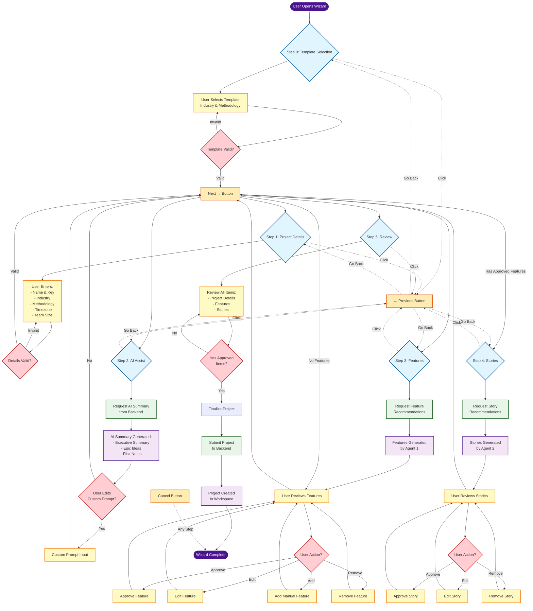

# Project Wizard Flow Diagram

This diagram shows the step-by-step flow of the project wizard with decision points and AI assistance.

```mermaid
graph TD
    %% ============================================
    %% Wizard Entry
    %% ============================================
    Start([User Opens Wizard])
    
    %% ============================================
    %% Step 0: Template Selection
    %% ============================================
    Step0{Step 0: Template Selection}
    SelectTemplate[User Selects Template<br/>Industry & Methodology]
    ValidateTemplate{Template Valid?}
    
    %% ============================================
    %% Step 1: Project Details
    %% ============================================
    Step1{Step 1: Project Details}
    EnterDetails[User Enters:<br/>- Name & Key<br/>- Industry<br/>- Methodology<br/>- Timezone<br/>- Team Size]
    ValidateDetails{Details Valid?}
    
    %% ============================================
    %% Step 2: AI Assist
    %% ============================================
    Step2{Step 2: AI Assist}
    RequestAISummary[Request AI Summary<br/>from Backend]
    AISummaryGenerated[AI Summary Generated:<br/>- Executive Summary<br/>- Epic Ideas<br/>- Risk Notes]
    EditCustomPrompt{User Edits<br/>Custom Prompt?}
    CustomPrompt[Custom Prompt Input]
    
    %% ============================================
    %% Step 3: Features
    %% ============================================
    Step3{Step 3: Features}
    RequestFeatures[Request Feature<br/>Recommendations]
    FeaturesGenerated[Features Generated<br/>by Agent 1]
    ReviewFeatures[User Reviews Features]
    FeatureAction{User Action?}
    ApproveFeature[Approve Feature]
    EditFeature[Edit Feature]
    AddManualFeature[Add Manual Feature]
    RemoveFeature[Remove Feature]
    
    %% ============================================
    %% Step 4: Stories
    %% ============================================
    Step4{Step 4: Stories}
    RequestStories[Request Story<br/>Recommendations]
    StoriesGenerated[Stories Generated<br/>by Agent 2]
    ReviewStories[User Reviews Stories]
    StoryAction{User Action?}
    ApproveStory[Approve Story]
    EditStory[Edit Story]
    RemoveStory[Remove Story]
    
    %% ============================================
    %% Step 5: Review
    %% ============================================
    Step5{Step 5: Review}
    ReviewAll[Review All Items:<br/>- Project Details<br/>- Features<br/>- Stories]
    CanSubmit{Has Approved<br/>Items?}
    Finalize[Finalize Project]
    
    %% ============================================
    %% Wizard Completion
    %% ============================================
    SubmitProject[Submit Project<br/>to Backend]
    ProjectCreated[Project Created<br/>in Workspace]
    End([Wizard Complete])
    
    %% ============================================
    %% Navigation Controls
    %% ============================================
    PreviousBtn[← Previous Button]
    NextBtn[Next → Button]
    CancelBtn[Cancel Button]
    
    %% ============================================
    %% Flow Connections
    %% ============================================
    Start --> Step0
    Step0 --> SelectTemplate
    SelectTemplate --> ValidateTemplate
    ValidateTemplate -->|Invalid| SelectTemplate
    ValidateTemplate -->|Valid| NextBtn
    NextBtn --> Step1
    
    Step1 --> EnterDetails
    EnterDetails --> ValidateDetails
    ValidateDetails -->|Invalid| EnterDetails
    ValidateDetails -->|Valid| NextBtn
    NextBtn --> Step2
    
    Step2 --> RequestAISummary
    RequestAISummary --> AISummaryGenerated
    AISummaryGenerated --> EditCustomPrompt
    EditCustomPrompt -->|Yes| CustomPrompt
    EditCustomPrompt -->|No| NextBtn
    CustomPrompt --> NextBtn
    NextBtn --> Step3
    
    Step3 --> RequestFeatures
    RequestFeatures --> FeaturesGenerated
    FeaturesGenerated --> ReviewFeatures
    ReviewFeatures --> FeatureAction
    FeatureAction -->|Approve| ApproveFeature
    FeatureAction -->|Edit| EditFeature
    FeatureAction -->|Add| AddManualFeature
    FeatureAction -->|Remove| RemoveFeature
    ApproveFeature --> ReviewFeatures
    EditFeature --> ReviewFeatures
    AddManualFeature --> ReviewFeatures
    RemoveFeature --> ReviewFeatures
    ReviewFeatures --> NextBtn
    NextBtn -->|Has Approved Features| Step4
    NextBtn -->|No Features| ReviewFeatures
    
    Step4 --> RequestStories
    RequestStories --> StoriesGenerated
    StoriesGenerated --> ReviewStories
    ReviewStories --> StoryAction
    StoryAction -->|Approve| ApproveStory
    StoryAction -->|Edit| EditStory
    StoryAction -->|Remove| RemoveStory
    ApproveStory --> ReviewStories
    EditStory --> ReviewStories
    RemoveStory --> ReviewStories
    ReviewStories --> NextBtn
    NextBtn --> Step5
    
    Step5 --> ReviewAll
    ReviewAll --> CanSubmit
    CanSubmit -->|Yes| Finalize
    CanSubmit -->|No| ReviewAll
    Finalize --> SubmitProject
    SubmitProject --> ProjectCreated
    ProjectCreated --> End
    
    %% ============================================
    %% Navigation Flow
    %% ============================================
    Step0 -.->|Click| PreviousBtn
    Step1 -.->|Click| PreviousBtn
    Step2 -.->|Click| PreviousBtn
    Step3 -.->|Click| PreviousBtn
    Step4 -.->|Click| PreviousBtn
    Step5 -.->|Click| PreviousBtn
    
    PreviousBtn -.->|Go Back| Step0
    PreviousBtn -.->|Go Back| Step1
    PreviousBtn -.->|Go Back| Step2
    PreviousBtn -.->|Go Back| Step3
    PreviousBtn -.->|Go Back| Step4
    
    CancelBtn -.->|Any Step| End
    
    %% ============================================
    %% Styling
    %% ============================================
    classDef startEnd fill:#4a148c,stroke:#fff,stroke-width:3px,color:#fff
    classDef step fill:#e1f5ff,stroke:#01579b,stroke-width:2px
    classDef action fill:#fff9c4,stroke:#f57f17,stroke-width:2px
    classDef decision fill:#ffcdd2,stroke:#c62828,stroke-width:2px
    classDef process fill:#e8f5e9,stroke:#1b5e20,stroke-width:2px
    classDef ai fill:#f3e5f5,stroke:#4a148c,stroke-width:2px
    classDef navigation fill:#ffecb3,stroke:#e65100,stroke-width:2px
    
    class Start,End startEnd
    class Step0,Step1,Step2,Step3,Step4,Step5 step
    class SelectTemplate,EnterDetails,ReviewFeatures,ReviewStories,ReviewAll action
    class ValidateTemplate,ValidateDetails,EditCustomPrompt,FeatureAction,StoryAction,CanSubmit decision
    class RequestAISummary,RequestFeatures,RequestStories,SubmitProject process
    class AISummaryGenerated,FeaturesGenerated,StoriesGenerated,ProjectCreated ai
    class ApproveFeature,EditFeature,AddManualFeature,RemoveFeature,ApproveStory,EditStory,RemoveStory,CustomPrompt action
    class PreviousBtn,NextBtn,CancelBtn navigation
```

