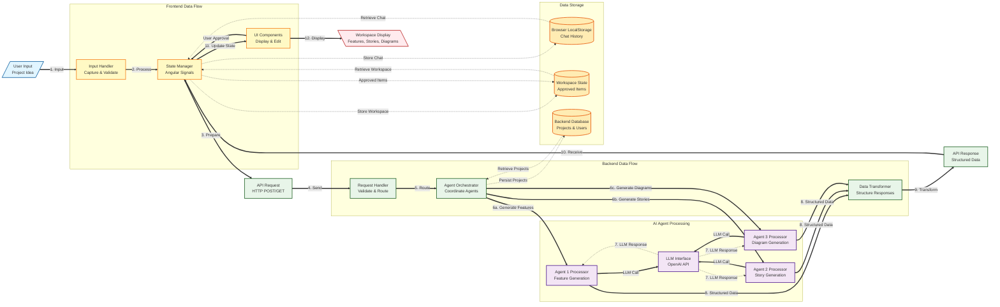

# Data Flow Diagram

This diagram shows how data flows through the system from user input to storage and display.

```mermaid
graph LR
    %% ============================================
    %% User Input Layer
    %% ============================================
    UserInput[/User Input<br/>Project Idea/]
    
    %% ============================================
    %% Frontend Processing
    %% ============================================
    subgraph Frontend["Frontend Data Flow"]
        InputHandler[Input Handler<br/>Capture & Validate]
        StateManager[State Manager<br/>Angular Signals]
        UIComponents[UI Components<br/>Display & Edit]
    end
    
    %% ============================================
    %% API Layer
    %% ============================================
    APIRequest[API Request<br/>HTTP POST/GET]
    APIResponse[API Response<br/>Structured Data]
    
    %% ============================================
    %% Backend Processing
    %% ============================================
    subgraph Backend["Backend Data Flow"]
        RequestHandler[Request Handler<br/>Validate & Route]
        AgentOrchestrator[Agent Orchestrator<br/>Coordinate Agents]
        DataTransformer[Data Transformer<br/>Structure Responses]
    end
    
    %% ============================================
    %% Agent Processing
    %% ============================================
    subgraph Agents["AI Agent Processing"]
        Agent1Proc[Agent 1 Processor<br/>Feature Generation]
        Agent2Proc[Agent 2 Processor<br/>Story Generation]
        Agent3Proc[Agent 3 Processor<br/>Diagram Generation]
        LLMInterface[LLM Interface<br/>OpenAI API]
    end
    
    %% ============================================
    %% Data Storage
    %% ============================================
    subgraph Storage["Data Storage"]
        BrowserStorage[(Browser LocalStorage<br/>Chat History)]
        WorkspaceState[(Workspace State<br/>Approved Items)]
        BackendDB[(Backend Database<br/>Projects & Users)]
    end
    
    %% ============================================
    %% Output Layer
    %% ============================================
    UserOutput[\Workspace Display<br/>Features, Stories, Diagrams\]
    
    %% ============================================
    %% Data Flow - Input Path
    %% ============================================
    UserInput ==>|1. Input| InputHandler
    InputHandler ==>|2. Process| StateManager
    StateManager ==>|3. Prepare| APIRequest
    
    %% ============================================
    %% Data Flow - API Communication
    %% ============================================
    APIRequest ==>|4. Send| RequestHandler
    RequestHandler ==>|5. Route| AgentOrchestrator
    
    %% ============================================
    %% Data Flow - Agent Processing
    %% ============================================
    AgentOrchestrator ==>|6a. Generate Features| Agent1Proc
    AgentOrchestrator ==>|6b. Generate Stories| Agent2Proc
    AgentOrchestrator ==>|6c. Generate Diagrams| Agent3Proc
    
    Agent1Proc ==>|LLM Call| LLMInterface
    Agent2Proc ==>|LLM Call| LLMInterface
    Agent3Proc ==>|LLM Call| LLMInterface
    
    LLMInterface -.->|7. LLM Response| Agent1Proc
    LLMInterface -.->|7. LLM Response| Agent2Proc
    LLMInterface -.->|7. LLM Response| Agent3Proc
    
    Agent1Proc ==>|8. Structured Data| DataTransformer
    Agent2Proc ==>|8. Structured Data| DataTransformer
    Agent3Proc ==>|8. Structured Data| DataTransformer
    
    %% ============================================
    %% Data Flow - Response Path
    %% ============================================
    DataTransformer ==>|9. Transform| APIResponse
    APIResponse ==>|10. Receive| StateManager
    StateManager ==>|11. Update State| UIComponents
    UIComponents ==>|12. Display| UserOutput
    
    %% ============================================
    %% Data Flow - Storage Paths
    %% ============================================
    StateManager -.->|Store Chat| BrowserStorage
    StateManager -.->|Store Workspace| WorkspaceState
    BrowserStorage -.->|Retrieve Chat| StateManager
    WorkspaceState -.->|Retrieve Workspace| StateManager
    
    AgentOrchestrator -.->|Persist Projects| BackendDB
    BackendDB -.->|Retrieve Projects| AgentOrchestrator
    
    %% ============================================
    %% Approval Flow
    %% ============================================
    UIComponents ==>|User Approval| StateManager
    StateManager -.->|Approved Items| WorkspaceState
    
    %% ============================================
    %% Styling
    %% ============================================
    classDef input fill:#e1f5ff,stroke:#01579b,stroke-width:2px
    classDef frontend fill:#fff9c4,stroke:#f57f17,stroke-width:2px
    classDef backend fill:#e8f5e9,stroke:#1b5e20,stroke-width:2px
    classDef agent fill:#f3e5f5,stroke:#4a148c,stroke-width:2px
    classDef storage fill:#ffecb3,stroke:#e65100,stroke-width:2px
    classDef output fill:#ffebee,stroke:#b71c1c,stroke-width:2px
    
    class UserInput input
    class InputHandler,StateManager,UIComponents frontend
    class APIRequest,APIResponse,RequestHandler,AgentOrchestrator,DataTransformer backend
    class Agent1Proc,Agent2Proc,Agent3Proc,LLMInterface agent
    class BrowserStorage,WorkspaceState,BackendDB storage
    class UserOutput output
```

