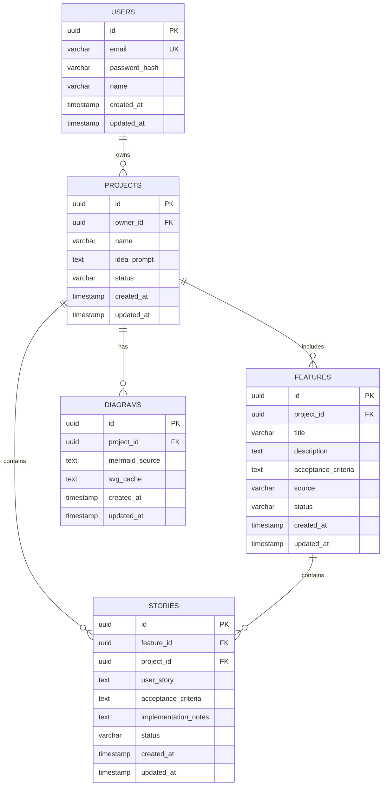

# Database Design Diagram

This diagram shows the database schema and entity relationships for the AutoAgents system.

```mermaid
erDiagram
    USERS ||--o{ PROJECTS : owns
    PROJECTS ||--o{ FEATURES : includes
    PROJECTS ||--o{ STORIES : contains
    PROJECTS ||--o{ DIAGRAMS : has
    FEATURES ||--o{ STORIES : contains
    
    USERS {
        uuid id PK
        varchar email UK
        varchar password_hash
        varchar name
        timestamp created_at
        timestamp updated_at
    }
    
    PROJECTS {
        uuid id PK
        uuid owner_id FK
        varchar name
        text idea_prompt
        varchar status
        timestamp created_at
        timestamp updated_at
    }
    
    FEATURES {
        uuid id PK
        uuid project_id FK
        varchar title
        text description
        text acceptance_criteria
        varchar source
        varchar status
        timestamp created_at
        timestamp updated_at
    }
    
    STORIES {
        uuid id PK
        uuid feature_id FK
        uuid project_id FK
        text user_story
        text acceptance_criteria
        text implementation_notes
        varchar status
        timestamp created_at
        timestamp updated_at
    }
    
    DIAGRAMS {
        uuid id PK
        uuid project_id FK
        text mermaid_source
        text svg_cache
        timestamp created_at
        timestamp updated_at
    }
```

